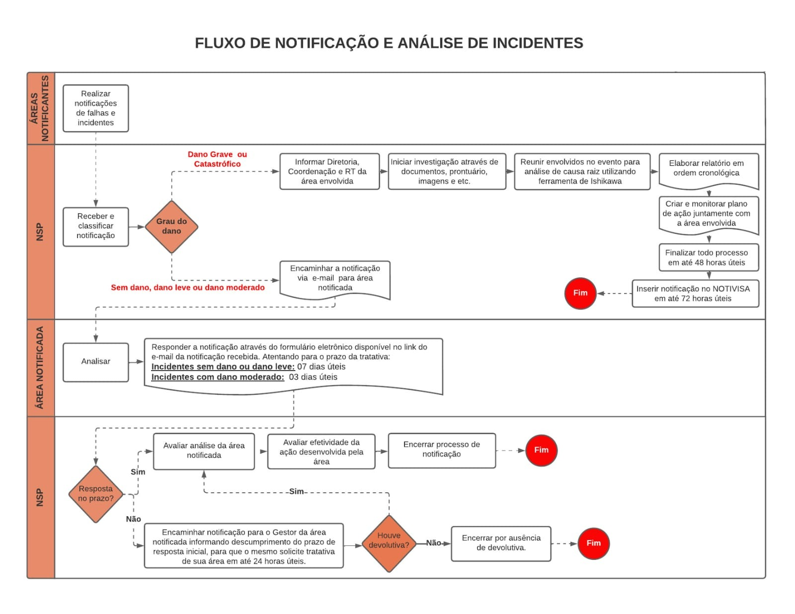

<h1 align="center">Documentos fornecidos pelas proponentes</h1>

<strong>Mantenedores:</strong> Gustavo Henrique, Kauan Cardoso, Sophya Ribeiro, Brenno, Catarina, Eduardo

??? note "Histórico de Alterações"

    | Versão | Data | Justificativa | Responsável |
    | --- | --- | --- | --- |
    | 1.0 | 07/10/2026 | Criação da página, com os documentos fornecidos pelas proponentes disponíveis para download. | Sophya Ribeiro |

Documentos entregues pelas proponentes durante a descoberta do produto. Eles descrevem como a notificação e a análise de incidentes funcionam hoje e serviram de base para a especificação de requisitos do NotificaSaúde. Os arquivos são os originais, com as informações que identificam instituições ou registros reais ocultadas.

-   :material-sitemap-outline:{ .lg .middle } **Fluxo de notificação e análise de incidentes**

    ---

    Fluxograma do processo atual em um hospital de referência, dividido por responsável: áreas notificantes, Núcleo de Segurança do Paciente (NSP) e área notificada. Mostra o caminho conforme o grau do dano, os prazos de tratativa e o encerramento da notificação.

    Imagem · JPG

    [:material-download: Baixar](../assets/docs/proponentes/fluxo-notificacao-analise-incidentes.jpg){ .md-button download="Fluxo de notificacao e analise de incidentes.jpg" }

-   :material-form-select:{ .lg .middle } **Formulário de notificação de incidentes**

    ---

    Proposta das proponentes para o formulário público de notificação, tela a tela: instituição, informações do paciente, momento e local do incidente, descrição do ocorrido, papel do notificador e identificação opcional.

    Documento · DOCX

    [:material-download: Baixar](../assets/docs/proponentes/formulario-notificacao.docx){ .md-button download="Formulario de notificacao de incidentes.docx" }

-   :material-shield-check-outline:{ .lg .middle } **Formulário de classificação do NSP**

    ---

    Proposta do formulário que o Núcleo de Segurança do Paciente usa para classificar a notificação: classificação do incidente, grau do dano, tipos de Never Event, tipo de incidente, envolvidos, observações e encaminhamento ao setor.

    Documento · DOCX

    [:material-download: Baixar](../assets/docs/proponentes/formulario-classificacao-nsp.docx){ .md-button download="Formulario de classificacao do NSP.docx" }

-   :material-file-document-check-outline:{ .lg .middle } **Formulário do NOTIVISA (ANVISA)**

    ---

    Exemplo preenchido com dados de teste do "Formulário de Notificação de Eventos Adversos para Cidadão", do NOTIVISA. Mostra os campos que a ANVISA solicita: dados do notificador, tipo de incidente, grau do dano, características do paciente e do incidente e serviço de saúde.

    Documento · PDF

    [:material-download: Baixar](../assets/docs/proponentes/formulario-notivisa-anvisa.pdf){ .md-button download="Formulario NOTIVISA - ANVISA.pdf" }

## Fluxo de notificação e análise de incidentes

{ loading=lazy }
