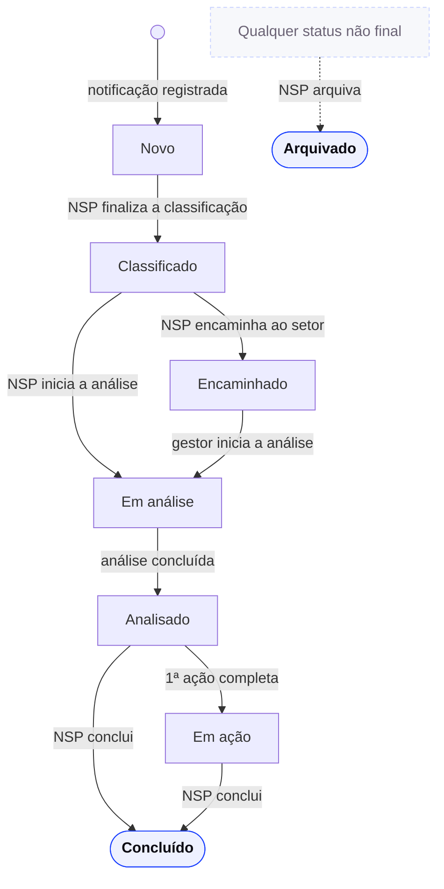

<h1 align="center">Especificação de Requisitos de Software</h1>

<strong>Mantenedores:</strong> Gustavo Henrique, Kauan Cardoso, Sophya Ribeiro, Brenno, Catarina, Eduardo

??? note "Histórico de Alterações"

    | Versão | Data | Justificativa | Responsável |
    | --- | --- | --- | --- |
    | 1.0 | 10/03/2026 | Primeira versão do documento, glossário e estrutura dos requisitos. | Sophya Ribeiro |
    | 1.0 | 11/03/2026 | Inserção de novos termos no glossário. Adição dos épicos 1 e 2, bem como suas respectivas histórias de usuário. | Sophya Ribeiro |
    | 1.0 | 12/03/2026 | Alteração e inserção nos critérios de aceite da US 2.3. | Sophya Ribeiro |
    | 1.1 | 16/03/2026 | Ajustes específicos. Primeira validação do documento. | Sophya Ribeiro |
    | 1.2 | 18/03/2026 | Adição de novo ator, conforme validação das proponentes. Ajustes pontuais em critérios de aceite. Primeira validação formal com proponentes. | Sophya Ribeiro |
    | 1.3 | 28/04/2026 | Atualização pontual nos épicos 1 e 2, requisitos não-funcionais e regras de negócio. | Sophya Ribeiro, Aline Hirokawa |
    | 1.4 | 29/04/2026 | Inserção do épico referente a autenticação. | Sophya Ribeiro |
    | 2.0 | 30/04/2026 | Inserção da História de usuário referente ao status dos incidentes. | Sophya Ribeiro |
    | 2.1 | 05/05/2026 | Ajustes nos requisitos não-funcionais | Aline Hirokawa |
    | 2.2 | 07/05/2026 | Adição de novos critérios de aceite na US2.5. | Sophya Ribeiro |
    | 2.3 | 19/05/2026 | Adição de texto para template do email da US2.5. | Sophya Ribeiro |
    | 2.4 | 20/05/2026 | Adição de nova pergunta no formulário de classificação. | Sophya Ribeiro |
    | 2.5 | 01/06/2026 | Atualização no modelo de descrição dos épicos. | Sophya Ribeiro |
    | 2.6 | 08/06/2026 | Edição e exclusão de requisitos não-funcionais. | Sophya Ribeiro |
    | 2.7 | 10/08/2026 | Adição do Épico 4, e das histórias de usuários | Gustavo Henrique |
    | 2.8 | 13/08/2026 | Adição do Épico 5, gestão do plano de ação | Gustavo Henrique |
    | 3.0 | 23/09/2026 | Revisão completa do fluxo classificação → análise → plano de ação conforme o protótipo funcional validado com as proponentes: atualização das US 2.3, 2.4 e 2.5 e dos épicos 4 e 5; inclusão das US 4.6 a 4.11 (seções do formulário de análise e decisão pós-análise) e 5.5 a 5.7 (ações originadas de recomendações, edição/exclusão de ações e conclusão do incidente); inclusão dos requisitos não-funcionais de usabilidade e feedback (6.7); numeração e ampliação das regras de negócio; novos termos no glossário. | Sophya Ribeiro |
    | 3.1 | 23/09/2026 | Ajuste do conceito de responsável e de acesso: responsável pelo incidente definido como o profissional do NSP que finalizou a classificação, mantido até o fim do fluxo e apenas como referência (sem conceder ou restringir permissões); fila do gestor da área restrita aos incidentes do seu setor encaminhados pelo NSP, antes ou depois da análise (US 4.1 reescrita, nova RN-26); uso genérico de "o responsável" substituído por "o usuário" nos critérios de aceite. | Sophya Ribeiro |
    | 3.2 | 23/09/2026 | Remoção das menções a escolha de metodologia (antiga RN-17 e critérios relacionados), com renumeração das regras de negócio seguintes. A história "Acompanhar plano de ação e prazos" passou do épico 4 para o épico 5 (antiga US 4.3, agora US 5.3), com renumeração das histórias seguintes dos dois épicos. | Sophya Ribeiro |
    | 3.3 | 23/09/2026 | Reorganização das histórias de usuário por épico: épico 2 com a gestão e classificação da notificação (inclui a consulta ao histórico, antiga US 4.4, agora US 2.6); épico 4 somente com a análise, na ordem do fluxo; épico 5 somente com o plano de ação, na ordem do fluxo. | Sophya Ribeiro |
    | 3.4 | 23/09/2026 | Inclusão do requisito não-funcional 6.2.9 (proteção contra o registro automatizado ou em massa de notificações por robôs) e do critério de aceite CA04 da US 1.1. | Sophya Ribeiro |
    | 3.5 | 23/09/2026 | Criação do épico 6 — Status e ciclo de vida do incidente, unificando o status, as mudanças provocadas pelas ações do usuário, o arquivamento e a conclusão do incidente (US 6.1 a 6.4). A antiga US 2.4 (status) e a antiga US 5.8 (concluir o incidente) passaram para o épico 6; as histórias seguintes do épico 2 foram renumeradas. As menções a status nas demais histórias foram mantidas, com referência à US 6.2. | Sophya Ribeiro |
    | 3.6 | 23/09/2026 | Sigilo da identificação do notificante para o gestor da área: novo critério de aceite CA05 na US 4.1, ajuste da Seção 1 da análise (US 4.3), nova RN-27 e novo requisito não-funcional 6.3.4. | Sophya Ribeiro |
    | 3.7 | 23/09/2026 | Autoria exclusiva da análise em andamento, para tratar acessos simultâneos: somente quem iniciou a análise pode continuá-la e concluí-la; os demais usuários veem "Análise em andamento. Aguarde a finalização para visualizar os detalhes."; início simultâneo resolvido pelo primeiro salvamento no servidor (US 4.2, CA02 a CA04, e nova RN-28). | Sophya Ribeiro |
    | 3.8 | 23/09/2026 | Limites dos anexos de evidência das ações: no máximo 10 anexos por ação e 10 MB por arquivo (novo CA12 da US 5.6 e RN-25). | Sophya Ribeiro |

## Sumário

- [1. Introdução](#introducao)
- [2. Glossário](#glossario)
- [3. Descrição dos Atores](#descricao-atores)
- [4. Épicos](#epicos)
- [5. Histórias de Usuário](#historias-usuario)
    - [5.1 Registro de notificações de incidentes](#historias-51)
    - [5.2 Gestão e classificação de notificações](#historias-52)
    - [5.3 Autenticação e controle de acesso](#historias-53)
    - [5.4 Registro de análise em notificação de incidentes](#historias-54)
    - [5.5 Gestão de plano de ação](#historias-55)
    - [5.6 Status e ciclo de vida do incidente](#historias-56)
- [6. Requisitos Não-funcionais](#rnf)
    - [6.1 Disponibilidade](#rnf-disponibilidade)
    - [6.2 Segurança da Informação](#rnf-seguranca)
    - [6.3 Proteção de Dados e LGPD](#rnf-lgpd)
    - [6.4 Compatibilidade e Acesso](#rnf-compatibilidade)
    - [6.5 Desempenho](#rnf-desempenho)
    - [6.6 Acessibilidade](#rnf-acessibilidade)
    - [6.7 Usabilidade e Feedback ao Usuário](#rnf-usabilidade)
- [7. Regras de Negócio](#regras-negocio)
- [8. Referências](#referencias)

---

## 1. Introdução

Este documento é destinado aos stakeholders da solução Notifica Saúde, tanto diretos quanto indiretos. Ele apresenta os requisitos de um sistema voltado ao registro, análise e monitoramento de incidentes relacionados à segurança do paciente em serviços de saúde.

A solução proposta permite que usuários realizem notificações de incidentes por meio de um formulário eletrônico, de forma identificada ou anônima. Após o registro, as notificações são encaminhadas ao Núcleo de Segurança do Paciente, responsável pela classificação do incidente, acompanhamento do fluxo de investigação e monitoramento das ações corretivas definidas pelos setores responsáveis.

Além disso, o sistema possibilita o acompanhamento do status das notificações, o registro das análises realizadas pelas áreas envolvidas e a geração de relatórios consolidados para apoio ao monitoramento e à melhoria contínua dos processos relacionados à segurança do paciente.

---

## 2. Glossário

| Termo | Descrição |
| --- | --- |
| Incidente | Ocorrência ou circunstância relacionada ao cuidado em saúde que poderia resultar, ou resultou, em dano ao paciente. Inclui desde situações de risco até eventos que efetivamente causaram dano. |
| Notificação | Registro formal de um incidente relacionado à segurança do paciente realizado no sistema. A notificação é o artefato gerado quando ocorre ou é identificado um incidente, devendo ser registrada independentemente da existência de dano ao paciente, conforme diretrizes e regulamentações de segurança do paciente. Seu objetivo é permitir o monitoramento, a análise e a implementação de ações de melhoria para prevenção de novos incidentes. A notificação pode ser realizada por qualquer pessoa e pode ocorrer de forma identificada ou anônima. |
| Evento adverso | Tipo de incidente que resulta em dano ao paciente decorrente do cuidado em saúde e não da evolução natural da doença. Pode ser classificado conforme a gravidade do dano (leve, moderado, grave, óbito ou Never Event). |
| Classificação do Incidente | Processo realizado pelo Núcleo de Segurança do Paciente para categorizar o incidente de acordo com critérios de gravidade, tipo e impacto ao paciente. |
| Dano Leve | Incidente que não resulta em dano ao paciente, mas que deve ser registrado e monitorado conforme exigências regulatórias e políticas de segurança do paciente. |
| Dano Moderado | Incidente que causa algum impacto ao paciente, podendo exigir intervenção ou acompanhamento, porém sem resultar em consequências graves ou permanentes. |
| Dano Grave | Incidente que causa dano significativo ao paciente, podendo resultar em agravamento clínico relevante, necessidade de intervenção médica importante ou prolongamento da internação. |
| Dano Catastrófico | Incidente que resulta em óbito do paciente decorrente do evento relacionado ao cuidado em saúde. |
| Near Miss | Incidente que poderia causar dano ao paciente, mas que foi interceptado antes de atingir o paciente ou antes de produzir qualquer consequência. |
| Circunstância de Risco | Situação ou condição com potencial de causar um incidente relacionado ao cuidado em saúde, mesmo que nenhum erro ou dano tenha ocorrido. |
| Área Notificada | Setor, unidade ou departamento da instituição de saúde onde o incidente ocorreu. Quando o NSP encaminha o incidente a esse setor, o gestor da área passa a ter acesso a ele e pode conduzir a investigação e o plano de ação. |
| Gestor da Área | Profissional responsável pela gestão de um setor específico da instituição de saúde. No sistema, só tem acesso aos incidentes do seu setor que o NSP encaminhou a ele, antes da análise (para que o setor a realize) ou depois dela (resultado da análise feita pelo NSP). |
| Responsável pelo Incidente | Profissional do Núcleo de Segurança do Paciente que registrou a classificação finalizada do incidente. É definido automaticamente nesse momento e se mantém o mesmo até o fim do fluxo (conclusão ou arquivamento), mesmo que o incidente seja encaminhado ao setor. Serve como referência de quem iniciou o tratamento do incidente e não concede nem restringe permissões: qualquer profissional do NSP pode atuar sobre o incidente. Não se confunde com os responsáveis pelas ações do plano de ação. |
| Investigação de Incidente | Processo de análise conduzido pelo setor onde o incidente ocorreu (quando encaminhado pelo NSP) ou pelo Núcleo de Segurança do Paciente para identificar as causas que levaram à ocorrência do incidente. No sistema, corresponde ao preenchimento do formulário de análise, organizado em seções sequenciais. |
| Análise de Causa Raiz | Método estruturado de investigação utilizado para identificar as causas fundamentais que contribuíram para a ocorrência de um incidente. No sistema, a análise é registrada pelas seções do formulário de análise, que já incorporam essas técnicas. |
| Diagrama de Ishikawa | Ferramenta de análise utilizada na investigação de incidentes para identificar e organizar possíveis causas do problema, também conhecida como diagrama de causa e efeito ou espinha de peixe. No sistema, é gerado automaticamente a partir dos fatores contribuintes registrados na análise. |
| Plano de Ação | Conjunto de ações corretivas e preventivas definidas após a investigação de um incidente, com responsáveis e prazos estabelecidos para evitar recorrência. Cada ação segue o modelo SMART (específica, mensurável, atingível, relevante e com prazo). |
| Ação Corretiva | Medida adotada para corrigir uma falha identificada e reduzir a probabilidade de repetição do incidente. |
| Prazo de Tratativa | Período definido para que o incidente seja analisado (pelo NSP ou pelo setor a que foi encaminhado) e as ações ou respostas sejam registradas no sistema. |
| Prazo para Análise | Data-limite para a análise do incidente, calculada automaticamente a partir da data de registro da notificação e do grau do dano definido na classificação. |
| Status da Notificação | Estado atual de uma notificação dentro do fluxo do sistema, indicando em que etapa do processo ela se encontra: Novo, Classificado, Encaminhado, Em análise, Analisado, Em ação, Concluído ou Arquivado. |
| Núcleo de Segurança do Paciente (NSP) | Unidade ou equipe institucional responsável por receber notificações de incidentes, realizar a classificação inicial, acompanhar investigações e monitorar ações corretivas relacionadas à segurança do paciente. |
| NOTIVISA | Sistema nacional da Agência Nacional de Vigilância Sanitária (ANVISA) utilizado para registro e monitoramento de incidentes relacionados à vigilância sanitária e segurança do paciente. |
| Never Events | Eventos nunca (NE) são incidentes de segurança do paciente que podem ser evitados e tão graves que nunca deveriam acontecer. |
| Incidente em Investigação | Descrição curta (até 100 caracteres), escrita por quem realiza a análise, do incidente que está sendo investigado. É exibida no topo das seções do formulário de análise e na "cabeça" do Diagrama de Ishikawa. |
| Condutor da Análise | Profissional que conduz a análise do incidente. É registrado com nome, formação, função e setor, junto dos demais membros participantes, para documentar a autoria de forma rastreável. |
| Cronologia do Incidente | Linha do tempo com os fatos relacionados ao incidente, em ordem cronológica, cada um com data, hora, fonte da informação e status de confirmação (Confirmado, Provável ou Em análise). |
| Problema na Prestação do Cuidado (PPC) | Ação ou omissão da equipe que se desviou do esperado e contribuiu para o incidente (ex.: falha em monitorar, observar ou agir; falha na comunicação; decisão incorreta). Cada PPC registra o que ocorreu, o que era esperado e a fonte/evidência. |
| Fatores Contribuintes | Condições que favoreceram a ocorrência do incidente, organizadas em oito categorias fixas: fatores do paciente; fatores individuais dos profissionais; fatores das tarefas; fatores da equipe; fatores do ambiente de trabalho; tecnologia e sistemas eletrônicos de informação; fatores organizacionais, gerenciais e culturais; e fatores do contexto institucional — além de uma categoria livre ("Outro / não mapeado"). |
| 5 Porquês | Técnica de aprofundamento que consiste em perguntar "por quê?" repetidamente a partir de um achado, para ir além do sintoma e chegar à falha de processo ou sistema (causa raiz). No sistema, é opcional e pode ser usada em cada categoria de fator contribuinte marcada, com até 15 níveis. |
| Recomendação | Ação sugerida ao final da análise para tratar as causas identificadas e evitar que o incidente se repita. Ao concluir a análise, cada recomendação dá origem a uma ação no plano de ação da notificação. |
| Cultura Justa | Princípio que orienta a análise: a investigação não busca punir individualmente profissionais da ponta assistencial, e sim identificar vulnerabilidades e barreiras do sistema. |
| Ação Pendente de Preenchimento | Ação do plano de ação criada automaticamente a partir de uma recomendação da análise, que ainda não possui todos os campos obrigatórios preenchidos. Não pode ter o andamento atualizado até ser completada. |
| Efetividade da Ação | Avaliação de se a ação executada produziu o resultado esperado (Sim, Parcialmente ou Não), registrada na atualização do andamento da ação. |

---

## 3. Descrição dos Atores

| Ator | Descrição |
| --- | --- |
| Notificante | Usuário responsável por registrar uma notificação de incidente no sistema. Pode ser um profissional de saúde, paciente, acompanhante ou qualquer pessoa que tenha conhecimento do ocorrido. A notificação pode ser realizada de forma identificada ou anônima. |
| Profissional do Núcleo de Segurança do Paciente (NSP) | Usuário responsável por acessar as notificações registradas, realizar a análise inicial e classificar o incidente conforme critérios estabelecidos. Também acompanha o andamento das notificações. Responsável por gerenciar os usuários vinculados à sua instituição, incluindo cadastro, edição e definição de perfis de acesso. Pode gerar relatórios com base em filtros. |
| Gestor de Área | Usuário responsável pela gestão de um setor da instituição. Acessa somente os incidentes do seu setor que o Núcleo de Segurança do Paciente encaminhou a ele: antes da análise, para realizar a investigação e registrar a análise das causas; ou depois da análise feita pelo NSP, quando o núcleo decide encaminhar o resultado ao setor. Nos incidentes a que tem acesso, define e acompanha o plano de ação com medidas corretivas ou preventivas. Pode gerar relatórios do seu setor/área com base em filtros. |
| Administrador do Sistema | Usuário responsável pela administração global do sistema, com acesso irrestrito a todas as instituições cadastradas. Pode gerenciar usuários em nível sistêmico, configurar parâmetros gerais da aplicação, supervisionar o uso do sistema e garantir seu correto funcionamento em todos os contextos institucionais. |

---

## 4. Épicos

Nesta seção são apresentados os épicos do sistema NotificaSaúde, organizados com o objetivo de agrupar funcionalidades relacionadas de acordo com os principais fluxos e necessidades identificados no processo de gestão de incidentes. Cada épico contém uma descrição resumida de seu propósito e a relação das histórias de usuário associadas, permitindo uma visão mais ampla das funcionalidades do produto e de como elas se conectam aos objetivos do sistema.

### Épico 1 — Registro de notificações de incidentes

**COMO** qualquer pessoa que tenha conhecimento de um incidente (profissional de saúde, paciente, acompanhante ou terceiro)
**QUERO** registrar uma notificação de incidente no sistema
**PARA** que a ocorrência seja analisada e tratada pela instituição, contribuindo para a melhoria da segurança do paciente.

**Histórias de usuário:** [US 1.1 — Registrar notificação de incidente](#us-1-1)

### Épico 2 — Gestão e classificação de notificações de incidentes

**COMO** profissional do Núcleo de Segurança do Paciente, devidamente autenticado no sistema
**QUERO** visualizar, complementar, classificar e encaminhar notificações de incidentes registradas e consultar seu histórico
**PARA** garantir que as ocorrências sejam corretamente analisadas e direcionadas aos setores onde ocorreram para investigação e definição de ações corretivas.

**Histórias de usuário:**

- [US 2.1 — Visualizar notificações registradas](#us-2-1)
- [US 2.2 — Complementar ou corrigir informações da notificação](#us-2-2)
- [US 2.3 — Classificar incidente notificado](#us-2-3)
- [US 2.4 — Encaminhar notificação para o setor](#us-2-4)
- [US 2.5 — Consultar histórico da notificação](#us-2-5)

### Épico 3 — Autenticação e controle de acesso

**COMO** usuário previamente cadastrado no sistema
**QUERO** realizar login e recuperar minha senha de acesso quando necessário
**PARA** acessar a plataforma de forma segura e utilizar suas funcionalidades conforme meu perfil de acesso.

**Histórias de usuário:**

- [US 3.1 — Realizar login no sistema](#us-3-1)
- [US 3.2 — Recuperar senha de acesso](#us-3-2)

### Épico 4 — Registro de análise em notificação de incidentes

**COMO** gestor da área ou profissional do Núcleo de Segurança do Paciente
**QUERO** registrar uma análise em uma notificação de incidente, seção a seção, e decidir o destino do seu resultado
**PARA** investigar as causas do ocorrido e documentar as informações relevantes para definição de ações corretivas e preventivas.

**Histórias de usuário:**

- [US 4.1 — Visualizar incidentes para análise](#us-4-1)
- [US 4.2 — Registrar análise do incidente](#us-4-2)
- [US 4.3 — Identificar o incidente em investigação (Seção 1)](#us-4-3)
- [US 4.4 — Registrar equipe, fontes e entrevistas da análise (Seção 2)](#us-4-4)
- [US 4.5 — Registrar cronologia e problemas na prestação do cuidado (Seção 3)](#us-4-5)
- [US 4.6 — Analisar fatores contribuintes e aprofundar com os 5 Porquês (Seções 4 e 4A)](#us-4-6)
- [US 4.7 — Revisar o Diagrama de Ishikawa e registrar recomendações (Seção 5)](#us-4-7)
- [US 4.8 — Concluir investigação do incidente](#us-4-8)
- [US 4.9 — Decidir o encaminhamento do resultado da análise ao setor](#us-4-9)

### Épico 5 — Gestão de plano de ação

**COMO** profissional do Núcleo de Segurança do Paciente ou gestor da área a que o incidente foi encaminhado
**QUERO** registrar e acompanhar um plano de ação relacionado ao problema identificado na análise
**PARA** definir, executar, acompanhar e avaliar as ações necessárias para tratar o problema identificado, até que o incidente possa ser concluído (épico 6).

**Histórias de usuário:**

- [US 5.1 — Acessar e preencher o plano de ação](#us-5-1)
- [US 5.2 — Adicionar ações ao plano de ação](#us-5-2)
- [US 5.3 — Completar ações originadas das recomendações da análise](#us-5-3)
- [US 5.4 — Editar e excluir ações do plano de ação](#us-5-4)
- [US 5.5 — Acompanhar plano de ação e prazos](#us-5-5)
- [US 5.6 — Acompanhar e atualizar o andamento das ações](#us-5-6)
- [US 5.7 — Avaliar a efetividade das ações](#us-5-7)

### Épico 6 — Status e ciclo de vida do incidente

**COMO** profissional do Núcleo de Segurança do Paciente ou gestor da área
**QUERO** acompanhar o status de cada incidente e entender como as ações realizadas no sistema o alteram, até o encerramento por conclusão ou arquivamento
**PARA** saber em que etapa do fluxo cada incidente se encontra e encerrá-lo de forma controlada e rastreável.

**Histórias de usuário:**

- [US 6.1 — Visualizar o status e o ciclo de vida do incidente](#us-6-1)
- [US 6.2 — Atualizar o status a partir das ações do usuário](#us-6-2)
- [US 6.3 — Arquivar incidente](#us-6-3)
- [US 6.4 — Concluir incidente](#us-6-4)

---

## 5. Histórias de Usuário

Nesta seção são apresentadas as histórias de usuário do sistema NotificaSaúde, elaboradas com o objetivo de representar as necessidades dos diferentes perfis de usuários envolvidos no processo de gestão de incidentes. Cada história é acompanhada de seus respectivos critérios de aceite, contexto de uso e relação com as regras de negócio identificadas, permitindo detalhar os comportamentos esperados do sistema e orientar o desenvolvimento das funcionalidades propostas. As histórias foram definidas com base nas informações levantadas junto aos stakeholders, entrevistas realizadas, análise do fluxo atual de gerenciamento de incidentes em instituições de saúde e validação do protótipo funcional com as proponentes.

### 5.1 Registro de notificações de incidentes

#### US-1.1 — Registrar notificação de incidente

**Épico:** 1 — Registro de notificações de incidentes · **Prioridade:** Alta

**COMO** Notificante
**QUERO** registrar uma notificação de incidente no sistema
**PARA** que a ocorrência seja analisada e tratada pela instituição, contribuindo para melhoria da segurança do paciente

**Regras de Negócio:** RN-04

**Critérios de Aceite**

- **CA01 — Acesso ao formulário de notificação**
    **Dado que** um usuário acesse o sistema de notificação, **quando** selecionar a opção de registrar um incidente, **então** o sistema deve apresentar um formulário eletrônico para preenchimento da notificação.
- **CA02 — Campos do formulário de notificação**
    **Dado que** o usuário esteja preenchendo o formulário de notificação, **quando** visualizar o formulário, **então** o sistema deve apresentar os campos previamente configurados.
- **CA03 — Registro da notificação**
    **Dado que** o usuário preencheu o formulário de notificação, **quando** confirmar o envio, **então** o sistema deve registrar a notificação e atribuir o status "Novo".
- **CA04 — Proteção contra envios em massa**
    **Dado que** uma mesma origem envie notificações acima do limite permitido ou o envio não passe na verificação de que é feito por uma pessoa (captcha), **quando** confirmar o envio, **então** o sistema não deve registrar a notificação e deve exibir a mensagem "Não foi possível enviar a notificação agora. Aguarde alguns minutos e tente novamente.", conforme o requisito não-funcional 6.2.9.

**Contexto de Uso:** Esta funcionalidade pode ser utilizada por qualquer pessoa que tenha conhecimento do incidente, incluindo profissionais de saúde, pacientes, acompanhantes ou terceiros. Por ser de acesso público, o formulário é protegido contra envios automatizados em massa (6.2.9).

### 5.2 Gestão e classificação de notificações

#### US-2.1 — Visualizar notificações registradas

**Épico:** 2 — Gestão e classificação de notificações · **Prioridade:** Alta

**COMO** Profissional do Núcleo de Segurança do Paciente, devidamente autenticado no sistema
**QUERO** visualizar as notificações registradas no sistema
**PARA** acompanhar os incidentes reportados e iniciar o processo de análise.

**Regras de Negócio:** RN-10

**Critérios de Aceite**

- **CA01 — Acesso à lista de notificações**
    **Dado que** o usuário esteja autenticado como profissional do Núcleo de Segurança do Paciente, **quando** acessar o painel de notificações, **então** o sistema deve apresentar uma lista com todas as notificações registradas.
- **CA02 — Informações exibidas na lista**
    **Dado que** o usuário esteja visualizando a lista de notificações, **quando** as notificações forem exibidas, **então** o sistema deve apresentar, no mínimo: identificador único da notificação (decimal sequencial), data de registro, setor, status da notificação e os primeiros 200 caracteres da descrição.
- **CA03 — Ordenação padrão das notificações**
    **Dado que** o profissional do Núcleo de Segurança do Paciente esteja visualizando a lista de notificações, **quando** acessar o painel de notificações, **então** o sistema deve apresentar as notificações ordenadas por padrão das mais recentes para as mais antigas.
- **CA04 — Ordenações possíveis para as notificações**
    **Dado que** o usuário esteja visualizando a lista de notificações, **quando** utilizar as opções de ordenação, **então** o sistema deve permitir ordenar as notificações por mais recentes ou mais antigas.
- **CA05 — Filtros**
    **Dado que** o usuário esteja visualizando a lista de notificações, **quando** desejar localizar uma notificação específica, **então** o sistema deve permitir buscar notificações pelo tipo de incidente, pelo grau de dano (se houver) e pelo setor onde ocorreu o incidente.
- **CA06 — Barra de pesquisa**
    **Dado que** o usuário esteja visualizando a lista de notificações, **quando** informar um identificador na barra de pesquisa, **então** o sistema deve exibir as notificações correspondentes ao identificador informado.
- **CA07 — Acesso ao detalhamento da notificação**
    **Dado que** o usuário esteja visualizando a lista de notificações, **quando** selecionar uma notificação específica, **então** o sistema deve apresentar os detalhes completos da notificação registrada, bem como o histórico de modificações.

**Contexto de Uso:** Essa funcionalidade é utilizada pelos profissionais do Núcleo de Segurança do Paciente para acompanhar as notificações registradas no sistema, ter uma visão geral da quantidade de notificações recebidas e iniciar o processo de análise e classificação dos incidentes.

#### US-2.2 — Complementar ou corrigir informações da notificação

**Épico:** 2 — Gestão e classificação de notificações · **Prioridade:** Média

**COMO** Profissional do Núcleo de Segurança do Paciente
**QUERO** complementar ou corrigir informações da notificação registrada
**PARA** garantir que os dados necessários para análise e encaminhamento do incidente estejam corretos.

**Regras de Negócio:** RN-02, RN-09

**Critérios de Aceite**

- **CA01 — Edição de campos da notificação**
    **Dado que** o profissional do Núcleo de Segurança do Paciente esteja visualizando os detalhes de uma notificação, **quando** selecionar a opção de editar informações da notificação, **então** o sistema deve permitir a edição ou preenchimento de campos complementares da notificação.
- **CA02 — Campos editáveis**
    **Dado que** o profissional esteja editando uma notificação, **quando** acessar a visão detalhada da notificação, **então** o sistema deve permitir a edição ou preenchimento dos campos do formulário de registro de incidente.
- **CA03 — Impedimento de edição da descrição**
    **Dado que** existe um incidente, **quando** o incidente for editado, **então** o sistema não deve permitir editar a descrição.
- **CA04 — Registro das alterações**
    **Dado que** o profissional do Núcleo de Segurança do Paciente realize alterações nas informações da notificação, **quando** salvar as modificações, **então** o sistema deve registrar essas alterações no histórico de modificações, incluindo data, hora, autor e quais campos foram alterados.

**Contexto de Uso:** Essa funcionalidade permite que o Núcleo de Segurança do Paciente complemente ou corrija informações da notificação quando os dados registrados inicialmente estiverem incompletos ou incorretos, garantindo maior qualidade das informações utilizadas na análise do incidente.

#### US-2.3 — Classificar incidente notificado

**Épico:** 2 — Gestão e classificação de notificações · **Prioridade:** Média

**COMO** Profissional do Núcleo de Segurança do Paciente
**QUERO** classificar o incidente registrado
**PARA** categorizar a notificação e dar continuidade ao fluxo de análise.

**Regras de Negócio:** RN-03, RN-05, RN-11, RN-14, RN-15, RN-24

**Critérios de Aceite**

- **CA01 — Acesso à classificação do incidente**
    **Dado que** o usuário esteja visualizando os detalhes de uma notificação com status "Novo" ou "Classificado", **quando** selecionar a opção "Registrar classificação" (ou "Continuar classificação", se já houver rascunho), **então** o sistema deve abrir o formulário de classificação do incidente.
- **CA02 — Impedimento de classificação**
    **Dado que** existam campos obrigatórios não preenchidos, **quando** o usuário tentar salvar a classificação, **então** o sistema deve impedir o registro da classificação finalizada e indicar os campos pendentes.
- **CA03 — Campos de classificação**
    **Dado que** o usuário esteja classificando um incidente, **quando** acessar o formulário de classificação, **então** o sistema deve apresentar um fluxo estruturado, com exibição condicional de campos conforme a classificação selecionada, contendo:
    - **Classificação do incidente** (obrigatória, seleção única), cada opção com uma breve descrição e um exemplo:
        - Circunstância notificável — situação de risco que poderia causar dano (ex.: cama sem grades, equipamentos sem manutenção);
        - Near Miss — um incidente que não atingiu o paciente (ex.: uma bolsa de sangue foi conectada ao acesso venoso do paciente errado, mas o erro foi detectado antes do início da transfusão);
        - Incidente sem dano — um evento atingiu o paciente, mas não resultou em dano perceptível (ex.: uma bolsa de sangue foi transfundida, mas não era incompatível);
        - Evento adverso — um incidente que resulta em dano a um paciente (ex.: a bolsa de sangue errada foi transfundida e o paciente morreu de uma reação hemolítica).
        Se "Evento adverso", segue para *Grau do dano*; caso contrário, segue direto para *Tipo de incidente*. Alterar a classificação limpa o grau do dano já selecionado.
    - **Grau do dano** (obrigatório, seleção única, exibido apenas para "Evento adverso"): Leve (sintomas leves, intervenção mínima) / Moderado (requer intervenção, sem risco de vida imediato) / Grave (risco de vida ou dano permanente) / Óbito (morte causada pelo dano) / Never Event (incidentes graves que nunca deveriam ocorrer). Se "Never Event", segue para *Tipo específico (Never Event)*; caso contrário, segue para *Tipo de incidente*.
    - **Tipo específico (Never Event)** (obrigatório de acordo com a condicional, seleção única, exibido apenas quando o grau do dano for "Never Event"): lista fechada com os eventos-sentinela reconhecidos — alta ou liberação de paciente incapaz para pessoa não autorizada; contaminação na administração de O2 ou gases medicinais; desaparecimento do corpo do recém-nascido que foi a óbito; exodontia de dente errado; gás errado na administração de O2 ou gases medicinais; inseminação artificial ou fertilização in vitro com esperma ou óvulo errado; lesão grave associada à queda do paciente durante a prestação de cuidados; lesão por pressão estágio 3, estágio 4 ou não classificável; óbito associado à queda do paciente durante a prestação de cuidados; óbito intraoperatório ou pós-operatório em paciente ASA Classe 1; óbito ou lesão grave associado à fuga do paciente, a choque elétrico, a objeto metálico em área de ressonância magnética, ao uso de contenção física ou grades da cama, a queimadura, à perda irrecuperável de amostra biológica, à falha no acompanhamento de exames laboratoriais ou radiológicos; óbito ou lesão grave de recém-nascido ou materna em parto de baixo risco; procedimento cirúrgico realizado em local errado, no lado errado do corpo ou no paciente errado; queda do recém-nascido durante o parto; realização de cirurgia errada em um paciente; retenção não intencional de corpo estranho após a cirurgia; suicídio, tentativa ou dano autoinfligido com lesão grave durante a assistência; troca de bebês.
    - **Tipo de incidente** (obrigatório, múltipla escolha — ao menos uma opção —, exibido apenas se o grau do dano for diferente de "Never Event"): Erro de medicação, Falha na identificação do paciente, Queda, Lesão por pressão, Infecção relacionada à assistência, Procedimento cirúrgico, Equipamento ou dispositivo médico, Falha de diagnóstico, Comunicação, Transfusão sanguínea, Documentação/prontuário, Outro (com campo de texto obrigatório de até 30 caracteres).
    - **Envolve** (obrigatório, múltipla escolha — ao menos uma opção): Profissional de saúde, Paciente, Familiar/acompanhante, Equipamento médico, Dispositivo médico, Medicamento, Sistema de informação, Ambiente físico, Outro (com campo de texto obrigatório de até 30 caracteres).
    - **Observações do NSP** (opcional, campo textual, limite de 400 caracteres).
- **CA04 — Registro da classificação**
    **Dado que** o usuário preencheu todos os campos obrigatórios de classificação, **quando** selecionar "Salvar classificação", **então** o sistema deve registrar a classificação, exibir o retorno de processamento ("Salvando...") e atualizar o status da notificação para "Classificado".
- **CA05 — Atribuição de prazo para análise com base na classificação**
    **Dado que** o profissional do NSP classificou um incidente, **quando** a classificação for salva, **então** o sistema deve exibir na tela e definir automaticamente a data-limite para análise ("Prazo para análise") com base no grau de dano: sem dano (circunstância notificável, near miss ou incidente sem dano) ou dano leve — 10 dias; dano moderado — 7 dias; dano grave — 4 dias; óbito ou Never Event — 2 dias. O prazo conta a partir da data de registro da notificação.
- **CA06 — Recálculo e exibição do prazo para análise**
    **Dado que** o incidente possua prazo para análise definido, **quando** a classificação for editada alterando o grau do dano, **então** o sistema deve recalcular o prazo; e, enquanto o incidente estiver com status "Classificado", "Encaminhado" ou "Em análise", o sistema deve exibir o prazo no detalhe da notificação ("Prazo para análise: dd/mm/aaaa") e na listagem ("Vence em X dias", "Vence hoje" ou "Vencido há X dias"). Rascunhos de classificação não possuem prazo.
- **CA07 — Salvar rascunho da classificação**
    **Dado que** o usuário esteja preenchendo a classificação, **quando** selecionar "Salvar rascunho", **então** o sistema deve salvar o que foi preenchido sem exigir os campos obrigatórios, exibir a confirmação "Rascunho salvo", identificar a classificação como "Rascunho" / "Classificação em andamento" e manter o status atual da notificação.
- **CA08 — Bloqueio da classificação conforme o status**
    **Dado que** o incidente esteja com status diferente de "Novo" ou "Classificado", **quando** o usuário visualizar a classificação, **então** o sistema deve impedir sua criação ou edição e exibir o motivo do bloqueio: "Notificação encaminhada ao setor", "Análise em andamento", "Análise já concluída", "Incidente concluído" ou "Notificação arquivada".
- **CA09 — Exibição de Never Event**
    **Dado que** o incidente tenha sido classificado com grau do dano "Never Event", **quando** a classificação for exibida, **então** o sistema deve apresentá-lo como "Evento adverso", com o tipo específico de Never Event selecionado.
- **CA10 — Responsável pelo incidente**
    **Dado que** a classificação seja finalizada, **quando** o sistema registrar a operação, **então** o profissional do NSP que finalizou a classificação passa a ser o responsável pelo incidente, exibido no cabeçalho da notificação, e a classificação é registrada no histórico com data, hora e usuário. O responsável é definido na primeira finalização da classificação e se mantém até o fim do fluxo: não muda com edições posteriores da classificação, com o encaminhamento ao setor nem com quem registra a análise ou o plano de ação. O responsável é apenas uma referência de quem iniciou o tratamento do incidente (permite ao profissional localizar os incidentes que classificou sem precisar abri-los) e não concede nem restringe permissões: qualquer profissional do NSP pode visualizar o incidente, registrar a análise e realizar as demais ações do núcleo (a análise em andamento só pode ser continuada por quem a iniciou — RN-28).

**Contexto de Uso:** A classificação do incidente é realizada pelo Núcleo de Segurança do Paciente após o recebimento da notificação, com base em critérios institucionais e diretrizes de segurança do paciente. É ela que define o prazo para análise do incidente e libera a etapa seguinte: a análise pelo próprio núcleo ou o encaminhamento ao setor.

#### US-2.4 — Encaminhar notificação para o setor

**Épico:** 2 — Gestão e classificação de notificações · **Prioridade:** Média

**COMO** Profissional do Núcleo de Segurança do Paciente
**QUERO** encaminhar a notificação para o setor onde o incidente ocorreu
**PARA** que o gestor da área tenha acesso ao incidente e realize a investigação.

**Regras de Negócio:** RN-06, RN-08, RN-11, RN-16, RN-26

**Critérios de Aceite**

- **CA01 — Escolha entre analisar ou encaminhar**
    **Dado que** o incidente esteja com status "Classificado", **quando** o profissional do NSP visualizar a seção "Análise" do detalhe da notificação, **então** o sistema deve apresentar a pergunta "Analisar agora ou encaminhar ao setor?" com as opções "Registrar análise" (o próprio NSP realiza a análise) e "Encaminhar para o setor analisar", acompanhada de uma caixa de informação explicando que, ao registrar a análise, ela é feita pelo próprio núcleo e que, ao encaminhar, o profissional do setor passa a ter acesso ao incidente e fica responsável por registrar a análise — sem o encaminhamento, o setor não consegue registrá-la.
- **CA02 — Encaminhamento ao setor**
    **Dado que** o incidente já tenha sido classificado, **quando** o profissional do NSP selecionar a opção de encaminhamento, **então** o sistema deve permitir encaminhar a notificação ao setor onde o incidente ocorreu, de acordo com template pré-estabelecido, com um campo opcional de mensagem de até 400 caracteres.
- **CA03 — Envio de e-mail de encaminhamento**
    **Dado que** a notificação seja encaminhada a um setor, **quando** o encaminhamento for concluído, **então** o sistema deve enviar um e-mail contendo o número da notificação, instruções de acesso ao sistema, orientações para análise do caso e registro do plano de ação pelo setor responsável, com o seguinte texto:

    > Olá,
    >
    > Informamos que o incidente de segurança do paciente nº (Número da Notificação) foi registrado e direcionado para sua unidade/setor.
    >
    > Para ter acesso aos detalhes do incidente e à sua gravidade, acesse a plataforma digital Notifica Saúde o mais breve possível e priorize a análise e a condução das ações necessárias para prevenir a recorrência de incidentes semelhantes.
    >
    > Para acessar o Notifica Saúde:
    > 1. Clique no link: (Inserir o link aqui)
    > 2. Insira seu login e senha institucional.
    > 3. Localize a notificação nº (Número da Notificação).
    > 4. Registre a análise detalhada do caso e seu respectivo plano de ação.
    >
    > Atenciosamente,
    > Núcleo de Segurança do Paciente (NSP)

- **CA04 — Encaminhamento de incidentes não classificados**
    **Dado que** o usuário tente encaminhar um incidente, **quando** a classificação do incidente não estiver finalizada (inexistente ou em rascunho), **então** o sistema deve impedir o encaminhamento da notificação.
- **CA05 — Atualização do status**
    **Dado que** o encaminhamento foi realizado, **quando** a operação for concluída, **então** o sistema deve atualizar o status da notificação para "Encaminhado" e registrar o encaminhamento no histórico (ver US-6.2).
- **CA06 — Restrição de reencaminhamento para o mesmo setor**
    **Dado que** o gestor da área esteja visualizando um incidente já encaminhado para seu setor, **quando** acessar as opções de encaminhamento da notificação, **então** o sistema não deve exibir a opção de encaminhar o incidente novamente para o mesmo setor.
- **CA07 — Bloqueio de edição após encaminhamento**
    **Dado que** a notificação tenha sido encaminhada a um setor, **quando** o usuário acessar a notificação, **então** o sistema não deve permitir a edição das informações gerais e da classificação, exibindo o motivo do bloqueio ("Notificação encaminhada ao setor").
- **CA08 — Análise exclusiva do setor após encaminhamento**
    **Dado que** o incidente tenha sido encaminhado, **quando** o gestor da área acessar a notificação, **então** o sistema deve disponibilizar a ele a opção de registrar a análise; sem o encaminhamento, a análise só pode ser registrada pelo NSP.
- **CA09 — Acesso do gestor a partir do encaminhamento**
    **Dado que** o NSP encaminhe o incidente a um setor, **quando** o encaminhamento for concluído, **então** o incidente deve passar a aparecer na fila do gestor daquele setor, que passa a ter acesso a ele; antes do encaminhamento, o gestor não visualiza o incidente. O encaminhamento não altera o responsável pelo incidente (RN-11).

**Contexto de Uso:** Após a classificação do incidente, o Núcleo de Segurança do Paciente decide se ele próprio realizará a análise ou se encaminhará a notificação ao gestor do setor onde o incidente ocorreu, que passará a ter acesso ao incidente para realizar a investigação e definir as ações corretivas. O responsável pelo incidente continua sendo o profissional do NSP que finalizou a classificação.

#### US-2.5 — Consultar histórico da notificação

**Épico:** 2 — Gestão e classificação de notificações · **Prioridade:** Média

**COMO** gestor da área ou profissional do Núcleo de Segurança do Paciente
**QUERO** consultar o histórico das alterações realizadas na notificação
**PARA** garantir rastreabilidade das informações, da classificação, da análise e das ações registradas na notificação.

**Regras de Negócio:** RN-02, RN-09

**Critérios de Aceite**

- **CA01 — Acesso ao histórico**
    **Dado que** o usuário possua permissão para visualizar a notificação, **quando** acessar o histórico, **então** o sistema deve apresentar os registros de alterações relacionados à investigação.
- **CA02 — Identificação das alterações**
    **Dado que** existam alterações registradas, **quando** o usuário visualizar o histórico, **então** o sistema deve apresentar, no mínimo, a data, hora, usuário que realizou a alteração e informação alterada.
- **CA03 — Eventos registrados**
    **Dado que** ocorra uma ação relevante no fluxo, **quando** ela for concluída, **então** o sistema deve incluir um registro no histórico, no mínimo para: classificação; encaminhamento ao setor (com o setor de destino e a mensagem, se informada); conclusão da análise; criação das ações a partir das recomendações; decisão pós-análise (encaminhar o resultado ou não encaminhar, com a justificativa); ação registrada, completada, atualizada (com o status) ou excluída; arquivamento; e conclusão do incidente.
- **CA04 — Histórico das ações**
    **Dado que** tenham sido registradas ações no plano de ação, **quando** o usuário consultar o histórico, **então** o sistema deve permitir identificar as alterações realizadas nas ações registradas.
- **CA05 — Preservação do histórico**
    **Dado que** uma alteração tenha sido registrada, **quando** o usuário consultar posteriormente a notificação, **então** o registro histórico deve permanecer disponível conforme as permissões de acesso definidas.

### 5.3 Autenticação e controle de acesso

#### US-3.1 — Realizar login no sistema

**Épico:** 3 — Autenticação e controle de acesso · **Prioridade:** Alta

**COMO** usuário previamente cadastrado no sistema
**QUERO** realizar login utilizando meu e-mail e senha
**PARA** acessar as funcionalidades do sistema de forma segura

**Regras de Negócio:** RN-01

**Critérios de Aceite**

- **CA01 — Acesso à tela de login**
    **Dado que** o usuário acesse o sistema, **quando** não estiver autenticado, **então** o sistema deve apresentar a tela de login.
- **CA02 — Autenticação com credenciais válidas**
    **Dado que** o usuário esteja na tela de login, **quando** informar e-mail e senha válidos, **então** o sistema deve autenticar o usuário e redirecioná-lo para a área interna.
- **CA03 — Validação de credenciais inválidas**
    **Dado que** o usuário esteja na tela de login, **quando** informar e-mail ou senha inválidos, **então** o sistema deve exibir uma mensagem de erro informando credenciais inválidas.

**Contexto de Uso:** Essa funcionalidade é utilizada por usuários previamente cadastrados no sistema para acessar a plataforma de forma segura, permitindo a utilização das funcionalidades disponíveis de acordo com seu perfil. O login é o ponto de entrada do sistema, sendo necessário para garantir controle de acesso e proteção das informações relacionadas às notificações e à gestão de incidentes.

#### US-3.2 — Recuperar senha de acesso

**Épico:** 3 — Autenticação e controle de acesso · **Prioridade:** Alta

**COMO** usuário previamente cadastrado no sistema
**QUERO** realizar login utilizando meu e-mail e senha
**PARA** acessar as funcionalidades do sistema de forma segura

**Critérios de Aceite**

- **CA01 — Acesso à recuperação de senha**
    **Dado que** o usuário esteja na tela de login, **quando** selecionar a opção "Esqueci minha senha", **então** o sistema deve redirecionar para a tela de recuperação de senha.
- **CA02 — Solicitação de recuperação**
    **Dado que** o usuário esteja na tela de recuperação de senha, **quando** informar um e-mail válido cadastrado no sistema, **então** o sistema deve enviar um link de redefinição de senha para o e-mail informado.
- **CA03 — Acesso via link de redefinição**
    **Dado que** o usuário tenha recebido o e-mail de recuperação, **quando** acessar o link enviado, **então** o sistema deve redirecionar o usuário para a tela de redefinição de senha.
- **CA04 — Validade do link**
    **Dado que** o usuário acesse o link de redefinição, **quando** o link estiver expirado ou inválido, **então** o sistema deve exibir uma mensagem de erro e permitir a solicitação de um novo link.
- **CA05 — Redefinição de senha**
    **Dado que** o usuário esteja na tela de redefinição de senha, **quando** informar uma nova senha válida, **então** o sistema deve atualizar a senha do usuário com sucesso.
- **CA06 — Confirmação de alteração**
    **Dado que** o usuário redefiniu sua senha, **quando** a operação for concluída, **então** o sistema deve informar o sucesso da alteração e permitir que o usuário realize login.
- **CA07 — Segurança do link**
    **Dado que** o sistema gere o link de redefinição, **quando** o link for enviado ao usuário, **então** ele deve conter um identificador seguro (token) que permita validar a autenticidade da solicitação.
- **CA08 — Validade do link (expiração)**
    **Dado que** o usuário acesse o link de redefinição, **quando** o link tiver sido gerado há mais de 1 hora, **então** o sistema deve considerar o link expirado, exibir uma mensagem de erro e permitir a solicitação de um novo link.

**Contexto de Uso:** Essa funcionalidade é utilizada por usuários que esqueceram sua senha de acesso ao sistema, permitindo a recuperação do acesso de forma segura por meio do envio de um código de verificação para o e-mail cadastrado. Ela garante que o usuário consiga redefinir sua senha e voltar a utilizar o sistema sem a necessidade de intervenção manual, mantendo a segurança e a continuidade do uso da plataforma.

### 5.4 Registro de análise em notificação de incidentes

#### US-4.1 — Visualizar incidentes para análise

**Épico:** 4 — Registro de análise em notificação de incidentes · **Prioridade:** Alta

**COMO** Gestor da Área ou profissional do Núcleo de Segurança do Paciente
**QUERO** visualizar os incidentes a que tenho acesso para análise e acompanhamento
**PARA** ter acesso às informações necessárias para iniciar a investigação do incidente.

**Regras de Negócio:** RN-08, RN-11, RN-16, RN-18, RN-26, RN-27

**Critérios de Aceite**

- **CA01 — Fila do gestor da área**
    **Dado que** o gestor da área esteja autenticado, **quando** acessar a sua lista de incidentes, **então** o sistema deve apresentar somente os incidentes do seu setor que o NSP encaminhou a ele: antes da análise (para que o setor a realize) ou depois da análise feita pelo NSP, quando o núcleo decidiu encaminhar o resultado ao setor. Incidentes de outros setores e incidentes não encaminhados não devem aparecer.
- **CA02 — Permanência na fila**
    **Dado que** um incidente tenha sido encaminhado ao setor, **quando** seu status avançar (Em análise, Analisado, Em ação, Concluído ou Arquivado), **então** o incidente deve continuar na fila do gestor daquele setor, que mantém o acesso a ele até o fim do fluxo.
- **CA03 — Visualização das informações do incidente**
    **Dado que** o usuário esteja visualizando um incidente a que tem acesso, **quando** acessar seus detalhes, **então** o sistema deve apresentar as informações registradas, incluindo os dados da notificação e sua classificação.
- **CA04 — Visualização da classificação e do responsável**
    **Dado que** a notificação tenha sido classificada pelo NSP, **quando** o usuário acessar a notificação, **então** o sistema deve permitir visualizar a classificação, o grau do dano, o tipo de incidente (ou o tipo específico de Never Event), os envolvidos, as observações do NSP, o prazo para análise e o responsável pelo incidente (profissional do NSP que finalizou a classificação — RN-11).
- **CA05 — Identificação do notificante oculta para o gestor**
    **Dado que** o usuário seja gestor da área, **quando** visualizar um incidente (detalhe da notificação, Seção 1 da análise ou qualquer outra tela), **então** o sistema deve omitir os campos de identificação do notificante — nome do notificante e celular/e-mail — sem exibir o campo vazio, "Não informado" ou qualquer indicação de que a notificação foi identificada ou anônima; esses dados também não devem ser enviados ao navegador do gestor. Somente o NSP e o Administrador visualizam a identificação do notificante (RN-27).
- **CA06 — Restrição de acesso do gestor**
    **Dado que** o gestor da área tente acessar um incidente de outro setor ou que não tenha sido encaminhado ao seu setor pelo NSP (por exemplo, por link direto ou pelo identificador), **quando** a tentativa ocorrer, **então** o sistema deve impedir o acesso às informações do incidente e da análise.
- **CA07 — Acesso do setor a análises feitas pelo NSP**
    **Dado que** a análise tenha sido realizada pelo NSP (sem encaminhamento prévio), **quando** o gestor do setor tentar acessar o incidente, **então** o sistema só deve permitir o acesso ao incidente e às informações da análise se o NSP tiver decidido encaminhar o resultado ao setor (ver US-4.9); caso contrário, o incidente não aparece na fila do gestor.
- **CA08 — Acesso do NSP**
    **Dado que** o usuário seja profissional do NSP, **quando** acessar a lista de incidentes, **então** o sistema deve apresentar todos os incidentes da instituição (US-2.1), independentemente de encaminhamento ou de quem seja o responsável pelo incidente.

**Contexto de Uso:** Essa funcionalidade permite que quem realiza a investigação — o NSP ou o gestor do setor a que o incidente foi encaminhado — tenha acesso às informações necessárias para compreender o incidente antes de iniciar a análise e registrar suas conclusões. O gestor da área trabalha a partir de uma fila restrita ao seu setor, formada apenas pelo que o NSP encaminhou a ele.

#### US-4.2 — Registrar análise do incidente

**Épico:** 4 — Registro de análise em notificação de incidentes · **Prioridade:** Média

**COMO** Gestor da Área ou profissional do Núcleo de Segurança do Paciente
**QUERO** registrar a análise realizada sobre o incidente
**PARA** documentar as informações identificadas durante a investigação e contribuir para a definição das ações corretivas ou preventivas.

**Regras de Negócio:** RN-07, RN-08, RN-16, RN-17, RN-28

**Critérios de Aceite**

- **CA01 — Acesso à análise**
    **Dado que** o incidente esteja "Classificado" (análise pelo NSP) ou "Encaminhado" (análise pelo setor) e nenhuma análise tenha sido iniciada, **quando** qualquer profissional do NSP (incidente "Classificado") ou o gestor da área do setor a que o incidente foi encaminhado (incidente "Encaminhado") acessar a seção "Análise" do detalhe da notificação, **então** o sistema deve disponibilizar a opção "Registrar análise" — não é necessário ser o responsável pelo incidente.
- **CA02 — Análise exclusiva de quem a iniciou**
    **Dado que** um usuário tenha iniciado a análise (salvo a primeira seção), **quando** esse mesmo usuário acessar a seção "Análise", **então** o sistema deve exibir a opção "Continuar análise", retomando o preenchimento de onde parou. Somente quem iniciou a análise pode continuá-la e concluí-la (RN-28).
- **CA03 — Análise em andamento por outro usuário**
    **Dado que** a análise tenha sido iniciada por outro usuário e ainda não tenha sido concluída, **quando** o usuário acessar a seção "Análise" do incidente, **então** o sistema não deve exibir as opções "Registrar análise" ou "Continuar análise" nem o conteúdo do rascunho, e deve apresentar a mensagem "Análise em andamento. Aguarde a finalização para visualizar os detalhes.".
- **CA04 — Início simultâneo**
    **Dado que** dois usuários abram o formulário de análise do mesmo incidente ao mesmo tempo, **quando** ambos tentarem salvar a primeira seção, **então** o sistema deve aceitar apenas o primeiro salvamento, que define o autor da análise, e recusar o do segundo usuário, exibindo a mensagem "Esta análise já foi iniciada por outro usuário. Aguarde a finalização para visualizar os detalhes." sem gravar o que ele preencheu. A verificação deve ser feita no servidor, e não apenas na tela.
- **CA05 — Seções do formulário**
    **Dado que** o usuário esteja registrando a análise, **quando** navegar pelo formulário, **então** o sistema deve apresentar as seções, nesta ordem: **Seção 1 — Informações da notificação** (US-4.3); **Seção 2 — Informações da análise** (US-4.4); **Seção 3 — Cronologia do incidente** (US-4.5); **Seção 4 — Análise dos fatores contribuintes** e **Seção 4A — Fatores contribuintes por item selecionado** (US-4.6); **Seção 5 — Resultado** (US-4.7).
- **CA06 — Navegação entre seções**
    **Dado que** o usuário esteja em uma seção, **quando** selecionar "Próximo", **então** o sistema deve validar a seção atual e avançar para a seguinte; "Voltar" retorna à seção anterior sem perder o que foi preenchido. Na última seção, o botão de avanço passa a ser "Concluir investigação".
- **CA07 — Salvamento automático do rascunho**
    **Dado que** o usuário avance de seção, **quando** a seção for validada, **então** o sistema deve salvar automaticamente o rascunho da análise e exibir a confirmação "Rascunho salvo"; o rascunho pode ser retomado depois, somente pelo autor da análise, pela opção "Continuar análise".
- **CA08 — Validação e indicação das pendências**
    **Dado que** existam informações obrigatórias não preenchidas ou textos acima do limite na seção atual, **quando** o usuário selecionar "Próximo" ou "Concluir investigação", **então** o sistema deve impedir o avanço e, conforme o padrão de validação do sistema (6.7.6): destacar em vermelho cada campo com problema (em tabelas, apenas as células pendentes); exibir abaixo de cada campo uma mensagem específica do que falta; exibir um aviso de atenção — com uma pendência, indicando qual é; com várias, "Corrija os N itens destacados para continuar." —; e rolar a tela até o primeiro campo pendente. O botão "Próximo" permanece sempre clicável.
- **CA09 — Destaque somente após tentar avançar**
    **Dado que** o usuário esteja preenchendo uma seção, **quando** ainda não tiver tentado avançar, **então** o sistema não deve destacar campos em vermelho; após a tentativa, os destaques valem para o que estava pendente naquele clique e somem à medida que cada campo é corrigido — itens criados depois (ex.: uma nova linha em uma tabela) não são destacados enquanto a pessoa preenche.
- **CA10 — Limites de caracteres**
    **Dado que** um campo de texto possua limite de caracteres, **quando** o usuário digitar, **então** o sistema deve exibir um contador "N/limite" abaixo do campo, que fica vermelho ao ultrapassar; no momento em que o limite for ultrapassado, o sistema deve exibir um aviso de atenção (ex.: "“Informe o incidente em investigação” deve ter no máximo 100 caracteres (atual: 112)."); o texto não é cortado automaticamente e o avanço fica bloqueado até que seja reduzido.
- **CA11 — Orientações visíveis e exemplos**
    **Dado que** o usuário esteja preenchendo o formulário, **quando** visualizar uma seção ou campo, **então** o sistema deve exibir a explicação da seção e as orientações dos campos em caixas de informação visíveis (fundo azul claro com ícone ⓘ), e não escondidas em ícones de ajuda; todo campo de texto vazio deve exibir um exemplo ou instrução (placeholder), menus de seleção começam com "Selecione..." e campos obrigatórios são marcados com asterisco (*).
- **CA12 — Aviso de cultura justa**
    **Dado que** o usuário esteja registrando a análise, **quando** o formulário for exibido, **então** o sistema deve apresentar o aviso fixo: "Cultura justa, não punitiva: a investigação retrospectiva nunca deve buscar punir individualmente profissionais da ponta assistencial. Foco em vulnerabilidades latentes e barreiras do sistema."
- **CA13 — Opção "Outro" nos menus de seleção**
    **Dado que** um menu de seleção do formulário ofereça a opção "Outro", **quando** o usuário a escolher, **então** o sistema deve exibir um campo de texto para especificar a opção ("Especifique a opção"), obrigatório e com no máximo 30 caracteres.
- **CA14 — Registro do autor da análise**
    **Dado que** uma análise seja registrada, **quando** o sistema salvar a análise, **então** deve registrar o usuário que a registrou, a data e a hora da operação.
- **CA15 — Atualização do status**
    **Dado que** o primeiro rascunho da análise seja salvo, **quando** a operação for concluída, **então** o sistema deve atualizar o status da notificação de "Classificado" ou "Encaminhado" para "Em análise" (ver US-6.2).

**Contexto de Uso:** A funcionalidade é utilizada durante a investigação do incidente para documentar as informações levantadas pelo gestor da área ou pelo profissional do NSP e manter o registro formal da análise realizada. O formulário é autoexplicativo e guia o usuário seção a seção, apontando exatamente o que precisa ser corrigido para avançar.

#### US-4.3 — Identificar o incidente em investigação (Seção 1)

**Épico:** 4 — Registro de análise em notificação de incidentes · **Prioridade:** Alta

**COMO** Gestor da Área ou profissional do Núcleo de Segurança do Paciente
**QUERO** revisar os dados da notificação e informar qual incidente será investigado
**PARA** delimitar o foco da análise antes de iniciar a investigação.

**Critérios de Aceite**

- **CA01 — Resumo da notificação**
    **Dado que** o usuário esteja na Seção 1 da análise, **quando** a seção for exibida, **então** o sistema deve apresentar, em modo somente leitura, o resumo da notificação — descrição, data do incidente, horário, turno, faixa etária e sexo do paciente (ou "Não envolve o paciente"), notificante (ou "Notificação anônima"; para o gestor da área, a identificação do notificante é omitida — RN-27) — e da classificação — classificação, grau do dano, tipo específico (Never Event) ou tipo de incidente, envolvidos, data da classificação e observações do NSP.
- **CA02 — Incidente em investigação obrigatório**
    **Dado que** o usuário esteja na Seção 1, **quando** tentar avançar, **então** o sistema deve exigir o preenchimento do campo "Informe o incidente em investigação".
- **CA03 — Limite do incidente em investigação**
    **Dado que** o usuário preencha o incidente em investigação, **quando** o texto ultrapassar 100 caracteres, **então** o sistema deve exibir o contador em vermelho, o aviso "“Informe o incidente em investigação” deve ter no máximo 100 caracteres (atual: N)." e bloquear o avanço até que o texto seja reduzido, sem cortá-lo automaticamente.
- **CA04 — Destaque do incidente nas demais seções**
    **Dado que** o incidente em investigação tenha sido informado, **quando** o usuário estiver nas Seções 2 em diante, **então** o sistema deve exibir no topo de cada seção apenas o texto "Incidente em investigação: …", sem repetir o resumo completo da notificação.

**Contexto de Uso:** A Seção 1 garante que quem analisa parta das informações já registradas e defina, em poucas palavras, o incidente que será investigado — texto que acompanha toda a análise e dá título ao Diagrama de Ishikawa.

#### US-4.4 — Registrar equipe, fontes e entrevistas da análise (Seção 2)

**Épico:** 4 — Registro de análise em notificação de incidentes · **Prioridade:** Alta

**COMO** Gestor da Área ou profissional do Núcleo de Segurança do Paciente
**QUERO** registrar quem conduz a análise, os demais participantes, as fontes consultadas e as entrevistas realizadas
**PARA** documentar a autoria da investigação de forma rastreável e as fontes que sustentam suas conclusões.

**Regras de Negócio:** RN-24

**Critérios de Aceite**

- **CA01 — Condutor da análise**
    **Dado que** o usuário esteja na Seção 2, **quando** preencher o "Condutor da análise", **então** o sistema deve exigir todos os campos: Nome (máximo de 50 caracteres), Formação, Função e Setor. A seção deve exibir a orientação: "Informe o condutor da análise e, abaixo, os demais membros participantes. Documentar a autoria de forma rastreável evita investigações conduzidas por uma única pessoa."
- **CA02 — Opções dos menus da equipe**
    **Dado que** o usuário esteja preenchendo a equipe, **quando** abrir os menus de seleção, **então** o sistema deve apresentar, além da opção "Outro" (texto obrigatório de até 30 caracteres):
    - **Formação:** Enfermagem, Medicina, Farmácia, Fisioterapia, Nutrição, Odontologia, Psicologia, Serviço Social, Administração;
    - **Função:** Enfermeiro(a), Técnico(a) de Enfermagem, Médico(a), Farmacêutico(a), Fisioterapeuta, Nutricionista, Coordenador(a), Gestor(a) de Qualidade e Segurança, Analista de Qualidade;
    - **Setor:** Qualidade e Segurança do Paciente, Clínica Médica, Farmácia Hospitalar, Centro Cirúrgico, UTI, Pronto-Socorro, Enfermagem, Administrativo.
- **CA03 — Demais membros participantes**
    **Dado que** o usuário deseje registrar outros participantes, **quando** selecionar "+ Adicionar membro", **então** o sistema deve incluir uma nova linha com Nome, Formação, Função e Setor. Membros são opcionais, mas todo membro adicionado deve ter todos os campos preenchidos (incluindo o texto de "Outro"); um membro adicionado por engano pode ser removido.
- **CA04 — Fontes consultadas**
    **Dado que** o usuário esteja na Seção 2, **quando** informar as fontes consultadas, **então** o sistema deve exigir a seleção de ao menos uma opção entre Prontuário, Protocolo/POP, Relato da equipe, Paciente/família e Outro (texto obrigatório de até 30 caracteres), permitindo selecionar várias, com a orientação "Selecione as fontes de informação utilizadas na análise. Você pode selecionar uma ou mais opções."
- **CA05 — Necessidade de entrevistas**
    **Dado que** o usuário esteja na Seção 2, **quando** responder "Alguém precisa ser ouvido?", **então** o sistema deve exigir a resposta (Sim ou Não); com "Não", a tabela de entrevistas não é exibida nem exigida.
- **CA06 — Registro de entrevistas**
    **Dado que** o usuário tenha respondido "Sim" em "Alguém precisa ser ouvido?", **quando** a tabela "Registro de cada entrevista" for exibida (já com uma linha em branco), **então** o sistema deve exigir ao menos uma entrevista (botão "+ Adicionar entrevista") com todos os campos preenchidos: Data, Nome (máximo de 50 caracteres), Função (menu com "Outro"), Relato / fatos relevantes (máximo de 500 caracteres) e Problemas ou condições percebidos (máximo de 500 caracteres).
- **CA07 — Mensagens de pendência da Seção 2**
    **Dado que** o usuário tente avançar com pendências, **quando** a validação for exibida, **então** o sistema deve indicar o que falta em cada campo — ex.: "Preencha Formação, Função e Setor.", "Selecione ao menos uma opção.", "Especifique a opção “Outro”.", "Adicione pelo menos 1 entrevista." — e, nas tabelas, destacar apenas as células pendentes.

**Contexto de Uso:** A Seção 2 registra a equipe responsável pela investigação e as fontes utilizadas, garantindo rastreabilidade e evitando análises conduzidas por uma única pessoa sem registro de quem participou.

#### US-4.5 — Registrar cronologia e problemas na prestação do cuidado (Seção 3)

**Épico:** 4 — Registro de análise em notificação de incidentes · **Prioridade:** Alta

**COMO** Gestor da Área ou profissional do Núcleo de Segurança do Paciente
**QUERO** registrar a linha do tempo do incidente e os problemas na prestação do cuidado identificados
**PARA** reconstruir o que aconteceu com base em fontes e identificar os desvios que contribuíram para o incidente.

**Critérios de Aceite**

- **CA01 — Cronologia obrigatória**
    **Dado que** o usuário esteja na Seção 3, **quando** tentar avançar, **então** o sistema deve exigir ao menos 1 evento na cronologia, com todos os campos preenchidos (Data, Hora, Fato, Fonte e Status — incluindo o texto de "Outro" na Fonte). A tabela já abre com um evento em branco; se todos forem removidos, o sistema deve exibir "Adicione pelo menos 1 evento.".
- **CA02 — Exibição da cronologia em linha do tempo**
    **Dado que** existam eventos na cronologia, **quando** a tabela for exibida, **então** o sistema deve apresentar um evento por linha, com os campos lado a lado na ordem Data · Hora · Fato · Fonte · Status (com rolagem horizontal se não couber na tela) e o botão "+ Adicionar evento".
- **CA03 — Campos da cronologia**
    **Dado que** o usuário esteja registrando um evento, **quando** preencher os campos, **então** o sistema deve oferecer: Fato — texto de até 500 caracteres; Fonte — Prontuário, Inspeção no local, Entrevista ou Outro (texto de até 30 caracteres); Status — Confirmado (fonte documental direta), Provável (relato/entrevista sem confirmação documental) ou Em análise (informação pendente de validação, inclusive divergência entre fontes, registrando as duas versões, uma por linha), com a legenda dos status visível na seção.
- **CA04 — Orientação da cronologia**
    **Dado que** o usuário esteja preenchendo a cronologia, **quando** a seção for exibida, **então** o sistema deve apresentar a orientação "Nunca registrar fatos baseados em suposições — sempre indicar a fonte.".
- **CA05 — Pergunta sobre PPC**
    **Dado que** o usuário esteja na Seção 3, **quando** tentar avançar, **então** o sistema deve exigir a resposta a "Foi identificado algum Problema na Prestação do Cuidado (PPC)?" (Sim ou Não), exibindo a orientação "Considere se houve alguma ação ou omissão da equipe que tenha contribuído para o incidente" e a lista de exemplos de PPC: não ouvir as preocupações dos pacientes e familiares; avaliação inadequada dos riscos; falha em monitorizar, observar ou agir; decisão incorreta; planejamento incorreto, erro de diagnóstico; não procurar ajuda quando necessário, pouca cooperação; falha na comunicação, não passar plantão; violar prática de segurança por pressão ou conclusão de tarefa; violar prática de segurança por não ter consciência do risco ou não acreditar na sua efetividade.
- **CA06 — Registro de PPC**
    **Dado que** o usuário tenha respondido "Sim", **quando** a tabela "Problemas na prestação do cuidado" for exibida (já com uma linha, um PPC por linha, com o botão "+ Adicionar PPC"), **então** o sistema deve exigir ao menos 1 PPC com todos os campos preenchidos: O que ocorreu (desvio observável) — até 500 caracteres; O esperado — até 500 caracteres; Fonte / evidência — Prontuário, Inspeção no local, Entrevista ou Outro (texto de até 30 caracteres). Com "Não", a tabela não é exibida nem exigida.
- **CA07 — Numeração automática dos PPCs**
    **Dado que** existam PPCs registrados, **quando** a tabela for exibida, **então** o sistema deve numerá-los automaticamente em ordem crescente a partir de 1 ("PPC nº"), pela posição da linha, sem permitir edição do número e renumerando os seguintes quando um PPC for removido.

**Contexto de Uso:** A cronologia e os PPCs formam a base factual da análise: a partir deles, quem realiza a análise escolhe o que será aprofundado na análise dos fatores contribuintes.

#### US-4.6 — Analisar fatores contribuintes e aprofundar com os 5 Porquês (Seções 4 e 4A)

**Épico:** 4 — Registro de análise em notificação de incidentes · **Prioridade:** Alta

**COMO** Gestor da Área ou profissional do Núcleo de Segurança do Paciente
**QUERO** selecionar os fatos e PPCs a aprofundar e registrar os fatores contribuintes de cada um
**PARA** identificar as condições que favoreceram o incidente e chegar às suas causas raiz.

**Regras de Negócio:** RN-24

**Critérios de Aceite**

- **CA01 — Seleção dos itens a aprofundar (Seção 4)**
    **Dado que** o usuário esteja na Seção 4, **quando** a seção for exibida, **então** o sistema deve listar em cartões selecionáveis os fatos da cronologia ("Evento N") e os PPCs registrados ("PPC N"), com o respectivo texto, permitindo marcar quais terão os fatores contribuintes analisados. Não é obrigatório marcar todos.
- **CA02 — Um bloco por item selecionado (Seção 4A)**
    **Dado que** o usuário tenha marcado itens na Seção 4, **quando** acessar a Seção 4A, **então** o sistema deve apresentar um bloco "Item em análise: Evento N / PPC N" para cada item marcado, com o texto do fato ou PPC; se nenhum item tiver sido marcado, o sistema deve informar que é preciso voltar e selecionar ao menos um fato da cronologia ou PPC, se aplicável.
- **CA03 — Itens em análise colapsáveis**
    **Dado que** existam itens em análise na Seção 4A, **quando** a seção for exibida, **então** cada item deve ser um bloco que abre e fecha clicando no cabeçalho (seta), exibindo no cabeçalho o nome do item, o texto do fato/PPC em uma linha e um resumo ("N fatores marcados" ou "Nenhum fator marcado"); por padrão apenas o primeiro item vem aberto e, com mais de um item, o sistema deve oferecer os atalhos "Expandir todos" e "Recolher todos".
- **CA04 — Categorias de fatores contribuintes**
    **Dado que** o usuário esteja analisando um item, **quando** visualizar o bloco do item, **então** o sistema deve apresentar as oito categorias fixas, cada uma com exemplos — fatores do paciente; fatores individuais dos profissionais; fatores das tarefas; fatores da equipe; fatores do ambiente de trabalho; tecnologia e sistemas eletrônicos de informação; fatores organizacionais, gerenciais e culturais; fatores do contexto institucional — e a categoria "Outro / não mapeado nas categorias acima".
- **CA05 — Ao menos um fator por item**
    **Dado que** o usuário tente avançar, **quando** algum item em análise não tiver nenhuma categoria marcada, **então** o sistema deve destacar o bloco inteiro com a mensagem "Marque ao menos um fator contribuinte.".
- **CA06 — Campos da categoria marcada**
    **Dado que** o usuário marque uma categoria, **quando** ela for aberta, **então** o sistema deve exigir "O que foi identificado / achado" e "Fonte / evidência"; na categoria "Outro / não mapeado", também a descrição da categoria, com até 30 caracteres.
- **CA07 — 5 Porquês opcional**
    **Dado que** uma categoria esteja marcada, **quando** o usuário selecionar "Por que isso aconteceu? (5 Porquês)", **então** o sistema deve abrir o bloco 5 Porquês alinhado aos campos da categoria, com uma explicação breve do método (perguntar "por quê?" repetidamente, em geral até umas 5 vezes, no máximo 15 níveis, para ir além do sintoma e chegar à falha de processo ou sistema) e a primeira pergunta sugerida a partir do achado ("Por que <achado>?"), editável.
- **CA08 — Níveis do 5 Porquês**
    **Dado que** o 5 Porquês esteja aberto, **quando** o usuário registrar os níveis, **então** o sistema deve apresentá-los em tabela, um por linha — Nível (numerado automaticamente) · Por que aconteceu? · Resposta —, exigir as duas colunas em todo nível criado, limitar cada texto a 100 caracteres e sugerir a pergunta do nível seguinte a partir da resposta anterior.
- **CA09 — Quantidade de níveis**
    **Dado que** o 5 Porquês esteja aberto, **quando** o usuário adicionar ou remover níveis, **então** o sistema deve manter no mínimo 1 e no máximo 15 níveis: o último nível restante não possui a opção "Remover"; ao lado de "+ Adicionar porquê" é exibido o contador (ex.: 3/15); ao atingir 15, o botão é desabilitado e o sistema informa "Limite de 15 porquês atingido.".
- **CA10 — Remover o 5 Porquês**
    **Dado que** o 5 Porquês esteja aberto, **quando** o usuário selecionar "Remover 5 Porquês", **então** o sistema deve apagar os níveis daquela categoria e fechar o bloco; se houver algo preenchido, deve antes pedir confirmação ("Remover o 5 Porquês desta categoria? Tudo o que foi preenchido nele será apagado." — Cancelar / Remover).
- **CA11 — Pendências por item**
    **Dado que** o usuário tente avançar com pendências na Seção 4A, **quando** a validação for exibida, **então** o sistema deve abrir automaticamente os itens com pendência, exibir no cabeçalho deles o resumo "Pendências" em vermelho e destacar exatamente os campos pendentes de cada item (ex.: "Preencha Fonte / evidência e 5 Porquês — Resposta.").

**Contexto de Uso:** Esta etapa aprofunda os fatos e problemas escolhidos, organizando as causas por categoria e, quando útil, descendo até a causa raiz pelos 5 Porquês. É o conteúdo que alimenta automaticamente o Diagrama de Ishikawa.

#### US-4.7 — Revisar o Diagrama de Ishikawa e registrar recomendações (Seção 5)

**Épico:** 4 — Registro de análise em notificação de incidentes · **Prioridade:** Alta

**COMO** Gestor da Área ou profissional do Núcleo de Segurança do Paciente
**QUERO** visualizar os fatores contribuintes organizados em um Diagrama de Ishikawa e registrar recomendações
**PARA** enxergar o quadro completo das causas e definir o que precisa ser feito para evitar que o incidente se repita.

**Regras de Negócio:** RN-19

**Critérios de Aceite**

- **CA01 — Explicação do diagrama**
    **Dado que** o usuário esteja na Seção 5, **quando** a seção for exibida, **então** o sistema deve apresentar, abaixo do título "Diagrama de Ishikawa (espinha de peixe)", uma caixa de informação explicando o que é o diagrama (os fatores contribuintes da Seção 4A agrupados por categoria, convergindo para o incidente, montado automaticamente) e por que ele é útil (enxergar o quadro completo, identificar quais áreas mais contribuíram e onde concentrar a melhoria, apresentar o resultado à equipe e à gestão e embasar as recomendações).
- **CA02 — Geração automática do diagrama**
    **Dado que** existam fatores contribuintes registrados, **quando** a Seção 5 for exibida, **então** o sistema deve gerar automaticamente um único diagrama: eixo central horizontal com cauda à esquerda e "cabeça" à direita contendo o incidente em investigação; cada categoria marcada é um "osso", exibido como texto (título + marcadores), alternando acima e abaixo do eixo, com linhas diagonais que se encontram no eixo. A cabeça cresce conforme o tamanho do texto e o diagrama cresce horizontalmente, com rolagem, conforme a quantidade de categorias.
- **CA03 — Conteúdo de cada categoria no diagrama**
    **Dado que** uma categoria tenha sido marcada em um ou mais itens, **quando** o diagrama for gerado, **então** o sistema deve exibir nela o achado ("O que foi identificado") de cada item e, logo abaixo, os níveis do 5 Porquês ("Por que …? — resposta") em fonte menor e cor mais suave; quando houver mais de um item em análise, cada achado deve vir prefixado com o nome do item (ex.: "Evento 1: …"). A fonte/evidência não é exibida no diagrama.
- **CA04 — Diagrama sem fatores**
    **Dado que** nenhum fator contribuinte tenha sido marcado, **quando** a Seção 5 for exibida, **então** o sistema deve informar que é preciso marcar ao menos um fator contribuinte na Seção 4A para gerar o diagrama.
- **CA05 — Explicação das recomendações**
    **Dado que** o usuário esteja registrando recomendações, **quando** a seção for exibida, **então** o sistema deve apresentar uma caixa de informação orientando a registrar o que precisa ser feito para tratar as causas e evitar que o incidente se repita, uma recomendação por vez, de forma concreta, e informando que, ao concluir a análise, cada recomendação vira uma ação no plano de ação da notificação (já com o "O que será feito?" preenchido), onde ganha responsável, prazo e acompanhamento.
- **CA06 — Registro de recomendações**
    **Dado que** o usuário esteja na Seção 5, **quando** registrar recomendações, **então** o sistema deve apresentar cada uma como um cartão "Recomendação #N" com um campo de texto (sem rótulo repetido), com o botão "+ Adicionar recomendação" e a opção "Remover". A seção começa com um cartão; as recomendações são opcionais, mas toda recomendação adicionada deve ser preenchida (título com asterisco) e ter no máximo 300 caracteres.

**Contexto de Uso:** A Seção 5 consolida a investigação: o diagrama sintetiza as causas identificadas e as recomendações transformam essas conclusões em ações a serem executadas no plano de ação.

#### US-4.8 — Concluir investigação do incidente

**Épico:** 4 — Registro de análise em notificação de incidentes · **Prioridade:** Alta

**COMO** Gestor da Área ou profissional do Núcleo de Segurança do Paciente
**QUERO** concluir a investigação de um incidente
**PARA** registrar formalmente o encerramento da etapa de análise e indicar que as informações necessárias para a tratativa foram registradas.

**Regras de Negócio:** RN-08, RN-18, RN-19

**Critérios de Aceite**

- **CA01 — Disponibilidade da conclusão**
    **Dado que** o usuário esteja na última seção do formulário de análise (Seção 5 — Resultado), **quando** visualizar as opções de navegação, **então** o sistema deve disponibilizar o botão "Concluir investigação".
- **CA02 — Validação antes da conclusão**
    **Dado que** existam informações obrigatórias pendentes, **quando** o usuário tentar concluir a investigação, **então** o sistema deve impedir a conclusão e informar as pendências conforme o padrão de validação (US-4.2, CA08).
- **CA03 — Registro da conclusão**
    **Dado que** todas as informações obrigatórias tenham sido preenchidas, **quando** o usuário confirmar a conclusão, **então** o sistema deve registrar a conclusão da investigação e retornar ao detalhe da notificação.
- **CA04 — Registro de data e autor**
    **Dado que** a investigação seja concluída, **quando** a operação for realizada, **então** o sistema deve registrar a data, hora e usuário que concluiu a investigação e incluir o registro "análise concluída" no histórico da notificação.
- **CA05 — Atualização do status — análise feita pelo setor**
    **Dado que** a análise tenha sido realizada pelo setor (incidente encaminhado), **quando** a conclusão for confirmada, **então** o sistema deve atualizar o status da notificação diretamente para "Analisado" (ver US-6.2).
- **CA06 — Atualização do status — análise feita pelo NSP**
    **Dado que** a análise tenha sido realizada pelo NSP (sem encaminhamento), **quando** a conclusão for confirmada, **então** o sistema deve manter o status "Em análise" até que o NSP decida encaminhar ou não o resultado ao setor (US-4.9) (ver US-6.2).
- **CA07 — Criação das ações a partir das recomendações**
    **Dado que** a análise possua recomendações registradas, **quando** a conclusão for confirmada, **então** o sistema deve criar automaticamente, no plano de ação da notificação, uma ação por recomendação, com o campo "O que será feito?" preenchido com o texto da recomendação e vínculo com a recomendação de origem (US-5.3), registrando no histórico a quantidade de ações pré-criadas.
- **CA08 — Visualização da análise concluída**
    **Dado que** a análise tenha sido concluída, **quando** o usuário acessar a seção "Análise" do detalhe da notificação, **então** o sistema deve exibi-la em modo somente leitura, organizada pelas mesmas seções do formulário, incluindo o Diagrama de Ishikawa.

**Contexto de Uso:** A conclusão encerra a etapa de investigação. A partir dela, as recomendações passam a existir como ações do plano de ação e, no caso de análise feita pelo NSP, o núcleo decide se o resultado será compartilhado com o setor.

#### US-4.9 — Decidir o encaminhamento do resultado da análise ao setor

**Épico:** 4 — Registro de análise em notificação de incidentes · **Prioridade:** Alta

**COMO** profissional do Núcleo de Segurança do Paciente
**QUERO** decidir se o resultado da análise feita pelo núcleo será encaminhado ao setor
**PARA** definir se o setor terá acesso ao incidente e às informações da análise.

**Regras de Negócio:** RN-08, RN-18

**Critérios de Aceite**

- **CA01 — Pergunta após a conclusão da análise**
    **Dado que** o NSP tenha concluído uma análise feita por ele mesmo (sem encaminhamento prévio), **quando** acessar a seção "Análise" do detalhe da notificação, **então** o sistema deve exibir "Análise concluída pelo núcleo. Deseja encaminhar o resultado ao setor?" com as opções "Encaminhar ao setor" e "Não encaminhar / justificar".
- **CA02 — Informação sobre a consequência da decisão**
    **Dado que** a pergunta esteja sendo exibida, **quando** o NSP visualizar as opções, **então** o sistema deve apresentar uma caixa de informação explicando que as informações da análise só poderão ser acessadas pelo setor conforme essa decisão: ao encaminhar, o setor responsável recebe o resultado e passa a ter acesso ao incidente; ao não encaminhar, o setor não terá acesso ao incidente nem às informações da análise, que ficam restritos ao núcleo, e é preciso registrar uma justificativa.
- **CA03 — Encaminhar o resultado**
    **Dado que** o NSP selecione "Encaminhar ao setor", **quando** confirmar o encaminhamento (com mensagem opcional de até 400 caracteres), **então** o sistema deve comunicar o resultado ao setor, conceder a ele acesso ao incidente e à análise, atualizar o status para "Analisado" e registrar no histórico o setor de destino e a mensagem. O encaminhamento apenas comunica: não altera quem realizou a análise.
- **CA04 — Não encaminhar o resultado**
    **Dado que** o NSP selecione "Não encaminhar / justificar", **quando** confirmar, **então** o sistema deve exigir uma justificativa, manter o incidente restrito ao núcleo, atualizar o status para "Analisado" e registrar no histórico a decisão e o motivo.

**Contexto de Uso:** Quando o próprio núcleo realiza a análise, o setor não tem acesso automático ao resultado. Essa decisão formaliza, com rastreabilidade, se o setor será envolvido.

### 5.5 Gestão de plano de ação

#### US-5.1 — Acessar e preencher o plano de ação

**Épico:** 5 — Gestão de plano de ação · **Prioridade:** Alta

**COMO** profissional do Núcleo de Segurança do Paciente ou gestor da área a que o incidente foi encaminhado
**QUERO** acessar e preencher o plano de ação relacionado ao problema identificado na análise
**PARA** definir as ações necessárias para tratar o problema identificado.

**Regras de Negócio:** RN-07, RN-19, RN-24

**Critérios de Aceite**

- **CA01 — Acessar plano de ação**
    **Dado que** o incidente esteja com status "Analisado" ou "Em ação", **quando** o profissional selecionar "Registrar plano de ação" (ou "Adicionar outra ação", se já houver ações) na seção "Plano de ação" do detalhe da notificação, **então** o sistema deve apresentar o formulário "Registrar plano de ação". Antes da conclusão da análise, a seção informa que o plano de ação ficará disponível após a conclusão da análise.
- **CA02 — Recuperação automática do problema**
    **Dado que** a análise tenha recomendações registradas, **quando** for concluída, **então** o sistema deve criar automaticamente uma ação por recomendação com o "O que será feito?" preenchido (US-5.3); e, ao registrar uma nova ação, deve pré-preencher o "O que será feito?" com a próxima recomendação que ainda não tenha ação vinculada, se houver.
- **CA03 — O que será feito**
    **Dado que** o profissional esteja preenchendo uma ação, **quando** informar "1. O que será feito?", **então** o sistema deve exigir o campo, aceitando até 500 caracteres.
- **CA04 — Onde será feito**
    **Dado que** o profissional esteja preenchendo uma ação, **quando** informar "2. Onde será feito?", **então** o sistema deve apresentar um menu de seleção com os setores da instituição (Qualidade e Segurança do Paciente, Clínica Médica, Farmácia Hospitalar, Centro Cirúrgico, UTI, Pronto-Socorro, Enfermagem, Administrativo) e a opção "Outro", que abre um campo de texto obrigatório de até 50 caracteres.
- **CA05 — Responsável(eis)**
    **Dado que** o profissional esteja preenchendo uma ação, **quando** informar "3. Quem será o(s) responsável(eis)?", **então** o sistema deve apresentar uma tabela com ao menos um responsável e o botão "+ Adicionar responsável"; cada linha contém Nome (até 50 caracteres), Função e Setor (menus com "Outro", texto de até 30 caracteres), todos obrigatórios — mesma lógica do condutor da análise. A primeira linha não pode ser removida.
- **CA06 — Previsões de início e conclusão**
    **Dado que** o profissional esteja preenchendo uma ação, **quando** informar "4. Previsão de início" e "5. Previsão de conclusão", **então** o sistema deve exigir as duas datas e impedir que a previsão de início seja posterior à previsão de conclusão: o calendário limita as datas possíveis e, se o intervalo ficar inválido, os dois campos ficam em vermelho com o aviso "A previsão de início não pode ser posterior à previsão de conclusão." e o salvamento é bloqueado.
- **CA07 — Situação inicial**
    **Dado que** o profissional esteja registrando uma nova ação, **quando** o formulário for exibido, **então** o sistema deve apresentar o campo "Situação da ação" com o valor padrão "Em andamento".
- **CA08 — Necessidade de recurso**
    **Dado que** o profissional esteja preenchendo uma ação, **quando** responder "6. Precisa de recurso para executar essa ação?" com "Sim", **então** o sistema deve exibir a tabela "Se sim, qual e quanto irá custar?", já com a primeira linha, e o botão "+ Adicionar recurso"; deve haver ao menos um item, e todo item adicionado deve ter Pedido/item (até 100 caracteres) e Preço estimado (em reais) preenchidos.
- **CA09 — Aprovação da Alta Gestão**
    **Dado que** o profissional esteja preenchendo uma ação, **quando** responder "7. Depende da aprovação da Alta Gestão?" com "Sim", **então** o sistema deve exigir a informação de qual aprovação é necessária, com até 100 caracteres.
- **CA10 — Comprovação da execução**
    **Dado que** o profissional esteja preenchendo uma ação, **quando** informar "8. Como vamos comprovar que foi feito?", **então** o sistema deve exigir o campo, aceitando até 500 caracteres.
- **CA11 — Resultado esperado**
    **Dado que** o profissional esteja preenchendo uma ação, **quando** informar "9. Qual resultado esperamos?", **então** o sistema deve exigir o campo, aceitando até 500 caracteres.
- **CA12 — Verificação do resultado**
    **Dado que** o profissional esteja preenchendo uma ação, **quando** informar "10. Como vamos saber se funcionou?" e "11. Quando verificar o resultado?", **então** o sistema deve exigir os dois campos, aceitando até 500 e até 100 caracteres, respectivamente.
- **CA13 — Indicador de acompanhamento**
    **Dado que** o profissional esteja preenchendo uma ação, **quando** responder "12. Esta ação irá gerar um indicador de acompanhamento?", **então** o sistema deve permitir selecionar entre "Sim" e "Não" e, com "Sim", exigir qual indicador, com até 100 caracteres.
- **CA14 — Textos explicativos**
    **Dado que** o profissional esteja preenchendo uma ação, **quando** visualizar cada pergunta, **então** o sistema deve exibir logo abaixo dela uma caixa de informação (fundo azul claro com ícone ⓘ) explicando o sentido do preenchimento, com exemplos: o que será feito (a ação concreta, e não só o objetivo); onde (setor ou local de execução); responsável(eis) (quem garante que a ação aconteça); previsões (acompanhar andamento e identificar atrasos); recurso (gasto necessário, com item e custo estimado, para a gestão prever e aprovar o orçamento — exibida antes mesmo de responder); aprovação da Alta Gestão; comprovação (a evidência da execução); resultado esperado (base da avaliação de eficácia); como saber se funcionou (forma de medição); quando verificar (dar tempo para a ação surtir efeito); e indicador.
- **CA15 — Limites e campos longos**
    **Dado que** um campo possua limite de caracteres, **quando** o profissional digitar, **então** o sistema deve exibir o contador "N/limite", destacar o campo em vermelho ao ultrapassar e impedir o salvamento; campos de texto longo têm altura máxima e, a partir dela, o conteúdo rola dentro do campo.
- **CA16 — Validação ao salvar**
    **Dado que** existam pendências, **quando** o profissional selecionar "Salvar plano de ação", **então** o sistema deve impedir o salvamento, destacar em vermelho os campos vazios (inclusive as células das tabelas) e exibir um aviso listando os campos que faltam, os textos acima do limite e se as datas estão inválidas.
- **CA17 — Tabelas responsivas**
    **Dado que** o formulário seja acessado em diferentes dispositivos, **quando** as tabelas de responsáveis e de recursos forem exibidas, **então** devem ocupar toda a largura disponível; a coluna "Remover" só aparece quando há linha que pode ser removida; e, em telas de celular, cada linha deve ser exibida como um bloco empilhado, com o rótulo acima de cada campo.

**Contexto de Uso:** Essa funcionalidade permite que o NSP ou o gestor da área a que o incidente foi encaminhado, após a conclusão da análise, registre o plano de ação a partir do problema identificado, definindo as informações necessárias para execução e posterior acompanhamento das ações.

#### US-5.2 — Adicionar ações ao plano de ação

**Épico:** 5 — Gestão de plano de ação · **Prioridade:** Alta

**COMO** profissional do Núcleo de Segurança do Paciente ou gestor da área a que o incidente foi encaminhado
**QUERO** adicionar uma ou mais ações relacionadas ao problema identificado
**PARA** definir todas as medidas necessárias para sua tratativa.

**Regras de Negócio:** RN-07

**Critérios de Aceite**

- **CA01 — Adicionar outra ação**
    **Dado que** o plano de ação já possua ao menos uma ação, **quando** o profissional selecionar "Adicionar outra ação", **então** o sistema deve abrir o formulário para preenchimento de uma nova ação.
- **CA02 — Preservação das ações**
    **Dado que** exista uma ou mais ações registradas, **quando** o profissional adicionar uma nova ação, **então** o sistema deve preservar as informações das ações anteriormente registradas.
- **CA03 — Associação ao problema**
    **Dado que** existam múltiplas ações cadastradas, **quando** o plano for salvo, **então** todas as ações devem permanecer associadas à notificação e ao problema identificado na análise; ações originadas de recomendações mantêm o vínculo com a recomendação de origem.
- **CA04 — Identificação das ações**
    **Dado que** o profissional adicione mais de uma ação, **quando** as ações forem exibidas, **então** o sistema deve identificar cada ação por uma numeração sequencial ("Ação 1", "Ação 2"...).
- **CA05 — Salvar plano**
    **Dado que** o profissional tenha preenchido a ação, **quando** selecionar "Salvar plano de ação", **então** o sistema deve validar os campos obrigatórios (US-5.1, CA16), registrar a ação, registrar o evento no histórico e, se o incidente estiver "Analisado", atualizar o status para "Em ação".
- **CA06 — Cancelar o registro**
    **Dado que** o profissional esteja preenchendo uma ação, **quando** selecionar "Cancelar", **então** o sistema deve fechar o formulário sem registrar as informações.

**Contexto de Uso:** Essa funcionalidade permite que um mesmo problema identificado durante a análise seja tratado por meio de uma ou mais ações, mantendo todas elas vinculadas ao mesmo plano de ação.

#### US-5.3 — Completar ações originadas das recomendações da análise

**Épico:** 5 — Gestão de plano de ação · **Prioridade:** Alta

**COMO** profissional do Núcleo de Segurança do Paciente ou gestor da área a que o incidente foi encaminhado
**QUERO** completar as ações criadas automaticamente a partir das recomendações da análise
**PARA** transformar cada recomendação em uma ação completa, com responsável, prazo e forma de acompanhamento.

**Regras de Negócio:** RN-19, RN-20

**Critérios de Aceite**

- **CA01 — Criação a partir das recomendações**
    **Dado que** a análise tenha sido concluída com recomendações, **quando** o usuário acessar a seção "Plano de ação", **então** o sistema deve exibir uma ação para cada recomendação, com apenas o "O que será feito?" preenchido e a indicação "Veio de uma recomendação da análise". O plano de ação não é cadastrado dentro do formulário de análise, que exige apenas o texto da recomendação.
- **CA02 — Identificação da ação pendente de preenchimento**
    **Dado que** uma ação ainda não tenha todos os campos obrigatórios preenchidos, **quando** o cartão for exibido, **então** o sistema não deve exibir selo de status, deve destacar o cartão com borda laranja e exibir o aviso "Faltam N campos obrigatórios para essa ação poder ser acompanhada", com o botão "Completar preenchimento".
- **CA03 — Bloqueio do acompanhamento**
    **Dado que** uma ação esteja pendente de preenchimento, **quando** o usuário visualizar o cartão, **então** o sistema não deve oferecer a opção "Atualizar andamento da ação" até que a ação seja completada.
- **CA04 — Completar preenchimento**
    **Dado que** o usuário selecione "Completar preenchimento" ou o botão Editar de uma ação pendente, **quando** o formulário for aberto, **então** o sistema deve exibir o título "Completar plano de ação", a explicação "Esta ação foi criada a partir de uma recomendação da análise e ainda não está completa. Preencha os demais campos para que ela possa ser acompanhada." e os dados já existentes, exigindo todos os campos obrigatórios (US-5.1).
- **CA05 — Ação completada**
    **Dado que** todos os campos obrigatórios tenham sido preenchidos, **quando** o usuário salvar, **então** o sistema deve passar a exibir o status normal da ação ("Em andamento"), liberar a atualização de andamento, registrar "plano de ação completado" no histórico e, se o incidente estiver "Analisado", atualizar o status para "Em ação".
- **CA06 — Disponibilidade**
    **Dado que** a análise tenha sido concluída, **quando** o usuário acessar o plano de ação, **então** o sistema deve permitir completar as ações pendentes inclusive antes da decisão pós-análise do NSP (US-4.9), e enquanto o incidente não estiver concluído.

**Contexto de Uso:** As recomendações registradas na análise são o ponto de partida do plano de ação. Esta funcionalidade garante que cada uma delas seja detalhada com todas as informações necessárias antes de ser acompanhada.

#### US-5.4 — Editar e excluir ações do plano de ação

**Épico:** 5 — Gestão de plano de ação · **Prioridade:** Média

**COMO** profissional do Núcleo de Segurança do Paciente ou gestor da área a que o incidente foi encaminhado
**QUERO** editar os dados de uma ação ou excluí-la
**PARA** corrigir informações e manter o plano de ação coerente com o que será executado.

**Regras de Negócio:** RN-09, RN-12

**Critérios de Aceite**

- **CA01 — Editar ação**
    **Dado que** a análise tenha sido concluída e o incidente não esteja concluído, **quando** o usuário selecionar o botão Editar (lápis) de uma ação, **então** o sistema deve abrir o formulário "Editar plano de ação" com os dados atuais da ação.
- **CA02 — Validação na edição**
    **Dado que** o usuário esteja editando uma ação, **quando** selecionar "Salvar alterações", **então** o sistema deve exigir todos os campos obrigatórios e limites (US-5.1), indicando quais campos faltam.
- **CA03 — Situação não editável na edição**
    **Dado que** o usuário esteja editando uma ação, **quando** o formulário for exibido, **então** o sistema não deve apresentar o campo "Situação da ação", que só é alterado pela atualização de andamento (US-5.6).
- **CA04 — Dados antigos de responsável**
    **Dado que** uma ação tenha o responsável registrado como texto livre (registro anterior à tabela de responsáveis), **quando** for editada, **então** o sistema deve apresentar esse nome como a primeira linha da tabela de responsáveis, para que função e setor sejam completados.
- **CA05 — Excluir ação**
    **Dado que** o incidente não esteja concluído, **quando** o usuário selecionar Excluir (lixeira) em uma ação, **então** o sistema deve pedir confirmação ("Tem certeza que deseja excluir esse plano de ação? Essa ação não poderá ser desfeita.") e, ao confirmar, excluir a ação e registrar a exclusão no histórico.
- **CA06 — Incidente concluído**
    **Dado que** o incidente esteja concluído, **quando** o usuário visualizar as ações, **então** o sistema deve exibi-las apenas para consulta, sem as opções de editar, atualizar andamento ou excluir.

**Contexto de Uso:** Durante a execução do plano, informações como responsáveis e prazos podem mudar. A edição permite manter o plano atualizado, preservando a rastreabilidade no histórico.

#### US-5.5 — Acompanhar plano de ação e prazos

**Épico:** 5 — Gestão de plano de ação · **Prioridade:** Média

**COMO** Gestor da Área ou profissional do Núcleo de Segurança do Paciente
**QUERO** acompanhar as ações definidas no plano de ação
**PARA** monitorar sua execução e identificar ações pendentes ou próximas do prazo.

**Regras de Negócio:** RN-07, RN-20

**Critérios de Aceite**

- **CA01 — Visualização das ações**
    **Dado que** exista um plano de ação registrado, **quando** o usuário acessar a seção "Plano de ação" do detalhe da notificação, **então** o sistema deve apresentar as ações vinculadas à notificação em cartões numerados ("Ação 1", "Ação 2"...).
- **CA02 — Visualização dos responsáveis**
    **Dado que** existam ações registradas, **quando** o usuário visualizar o plano de ação, **então** o sistema deve apresentar o(s) responsável(eis) definido(s) para cada ação.
- **CA03 — Visualização dos prazos**
    **Dado que** uma ação possua prazos definidos, **quando** o usuário visualizar o plano de ação, **então** o sistema deve apresentar a previsão de início e a previsão de conclusão ("Início: dd/mm/aaaa · Fim: dd/mm/aaaa") e a data da última atualização da ação.
- **CA04 — Prazo da ação**
    **Dado que** uma ação seja registrada, **quando** o usuário definir o prazo de execução, **então** o sistema deve armazenar a data prevista para conclusão da ação, que não pode ser anterior à previsão de início.
- **CA05 — Validação das informações obrigatórias**
    **Dado que** existam informações obrigatórias não preenchidas, **quando** o usuário tentar salvar o plano de ação, **então** o sistema deve impedir o registro e informar os campos pendentes.
- **CA06 — Identificação de ações pendentes**
    **Dado que** existam ações ainda não concluídas, **quando** o usuário consultar o plano de ação, **então** o sistema deve permitir identificar quais ações permanecem pendentes — pelo status de cada ação (Em andamento, Parcialmente concluído, Atrasada) e, para ações pendentes de preenchimento, pelo aviso "Faltam N campos obrigatórios para essa ação poder ser acompanhada" (US-5.3).
- **CA07 — Informação não preenchida**
    **Dado que** algum campo de uma ação não tenha sido preenchido, **quando** o cartão ou os detalhes da ação forem exibidos, **então** o sistema deve apresentar "Não informado" no lugar do valor, nunca um espaço em branco.

**Contexto de Uso:** A funcionalidade permite ao gestor e ao NSP acompanhar a execução das ações definidas durante a investigação e monitorar os respectivos prazos.

#### US-5.6 — Acompanhar e atualizar o andamento das ações

**Épico:** 5 — Gestão de plano de ação · **Prioridade:** Alta

**COMO** profissional do Núcleo de Segurança do Paciente ou gestor da área a que o incidente foi encaminhado
**QUERO** acompanhar e atualizar o andamento das ações do plano
**PARA** manter registrado o estado de execução e as evidências relacionadas a cada ação.

**Regras de Negócio:** RN-20, RN-21, RN-25

**Critérios de Aceite**

- **CA01 — Cartões de acompanhamento**
    **Dado que** existam ações registradas, **quando** o usuário acessar a seção "Plano de ação", **então** o sistema deve exibir um cartão por ação, lado a lado, com: número da ação; status (Em andamento, Parcialmente concluído, Concluído, Atrasada ou Cancelada, cada um com cor própria); indicação "Veio de uma recomendação da análise", quando for o caso; o que será feito; responsável(eis); início e fim previstos; e data/hora da última atualização.
- **CA02 — Ações do cartão**
    **Dado que** o usuário esteja visualizando um cartão, **quando** o incidente não estiver concluído, **então** o sistema deve oferecer os botões Editar (lápis — US-5.4), Atualizar andamento (setas circulares), Visualizar detalhes (olho) e Excluir (lixeira — US-5.4). O título "Ação N" nunca deve quebrar de linha; se não houver espaço, o status e os botões passam para a linha de baixo.
- **CA03 — Detalhes da ação**
    **Dado que** o usuário selecione "Visualizar detalhes", **quando** os detalhes forem exibidos, **então** o sistema deve apresentar: onde será feito, comprovação, resultado esperado, como verificar, quando verificar, resultado observado e os anexos (com opção de download), exibindo "Não informado" para campos vazios.
- **CA04 — Atualização individual da ação**
    **Dado que** exista uma ação com todos os campos obrigatórios preenchidos, **quando** o usuário selecionar "Atualizar andamento da ação", **então** o sistema deve abrir a tela "Atualizar andamento da ação" da ação selecionada. Ações pendentes de preenchimento não podem ter o andamento atualizado (US-5.3).
- **CA05 — Identificação automática da ação**
    **Dado que** o usuário tenha selecionado uma ação para atualização, **quando** a tela de atualização for aberta, **então** o sistema deve apresentar automaticamente a descrição da ação no campo "Ação selecionada", travado (visual de somente leitura, com ícone de cadeado), sem permitir edição.
- **CA06 — Situação e data real de início**
    **Dado que** o usuário esteja atualizando uma ação, **quando** a tela for exibida, **então** o sistema deve apresentar lado a lado "Situação da ação" (Em andamento, Parcialmente concluído, Concluído, Atrasada ou Cancelada) e "Data real de início", com uma caixa de informação explicando o que cada situação exige.
- **CA07 — Ação concluída**
    **Dado que** o usuário selecione a situação "Concluído", **quando** salvar a atualização, **então** o sistema deve exigir a data real de conclusão e a descrição do que foi realizado.
- **CA08 — Ação atrasada**
    **Dado que** o usuário selecione a situação "Atrasada", **quando** salvar a atualização, **então** o sistema deve exigir o motivo do atraso e uma nova previsão de finalização.
- **CA09 — Ação cancelada**
    **Dado que** o usuário selecione a situação "Cancelada", **quando** salvar a atualização, **então** o sistema deve exigir o motivo do cancelamento.
- **CA10 — Registro da evidência**
    **Dado que** o usuário esteja atualizando uma ação, **quando** informar onde a evidência está armazenada, **então** o sistema deve permitir registrar a localização ou descrição da evidência (ex.: pasta compartilhada, protocolo ou link), exibindo na caixa de informação a comprovação definida no plano para aquela ação.
- **CA11 — Anexos de evidência**
    **Dado que** o usuário esteja atualizando uma ação, **quando** selecionar "Escolher arquivos", **então** o sistema deve aceitar somente arquivos PDF, DOCX, PNG e JPG/JPEG — a janela de seleção já filtra esses formatos, e qualquer outro arquivo escolhido não é anexado, com o aviso "O arquivo “X” não foi anexado: só são aceitos PDF, DOCX, PNG e JPG/JPEG." —; os anexos devem aparecer em lista, cada um com a opção de remover antes de salvar.
- **CA12 — Quantidade e tamanho dos anexos**
    **Dado que** o usuário esteja anexando evidências a uma ação, **quando** selecionar os arquivos, **então** o sistema deve aceitar no máximo 10 anexos por ação (somando os já anexados em atualizações anteriores) e no máximo 10 MB por arquivo. O arquivo que ultrapassar o tamanho não é anexado, com o aviso "O arquivo “X” não foi anexado: o tamanho máximo é 10 MB."; ao atingir 10 anexos, a opção "Escolher arquivos" deve ser desabilitada, com a informação "Limite de 10 anexos por ação atingido.". A lista de anexos deve exibir o contador (ex.: 3/10) e o tamanho de cada arquivo.
- **CA13 — Validação da atualização**
    **Dado que** existam campos obrigatórios não preenchidos, **quando** o usuário selecionar "Salvar atualização", **então** o sistema deve impedir o salvamento, destacar em vermelho cada campo obrigatório vazio com a mensagem "Campo obrigatório." logo abaixo, listar no aviso final os campos que faltam e rolar a tela até o primeiro campo pendente; o destaque some conforme o campo é preenchido.
- **CA14 — Atualização do cartão**
    **Dado que** o usuário tenha salvo uma atualização, **quando** retornar ao acompanhamento do plano, **então** o sistema deve apresentar a situação e as informações atualizadas da ação e registrar a atualização no histórico.
- **CA15 — Cancelamento da atualização**
    **Dado que** o usuário esteja preenchendo uma atualização, **quando** selecionar "Cancelar", **então** o sistema deve retornar à tela anterior sem registrar as alterações realizadas.

**Contexto de Uso:** Essa funcionalidade permite o acompanhamento individual das ações cadastradas no plano, possibilitando que o NSP ou o gestor da área registre o andamento, situação, prazos e evidências da execução.

#### US-5.7 — Avaliar a efetividade das ações

**Épico:** 5 — Gestão de plano de ação · **Prioridade:** Alta

**COMO** profissional do Núcleo de Segurança do Paciente ou gestor da área a que o incidente foi encaminhado
**QUERO** registrar o resultado observado e avaliar sua efetividade
**PARA** verificar se a ação executada produziu o resultado esperado para o problema identificado.

**Regras de Negócio:** RN-21, RN-23

**Critérios de Aceite**

- **CA01 — Resultado observado**
    **Dado que** o usuário esteja atualizando uma ação, **quando** informar o resultado observado, **então** o sistema deve permitir registrar o resultado obtido após a execução da ação, exibindo na caixa de informação o resultado esperado registrado no plano, para comparação.
- **CA02 — Avaliação da efetividade obrigatória**
    **Dado que** o usuário esteja atualizando uma ação, **quando** salvar a atualização, **então** o sistema deve exigir a resposta a "A ação produziu o efeito esperado?", com as opções "Sim", "Parcialmente" e "Não", e uma caixa de informação explicando as consequências de cada resposta.
- **CA03 — Efetividade parcial**
    **Dado que** o usuário selecione "Parcialmente", **quando** salvar a avaliação, **então** o sistema deve exigir o preenchimento de "Por que o efeito foi parcial?".
- **CA04 — Ação não efetiva**
    **Dado que** o usuário selecione "Não", **quando** salvar a avaliação, **então** o sistema deve exigir o preenchimento de "Por que a ação não foi efetiva?".
- **CA05 — Efetividade positiva conclui a ação**
    **Dado que** o usuário selecione "Sim", **quando** salvar a avaliação, **então** o sistema deve registrar a ação como efetiva e marcá-la automaticamente como "Concluído", independentemente da situação selecionada.
- **CA06 — Efetividade parcial ou negativa não altera a situação**
    **Dado que** uma ação possa estar concluída sem necessariamente solucionar o problema, **quando** o usuário avaliar a efetividade como "Parcialmente" ou "Não", **então** o sistema deve manter a situação selecionada pelo usuário, registrando a efetividade separadamente.
- **CA07 — Registro da avaliação**
    **Dado que** a avaliação tenha sido preenchida corretamente, **quando** o usuário selecionar "Salvar atualização", **então** o sistema deve registrar o resultado observado e a avaliação de efetividade associados à ação.

**Contexto de Uso:** Essa funcionalidade permite avaliar se as ações executadas produziram o resultado esperado, diferenciando a conclusão da execução da ação de sua efetividade na resolução do problema identificado.

### 5.6 Status e ciclo de vida do incidente

#### US-6.1 — Visualizar o status e o ciclo de vida do incidente

**Épico:** 6 — Status e ciclo de vida do incidente · **Prioridade:** Alta

**COMO** profissional do Núcleo de Segurança do Paciente ou gestor da área
**QUERO** visualizar o status atual de cada incidente e entender o seu ciclo de vida
**PARA** saber em que etapa do fluxo o incidente se encontra e o que precisa acontecer para ele avançar.

**Regras de Negócio:** RN-08, RN-12, RN-14

O ciclo de vida do incidente, do registro ao encerramento, é o seguinte:

| Status | Significado | Tipo |
| --- | --- | --- |
| Novo | Notificação registrada, ainda sem classificação finalizada. | Em andamento |
| Classificado | Classificação finalizada pelo NSP; aguarda a definição de quem fará a análise (o próprio NSP ou o setor). | Em andamento |
| Encaminhado | Incidente encaminhado ao setor onde ocorreu, para que o gestor da área realize a análise. | Em andamento |
| Em análise | Análise em preenchimento ou, quando feita pelo NSP, concluída e aguardando a decisão de encaminhar ou não o resultado ao setor. | Em andamento |
| Analisado | Análise concluída e plano de ação ainda não montado: nenhuma ação está completa (as ações criadas a partir das recomendações continuam pendentes de preenchimento). O incidente pode seguir para "Em ação" ou ser concluído direto, se não precisar de plano de ação. | Em andamento |
| Em ação | Ao menos uma ação do plano de ação com todos os campos obrigatórios preenchidos. | Em andamento |
| Concluído | Incidente encerrado após o tratamento. | Final |
| Arquivado | Incidente encerrado sem seguir o fluxo até o fim. | Final |

**Critérios de Aceite**

- **CA01 — Status sempre visível**
    **Dado que** o usuário tenha acesso a um incidente, **quando** visualizar a lista de notificações ou o detalhe do incidente, **então** o sistema deve exibir o status atual do incidente, com um dos oito valores: Novo, Classificado, Encaminhado, Em análise, Analisado, Em ação, Concluído ou Arquivado.
- **CA02 — Status inicial**
    **Dado que** uma nova notificação seja registrada, **quando** for criada, **então** o sistema deve definir automaticamente o status como "Novo".
- **CA03 — Status não editável manualmente**
    **Dado que** o usuário esteja visualizando um incidente, **quando** acessar o campo de status, **então** o sistema deve permitir apenas a visualização, sem opção de alterar o status manualmente. O status muda somente pelas ações do fluxo, conforme a US-6.2, e pelos encerramentos das US-6.3 e US-6.4.
- **CA04 — Ordem do fluxo**
    **Dado que** o incidente esteja em um determinado status, **quando** ocorrer uma ação no sistema, **então** o status só pode avançar pelo caminho Novo → Classificado → (Encaminhado →) Em análise → Analisado → (Em ação →) Concluído, ou ir para Arquivado a partir de qualquer status que não seja final; o sistema não deve permitir retornar a um status anterior.
- **CA05 — Prazo para análise conforme o status**
    **Dado que** o incidente possua prazo para análise (RN-14), **quando** estiver "Classificado", "Encaminhado" ou "Em análise", **então** o sistema deve exibir a data-limite para análise junto ao status; nos demais status, o prazo não é exibido.
- **CA06 — Status finais somente leitura**
    **Dado que** o incidente esteja "Concluído" ou "Arquivado", **quando** o usuário visualizar ou acessar o incidente, **então** o sistema deve mantê-lo como estado final, em modo somente leitura, não permitindo editar, adicionar ou excluir informações, classificação, análise ou ações, e não deve oferecer nenhuma opção que altere o status.

**Contexto de Uso:** O status permite identificar rapidamente em que etapa cada incidente se encontra, do registro até a conclusão ou o arquivamento, garantindo organização, rastreabilidade e controle do ciclo de vida das notificações, sem alterações manuais indevidas.

#### US-6.2 — Atualizar o status a partir das ações do usuário

**Épico:** 6 — Status e ciclo de vida do incidente · **Prioridade:** Alta

**COMO** profissional do Núcleo de Segurança do Paciente ou gestor da área
**QUERO** que o status do incidente seja atualizado automaticamente conforme as ações que realizo no sistema
**PARA** manter o status sempre coerente com a etapa real do tratamento, sem precisar alterá-lo manualmente.

**Regras de Negócio:** RN-02, RN-08, RN-16, RN-18, RN-20

O quadro abaixo reúne todas as ações do usuário que alteram o status do incidente. Cada mudança é detalhada nos critérios de aceite e na história onde a ação acontece.

| De | Para | Ação do usuário que provoca a mudança | Quem realiza | Onde acontece |
| --- | --- | --- | --- | --- |
| — | Novo | Registrar a notificação | Notificante | US-1.1 |
| Novo | Classificado | Finalizar a classificação (o rascunho não altera o status) | NSP | US-2.3 |
| Classificado | Encaminhado | Encaminhar o incidente ao setor | NSP | US-2.4 |
| Classificado | Em análise | Salvar a primeira seção da análise | NSP | US-4.2 |
| Encaminhado | Em análise | Salvar a primeira seção da análise | Gestor da área | US-4.2 |
| Em análise | Analisado | Concluir a análise, quando realizada pelo setor | Gestor da área | US-4.8 |
| Em análise | Analisado | Decidir encaminhar ou não o resultado ao setor, quando a análise foi realizada pelo NSP | NSP | US-4.9 |
| Analisado | Em ação | Registrar ou completar a primeira ação com todos os campos obrigatórios | NSP ou gestor da área | US-5.1, US-5.3 |
| Analisado ou Em ação | Concluído | Concluir o incidente e confirmar | NSP | US-6.4 |
| Qualquer status não final | Arquivado | Arquivar o incidente e confirmar | NSP | US-6.3 |

**Critérios de Aceite**

- **CA01 — Classificação finalizada**
    **Dado que** o incidente esteja "Novo", **quando** o profissional do NSP finalizar a classificação (todos os campos obrigatórios preenchidos e salvos, não rascunho), **então** o sistema deve atualizar o status para "Classificado". Salvar a classificação como rascunho ou editá-la com o incidente já "Classificado" não altera o status.
- **CA02 — Encaminhamento ao setor**
    **Dado que** o incidente esteja "Classificado", **quando** o profissional do NSP encaminhar o incidente ao setor, **então** o sistema deve atualizar o status para "Encaminhado".
- **CA03 — Início da análise**
    **Dado que** o incidente esteja "Classificado" (análise pelo NSP) ou "Encaminhado" (análise pelo setor), **quando** quem realiza a análise salvar a primeira seção do formulário de análise, **então** o sistema deve atualizar o status para "Em análise". Salvar as seções seguintes não altera o status.
- **CA04 — Conclusão da análise pelo setor**
    **Dado que** o incidente esteja "Em análise" e a análise seja realizada pelo gestor da área, **quando** a conclusão da investigação for confirmada, **então** o sistema deve atualizar o status para "Analisado".
- **CA05 — Conclusão da análise pelo NSP**
    **Dado que** o incidente esteja "Em análise" e a análise seja realizada pelo NSP, **quando** a conclusão da investigação for confirmada, **então** o status deve permanecer "Em análise" até o NSP decidir encaminhar ou não o resultado ao setor; ao registrar a decisão, o sistema deve atualizar o status para "Analisado".
- **CA06 — Primeira ação completa**
    **Dado que** o incidente esteja "Analisado", **quando** a primeira ação do plano de ação for registrada ou completada com todos os campos obrigatórios, **então** o sistema deve atualizar o status para "Em ação". Ações pendentes de preenchimento (ex.: criadas automaticamente a partir das recomendações) não alteram o status.
- **CA07 — Ações que não alteram o status**
    **Dado que** o incidente esteja "Em ação", **quando** o usuário adicionar, editar, excluir ou atualizar o andamento de ações — inclusive marcando todas como "Concluído" —, **então** o status do incidente não deve ser alterado; o encerramento só ocorre pela conclusão do incidente (US-6.4), que pode ser sugerida pelo sistema.
- **CA08 — Registro das mudanças no histórico**
    **Dado que** o status do incidente seja alterado, **quando** a operação for concluída, **então** o sistema deve registrar no histórico da notificação a ação que provocou a mudança, com data, hora e usuário (US-2.5).

**Contexto de Uso:** Cada mudança de status é consequência de uma ação do usuário em outra etapa do fluxo. Esta história concentra essas regras para que o comportamento do status seja o mesmo em todo o sistema.

#### US-6.3 — Arquivar incidente

**Épico:** 6 — Status e ciclo de vida do incidente · **Prioridade:** Média

**COMO** profissional do Núcleo de Segurança do Paciente
**QUERO** arquivar um incidente que não seguirá o fluxo de tratamento
**PARA** encerrá-lo de forma rastreável, sem precisar concluí-lo.

**Regras de Negócio:** RN-01, RN-09, RN-12, RN-13

**Critérios de Aceite**

- **CA01 — Quando o arquivamento é possível**
    **Dado que** o incidente esteja com qualquer status, exceto "Concluído" ou "Arquivado", **quando** o profissional do NSP abrir o menu de opções ao lado do status (⋮), **então** o sistema deve disponibilizar a opção de arquivar. Nos status "Concluído" e "Arquivado", a opção não é exibida.
- **CA02 — Quem pode arquivar**
    **Dado que** o usuário não seja profissional do NSP ou Administrador (ex.: gestor da área), **quando** visualizar o incidente, **então** o sistema não deve exibir a opção de arquivar.
- **CA03 — Confirmação de ação irreversível**
    **Dado que** o profissional selecione a opção de arquivar, **quando** a solicitação for feita, **então** o sistema deve exibir a confirmação "Tem certeza que deseja arquivar essa notificação? Essa decisão não poderá ser alterada."; ao cancelar, nada muda.
- **CA04 — Resultado do arquivamento**
    **Dado que** o profissional confirme o arquivamento, **quando** a operação for concluída, **então** o sistema deve atualizar o status para "Arquivado", registrar o arquivamento no histórico com data, hora e usuário e tornar o incidente somente leitura (US-6.1, CA06).
- **CA05 — Preservação das informações**
    **Dado que** o incidente seja arquivado, **quando** o usuário acessar o incidente, **então** todas as informações já registradas (notificação, classificação, análise, inclusive em rascunho, e ações) devem ser preservadas e continuar disponíveis para consulta.

**Contexto de Uso:** O arquivamento encerra incidentes que não seguirão o fluxo até a conclusão. Por ser irreversível, é sempre confirmado e fica registrado no histórico.

#### US-6.4 — Concluir incidente

**Épico:** 6 — Status e ciclo de vida do incidente · **Prioridade:** Alta

**COMO** profissional do Núcleo de Segurança do Paciente
**QUERO** concluir o incidente após o tratamento
**PARA** encerrar formalmente o fluxo da notificação.

**Regras de Negócio:** RN-01, RN-12, RN-22, RN-23

**Critérios de Aceite**

- **CA01 — Quando a conclusão é possível**
    **Dado que** o incidente esteja "Analisado" ou "Em ação", **quando** o profissional do NSP abrir o menu de opções ao lado do status (⋮), **então** o sistema deve disponibilizar a opção "Concluir incidente". Nos demais status, a opção não é exibida.
- **CA02 — Quem pode concluir**
    **Dado que** o usuário não seja profissional do NSP ou Administrador (ex.: gestor da área), **quando** visualizar o incidente, **então** o sistema não deve exibir a opção de concluir nem a sugestão de conclusão.
- **CA03 — Confirmação de ação irreversível**
    **Dado que** o profissional solicite a conclusão do incidente, por qualquer caminho, **quando** a solicitação for feita, **então** o sistema deve sempre exibir a confirmação "Tem certeza que deseja concluir esse incidente? Essa decisão não poderá ser alterada." (Não / Sim); com "Não", nada muda.
- **CA04 — Aviso de ações em andamento**
    **Dado que** exista ao menos uma ação com status "Em andamento" (incluindo ações pendentes de preenchimento), **quando** o profissional solicitar a conclusão, **então** a confirmação deve informar "Ainda há N ação(ões) em andamento neste incidente. Tem certeza que deseja concluí-lo mesmo assim? Essa decisão não poderá ser alterada."; a conclusão não é bloqueada por ações pendentes. Apenas o status "Em andamento" dispara esse aviso.
- **CA05 — Sugestão de conclusão**
    **Dado que** o usuário salve a atualização de uma ação com status "Concluído" (inclusive quando a ação é concluída automaticamente pela efetividade "Sim" — US-5.6 e US-5.7), **quando**, após o salvamento, todas as ações do incidente estiverem finalizadas — "Concluído" ou "Cancelada" —, **então** o sistema deve exibir o aviso "Todas as ações desse incidente já foram concluídas. Deseja concluir o incidente?" com as opções "Sim, concluir incidente" (segue para a confirmação do CA03) e "Não, criar outro plano de ação" (abre o formulário de nova ação, mantendo o incidente "Em ação").
- **CA06 — Quando a sugestão não aparece**
    **Dado que** a última ação pendente seja salva como "Cancelada" ou o usuário apenas abra o detalhe do incidente, **quando** a operação for realizada, **então** o sistema não deve exibir a sugestão de conclusão; o incidente pode ser concluído pelo menu (CA01).
- **CA07 — Resultado da conclusão**
    **Dado que** o profissional confirme a conclusão, **quando** a operação for concluída, **então** o sistema deve atualizar o status para "Concluído", registrar a conclusão no histórico com data, hora e usuário e tornar o incidente somente leitura (US-6.1, CA06).

**Contexto de Uso:** A conclusão encerra o ciclo de tratamento do incidente, pelo menu de opções do status ou a partir da sugestão exibida quando todas as ações terminam. Por ser irreversível, é sempre confirmada, e o sistema alerta quando ainda há ações em andamento.

---

## 6. Requisitos Não-funcionais

Esta seção descreve os requisitos não funcionais do sistema NotificaSaúde, incluindo aspectos relacionados à disponibilidade, segurança, proteção de dados, desempenho e compatibilidade da solução. Esses requisitos definem características e restrições que o sistema deve atender para garantir seu funcionamento adequado e seguro em ambientes institucionais de saúde.

### 6.1 Disponibilidade

- **6.1.1** O sistema deve manter disponibilidade mínima de 99,5% ao mês, desconsiderando períodos programados de manutenção previamente comunicados.
- **6.1.2** O sistema deve permitir o registro de notificações 24 horas por dia, 7 dias por semana, considerando que incidentes podem ocorrer em diferentes turnos de atendimento.

### 6.2 Segurança da Informação

- **6.2.1** O sistema deve exigir autenticação para acesso às funcionalidades internas e impedir acesso não autenticado a endpoints protegidos.
- **6.2.2** O sistema deve garantir controle de acesso baseado em perfis de usuário, de acordo com a Matriz RBAC, impedindo acesso indevido mediante manipulação manual de URLs, rotas ou requisições HTTP.
- **6.2.3** O sistema deve registrar histórico de modificações realizadas nas notificações.
- **6.2.4** O sistema deve enviar ao usuário um link de redefinição por e-mail com validade máxima de 1 hora e utilização única, ao ser acionada a funcionalidade de recuperação de senha.
- **6.2.5** O sistema deve bloquear temporariamente o acesso do usuário e do endereço IP por 60 segundos após 15 tentativas consecutivas de autenticação inválida realizadas em intervalo máximo de 5 minutos.
- **6.2.6** O sistema deve estabelecer que a senha do usuário, ao ser criada ou redefinida, possua no mínimo: 8 caracteres; um número; uma letra maiúscula; uma letra minúscula; um caractere especial.
- **6.2.7** O sistema não deve expor informações sensíveis em respostas HTTP, mensagens de erro, logs públicos ou stack traces.
- **6.2.8** O sistema deve ter verificação via captcha, a fim de verificar se de fato é um humano a acessar o sistema.
- **6.2.9** O sistema deve possuir uma camada de proteção (guard) contra o registro automatizado ou em massa de notificações — por exemplo, por robôs (bots) — com o objetivo de sobrecarregar ou derrubar o sistema. Como o formulário de notificação é público (não exige login), o envio de notificações deve, no mínimo:
    - limitar a quantidade de notificações enviadas por uma mesma origem (endereço IP/dispositivo) em um intervalo de tempo, com limites configuráveis (ex.: 5 envios a cada 10 minutos);
    - exigir a verificação de que o envio é feito por uma pessoa (captcha — 6.2.8) antes de registrar a notificação;
    - rejeitar, sem gravar no banco de dados, os envios que excederem o limite, que não passarem na verificação ou que ultrapassarem o tamanho máximo permitido (texto e anexos), respondendo com uma mensagem amigável, sem expor detalhes técnicos;
    - registrar em log as tentativas bloqueadas (data, hora, origem e motivo), para monitoramento;
    - não impedir o registro legítimo de notificações, inclusive anônimas, por pessoas que enviem dentro dos limites.

### 6.3 Proteção de Dados e LGPD

- **6.3.1** O sistema deve permitir o registro de notificações de forma anônima, quando desejado pelo notificante.
- **6.3.2** O sistema deve limitar o acesso às informações apenas aos usuários autorizados conforme suas permissões de acesso.
- **6.3.3** O sistema deve garantir o isolamento de modo que cada instituição de saúde tenha acesso aos dados no âmbito de sua própria organização.
- **6.3.4** O sistema deve restringir os dados de identificação do notificante (nome e celular/e-mail) ao NSP e ao Administrador: para o gestor da área, esses dados devem ser omitidos já na resposta do servidor (API), e não apenas escondidos na tela (RN-27).

### 6.4 Compatibilidade e Acesso

- **6.4.1** O sistema deve ser compatível com os navegadores Chrome, Safari e Microsoft Edge, possuindo as respectivas versões mínimas: 145.0.7632.45/46, 18.6 e 147.0.3912.98.
- **6.4.2** A interface deve ser responsiva, permitindo o uso em smartphones, tablets e computadores, com seus respectivos viewports mínimos: 375 × 667 pixels, 744 × 1133 pixels e 1024 × 1366 pixels.

### 6.5 Desempenho

- **6.5.1** O sistema deve garantir desempenho ao carregar as páginas e submeter os formulários, atendendo aos seguintes critérios:
    - O desempenho deve ser consistente para ambas as operações de navegação e submissão dos dados;
    - A latência das respostas da API do sistema deve ser no máximo 500ms no percentil 95 (p95) sob carga de 50 requisições simultâneas.

### 6.6 Acessibilidade

- **6.6.1** A interface do sistema deve estar em conformidade com as diretrizes WCAG do nível AA.

### 6.7 Usabilidade e Feedback ao Usuário

- **6.7.1** O sistema deve sempre informar o status do que está acontecendo: toda ação do usuário (salvar, enviar, encaminhar, concluir, excluir etc.) deve ter um retorno visível enquanto é processada, ao terminar com sucesso, ao falhar e quando algo precisa ser corrigido. O usuário nunca deve ficar sem saber se a ação funcionou; mensagens de erro não devem usar alertas nativos do navegador.
- **6.7.2** Ao salvar, o sistema deve indicar o processamento (ex.: botão com o texto "Salvando..." e desabilitado, evitando clique duplo) e, ao concluir, exibir a confirmação (ex.: "Rascunho salvo"), inclusive no salvamento automático do rascunho da análise a cada avanço de seção.
- **6.7.3** Os avisos flutuantes (toasts) devem seguir três tipos padronizados, com texto e ícone brancos e cores com contraste mínimo WCAG AA:

    | Tipo | Ícone | Cor de fundo | Quando usar |
    | --- | --- | --- | --- |
    | Sucesso | ✓ | Verde `#15803d` | Ação concluída (ex.: "Rascunho salvo") |
    | Erro | ✕ | Vermelho `#b91c1c` | Algo falhou (ex.: erro ao salvar) |
    | Atenção | ⚠ | Laranja `#c2410c` | Algo precisa ser corrigido pelo usuário (ex.: limite de caracteres ultrapassado) |

- **6.7.4** A interface deve ser autoexplicativa: campos de texto vazios exibem um exemplo ou instrução (placeholder — na falta de um texto específico, "Digite aqui..."), menus de seleção começam com "Selecione...", o campo de "Outro" exibe "Especifique a opção", campos obrigatórios são marcados com asterisco (*) e as orientações de seções e campos ficam visíveis em caixas de informação (fundo azul claro com ícone ⓘ) logo abaixo do título, em vez de escondidas em ícones de ajuda com tooltip.
- **6.7.5** Campos com limite de caracteres devem exibir um contador "N/limite", que fica vermelho ao ultrapassar o limite. O texto digitado não deve ser cortado automaticamente nos formulários de análise e de plano de ação: o sistema avisa e bloqueia o avanço/salvamento até que seja reduzido. Nos formulários de classificação e de notificação, o texto de "Outro" não permite digitar além do limite.
- **6.7.6** Nos formulários, o sistema deve dizer exatamente o que impede de avançar ou salvar: o botão de avanço permanece sempre clicável e, ao ser acionado com pendências, o sistema não avança, destaca em vermelho cada campo com problema (em tabelas, apenas as células pendentes), exibe abaixo de cada campo uma mensagem específica do que falta (ex.: "Preencha Formação, Função e Setor.", "Selecione ao menos uma opção.", "Especifique a opção “Outro”.", "Máximo de 100 caracteres (atual: 112)."), exibe um aviso de atenção (com uma pendência, qual é; com várias, "Corrija os N itens destacados para continuar.") e rola a tela até o primeiro campo pendente. Os destaques aparecem somente após a tentativa de avançar e desaparecem à medida que cada campo é corrigido.
- **6.7.7** Em todos os menus de seleção do sistema com a opção "Outro", o texto especificado deve ter no máximo 30 caracteres, com contador "N/30" — exceto o "Onde será feito?" do plano de ação, que aceita até 50 caracteres (RN-24).
- **6.7.8** Caixas de texto longo devem ter altura limitada: o usuário pode aumentá-las arrastando o canto até um limite (menor dentro de tabelas) e, a partir dele, o texto rola dentro da própria caixa, sem deformar a tela.
- **6.7.9** Campos somente leitura exibidos em formulários (ex.: "Ação selecionada" na atualização de andamento) devem ter aparência de bloqueado — fundo cinza, texto esmaecido, borda contínua, ícone de cadeado e cursor de não permitido —, para não serem confundidos com campos editáveis.
- **6.7.10** Informações não preenchidas devem ser exibidas como "Não informado", nunca como espaço em branco.
- **6.7.11** Formulários devem manter espaçamento padronizado entre perguntas e posicionar campos relacionados lado a lado quando houver espaço (ex.: previsão de início e de conclusão; situação da ação e data real de início), empilhando-os em telas de celular. Tabelas de preenchimento devem ocupar a largura disponível e, no celular, podem exibir cada linha como um bloco empilhado.
- **6.7.12** Listas extensas de itens dentro de um formulário (ex.: itens em análise na Seção 4A) devem poder ser recolhidas e expandidas, individualmente ou todas de uma vez, abrindo automaticamente os itens que contenham pendências.

---

## 7. Regras de Negócio

**RN-01 — Acesso restrito**
Somente usuários previamente cadastrados e autorizados devem ter acesso às funcionalidades internas do sistema, como classificação de incidentes, análise, investigação, definição de plano de ação e geração de relatórios. O acesso deve ocorrer mediante autenticação (login e senha) e respeitar os perfis de usuário definidos. Classificar, encaminhar, decidir o encaminhamento pós-análise, concluir e arquivar incidentes são ações exclusivas do Núcleo de Segurança do Paciente (e do Administrador).

**RN-02 — Histórico de modificações**
Todas as alterações realizadas nas informações de uma notificação devem ser registradas e mantidas em histórico. O sistema deve permitir a visualização das modificações realizadas, incluindo informações como data da alteração, usuário que a realizou e conteúdo modificado, garantindo transparência e rastreabilidade do processo de gestão do incidente. Devem gerar registro, no mínimo: classificação, encaminhamento, conclusão da análise, criação de ações a partir das recomendações, decisão pós-análise, registro/complementação/atualização/exclusão de ações, arquivamento e conclusão do incidente.

**RN-03 — Obrigatoriedade de registro de incidentes**
Todo incidente relacionado ao cuidado em saúde deve ser passível de registro no sistema, independentemente de ter causado dano ao paciente. A notificação deve ser realizada mesmo em situações classificadas como near miss ou circunstância de risco, conforme diretrizes de segurança do paciente.

**RN-04 — Possibilidade de notificação anônima**
O sistema deve permitir que notificações sejam registradas de forma anônima, sem a identificação do notificante, com o objetivo de incentivar o registro de incidentes e reduzir barreiras ao relato de ocorrências.

**RN-05 — Classificação obrigatória do incidente**
Toda notificação registrada deve passar por uma etapa de classificação realizada por um profissional do Núcleo de Segurança do Paciente, que deverá categorizar o incidente conforme os critérios estabelecidos (classificação, grau de dano, tipo de incidente ou tipo de Never Event e envolvidos). Somente usuários do núcleo podem realizar classificação. A classificação pode ser salva como rascunho, mas somente a classificação finalizada libera as etapas seguintes.

**RN-06 — Encaminhamento ao setor**
Após a classificação finalizada do incidente, o Núcleo de Segurança do Paciente pode encaminhar a notificação ao gestor do setor onde o incidente ocorreu, que passa a ter acesso ao incidente para realizar a investigação e definir as ações corretivas ou preventivas. O encaminhamento não altera o responsável pelo incidente (RN-11). Após o encaminhamento, as informações gerais e a classificação da notificação não podem mais ser editadas.

**RN-07 — Registro de plano de ação**
Para incidentes que demandem tratativa, o plano de ação deve ser registrado no sistema pelo NSP ou pelo gestor da área a que o incidente foi encaminhado, contendo as medidas a serem adotadas, os responsáveis pela execução de cada ação e os prazos previstos. Novas ações só podem ser registradas com o incidente "Analisado" ou "Em ação", e cada ação deve ter todos os campos obrigatórios do modelo SMART preenchidos para ser acompanhada.

**RN-08 — Acompanhamento do status da notificação**
Cada notificação deve possuir um status que indique a etapa atual do fluxo de tratamento do incidente, permitindo o monitoramento do processo ao longo do tempo. Os status são: **Novo** (registrada, sem classificação); **Classificado** (classificação finalizada, aguardando definição de quem analisa); **Encaminhado** (encaminhada ao setor para análise); **Em análise** (análise em preenchimento ou, quando feita pelo NSP, aguardando a decisão de encaminhamento do resultado); **Analisado** (análise concluída); **Em ação** (ao menos uma ação completa no plano de ação); **Concluído** (incidente encerrado após o tratamento — status final); e **Arquivado** (encerrado sem seguir o fluxo — status final). O status muda somente pelas ações do fluxo, nunca manualmente.

**RN-09 — Preservação e histórico dos registros**
As notificações registradas não devem ser excluídas do sistema, garantindo a manutenção do histórico para fins de auditoria, monitoramento institucional e geração de relatórios. Ações do plano de ação podem ser excluídas enquanto o incidente não estiver concluído, mediante confirmação, e toda exclusão deve ser registrada no histórico. Em conformidade com a LGPD, o sistema deve apresentar aos usuários um Termo de Uso e Responsabilidade, com o objetivo de esclarecer a finalidade do tratamento dos dados, os direitos do titular e as condições de utilização da plataforma.

**RN-10 — Identificador de notificações**
Toda notificação registrada no sistema deve possuir um identificador único, gerado automaticamente no momento do registro. Esse identificador deve permitir a rastreabilidade da notificação ao longo de todo o fluxo de tratamento do incidente, sendo utilizado para consulta, acompanhamento, classificação, investigação e geração de relatórios.

**RN-11 — Responsável pelo incidente**
O responsável pelo incidente é o profissional do NSP que registrou a classificação finalizada. Ele é definido automaticamente nesse momento e se mantém o mesmo até o fim do fluxo (conclusão ou arquivamento): não muda com edições posteriores da classificação, com o encaminhamento ao setor nem com quem registra a análise ou o plano de ação. Não existe atribuição manual de responsável. O responsável é apenas uma referência de quem iniciou o tratamento do incidente (permite ao profissional localizar os incidentes que classificou sem precisar abri-los) e não concede nem restringe permissões: qualquer profissional do NSP pode visualizar o incidente, registrar a análise e realizar as demais ações do núcleo (a análise em andamento só pode ser continuada por quem a iniciou — RN-28). O responsável pelo incidente não se confunde com os responsáveis pela execução das ações do plano de ação.

**RN-12 — Incidentes concluídos e arquivados são somente leitura**
Incidentes com status "Concluído" ou "Arquivado" não podem ter informações, classificação, análise ou ações editadas, adicionadas ou excluídas.

**RN-13 — Arquivamento**
O arquivamento é possível em qualquer status, exceto "Concluído" e "Arquivado", e exige a confirmação de que a decisão não poderá ser alterada.

**RN-14 — Prazo para análise por grau do dano**
Ao finalizar a classificação, o sistema calcula a data-limite para análise a partir da data de registro da notificação: sem dano (circunstância notificável, near miss ou incidente sem dano) ou dano leve — 10 dias; dano moderado — 7 dias; dano grave — 4 dias; óbito ou Never Event — 2 dias. O prazo é recalculado se o grau do dano for alterado e é exibido enquanto o incidente estiver "Classificado", "Encaminhado" ou "Em análise". Rascunhos de classificação não possuem prazo.

**RN-15 — Bloqueio da classificação**
A classificação só pode ser criada ou editada com o incidente "Novo" ou "Classificado". A partir do encaminhamento ou do início da análise, ela fica bloqueada, com a exibição do motivo do bloqueio.

**RN-16 — Definição de quem realiza a análise**
Com o incidente "Classificado", o NSP escolhe entre realizar a análise ou encaminhá-la ao setor. O gestor da área só pode registrar a análise de incidentes encaminhados ao seu setor; sem encaminhamento, a análise é realizada pelo NSP.

**RN-17 — Cultura justa**
A análise segue o princípio de cultura justa: a investigação retrospectiva não deve buscar punir individualmente profissionais da ponta assistencial, e sim identificar vulnerabilidades latentes e barreiras do sistema. Esse princípio é exibido de forma fixa no formulário de análise.

**RN-18 — Decisão pós-análise e acesso do setor**
Quando a análise é realizada pelo NSP, ao concluí-la o incidente permanece "Em análise" até o núcleo decidir encaminhar ou não o resultado ao setor. Ao encaminhar (mensagem opcional), o setor passa a ter acesso ao incidente e às informações da análise; ao não encaminhar (justificativa obrigatória), incidente e análise ficam restritos ao núcleo. Em ambos os casos, o status passa a "Analisado". Quando a análise é realizada pelo setor, o status passa diretamente a "Analisado" ao concluí-la.

**RN-19 — Recomendações originam ações do plano de ação**
Ao concluir a análise, cada recomendação registrada gera automaticamente uma ação no plano de ação, com o "O que será feito?" preenchido com o texto da recomendação e vínculo com a recomendação de origem. O plano de ação não é cadastrado dentro da análise.

**RN-20 — Ações incompletas não são acompanhadas**
Uma ação sem todos os campos obrigatórios preenchidos (ex.: criada a partir de uma recomendação) fica pendente de preenchimento: não exibe status e não pode ter o andamento atualizado até ser completada. Ao ser completada com o incidente "Analisado", o status do incidente passa a "Em ação".

**RN-21 — Efetividade da ação**
A atualização do andamento de uma ação exige a avaliação da efetividade ("A ação produziu o efeito esperado?"). A resposta "Sim" marca a ação automaticamente como "Concluído"; as respostas "Parcialmente" e "Não" exigem justificativa e mantêm a situação escolhida pelo usuário.

**RN-22 — Conclusão do incidente**
O incidente pode ser concluído pelo NSP, com status "Analisado" ou "Em ação", pelo menu de opções do status ou a partir da sugestão de conclusão (RN-23). Por ser irreversível, a conclusão sempre exige confirmação. Ações pendentes não impedem a conclusão, mas, havendo ações "Em andamento", a confirmação informa quantas ainda estão em andamento.

**RN-23 — Sugestão de conclusão do incidente**
Ao salvar a atualização de uma ação com status "Concluído", se todas as ações do incidente estiverem finalizadas, o sistema sugere concluir o incidente. Uma ação "Cancelada" conta como finalizada para essa verificação, mas salvar a última ação como "Cancelada" não dispara a sugestão.

**RN-24 — Especificação da opção "Outro"**
Em todos os menus de seleção com a opção "Outro", ao escolhê-la o usuário deve especificar a opção em texto de no máximo 30 caracteres. A única exceção é o local de execução de uma ação do plano de ação ("Onde será feito?"), cujo texto de "Outro" aceita até 50 caracteres.

**RN-25 — Anexos de evidência**
Os anexos de evidência das ações aceitam somente arquivos nos formatos PDF, DOCX, PNG e JPG/JPEG, com no máximo 10 anexos por ação e 10 MB por arquivo. O limite deve ser validado também no servidor.

**RN-26 — Acesso do gestor da área**
O gestor da área só tem acesso aos incidentes do seu setor que o NSP encaminhou a ele — antes da análise, para que o setor a realize, ou depois da análise feita pelo NSP, quando o núcleo decide encaminhar o resultado ao setor. Sua fila contém apenas esses incidentes, que permanecem nela até o fim do fluxo. Incidentes de outros setores ou não encaminhados não aparecem para o gestor e não podem ser acessados por ele, nem por link direto. O NSP tem acesso a todos os incidentes da instituição.

**RN-27 — Sigilo da identificação do notificante**
Os dados de identificação do notificante (nome e celular/e-mail) só podem ser visualizados pelo Núcleo de Segurança do Paciente e pelo Administrador. Para o gestor da área, esses campos são omitidos em todas as telas — sem campo vazio, "Não informado" ou indicação de notificação identificada ou anônima — e não são enviados ao seu navegador, preservando o notificante e incentivando o relato de incidentes.

**RN-28 — Autoria exclusiva da análise em andamento**
A análise pertence a quem a iniciou, a partir do salvamento da primeira seção. Enquanto não for concluída, somente o autor pode continuá-la e concluí-la; os demais usuários com acesso ao incidente veem apenas a mensagem "Análise em andamento. Aguarde a finalização para visualizar os detalhes.", sem acesso ao rascunho. Se dois usuários tentarem iniciar a análise ao mesmo tempo, vale o primeiro salvamento registrado no servidor, e o segundo é recusado sem gravar dados. Após a conclusão, a análise fica disponível para consulta de todos que têm acesso ao incidente.

---

## 8. Referências

- PRESSMAN, Roger S.; MAXIM, Bruce R. *Engenharia de Software: Uma abordagem profissional*. 8 ed. Porto Alegre: Bookman, 2016.
- SOMMERVILLE, Ian. *Engenharia de Software*. 9 ed. São Paulo: Pearson, 2011.
- VALENTE, Marco Tulio. *Engenharia de Software Moderna: Princípios e Práticas para Desenvolvimento de Software com Produtividade*. Editora Independente, 2020.
