---
hide:
  - toc
---

<h1 align="center">Relatório de Bugs</h1>

<p align="center"><strong>Mantenedores:</strong> Gustavo Henrique, Kauan Cardoso, Sophya Ribeiro, Brenno, Catarina, Eduardo</p>

??? note "Histórico de Alterações"

    | Versão | Data | Justificativa | Responsável |
    | --- | --- | --- | --- |
    | 1.0 | 23/03/2026 | Criação e estruturação do documento. | Pedro Silva Soledade |
    | 1.1 | 23/04/2026 | Adição retroativa dos bugs 1 ao 5. | Pedro Silva Soledade |
    | 1.2 | 24/04/2026 | Melhoria dos relatos dos bugs 1 ao 5. | Pedro Silva Soledade |
    | 1.3 | 24/09/2026 | Migração do documento (Google Docs) para o MkDocs; renumeração dos IDs duplicados e remoção de um registro repetido e de um registro de modelo não preenchido. | Sophya Ribeiro |

<div class="ns-dec-resumo" markdown>
<div class="ns-dec-stat"><strong>27</strong><span>bugs registrados</span></div>
<div class="ns-dec-stat"><strong>27</strong><span>com status <span class="ns-status ns-status--encerrado">Fechado</span></span></div>
<div class="ns-dec-stat"><strong>4</strong><span>de severidade <span class="ns-nivel ns-nivel--alta">Alta</span></span></div>
<div class="ns-dec-stat"><strong>23</strong><span>de severidade <span class="ns-nivel ns-nivel--media">Média</span></span></div>
</div>

## Sumário

- [1. Introdução](#introducao)
- [2. Criticidade e Severidade](#criticidade)
- [3. Relato de Bugs](#relato)
    - [3.1 Front-end](#front-end) (18)
    - [3.2 Back-end](#back-end) (8)
    - [3.3 End-to-End](#end-to-end) (1)
- [4. Como registrar um novo bug](#novo-bug)

---

## 1. Introdução { #introducao }

Este documento tem como objetivo registrar, acompanhar e gerenciar os defeitos (bugs) identificados durante a execução dos testes do sistema NotificaSaúde. Os registros aqui descritos permitem o controle do ciclo de vida dos defeitos, desde sua identificação até sua correção e validação.

### 1.1 Visão geral do documento

O documento está organizado em uma seção principal com os relatos dos bugs identificados durante os testes, incluindo descrição, severidade, status e rastreabilidade com os testes executados.

| Seção | Conteúdo |
| --- | --- |
| [2. Criticidade e Severidade](#criticidade) | Definição dos níveis de criticidade e severidade adotados, usados para classificar o impacto e a prioridade dos defeitos encontrados. |
| [3. Relato de Bugs](#relato) | Defeitos identificados durante a execução dos testes, com as informações necessárias para sua reprodução, análise e acompanhamento. |

---

## 2. Criticidade e Severidade { #criticidade }

Esta seção define os critérios adotados para classificar os defeitos identificados durante a execução dos testes do sistema **NotificaSaúde**. A categorização orienta a priorização das correções, considerando o impacto funcional, técnico e na experiência do usuário.

Foi adotado um modelo simplificado com três níveis de classificação (Alta, Média e Baixa), o que dá mais agilidade à análise e à tomada de decisão.

<div class="grid cards ns-sev-cards" markdown>

-   <span class="ns-nivel ns-nivel--alta">Alta</span>

    Defeitos que impactam diretamente funcionalidades críticas do sistema ou impedem sua utilização.

    <span class="ns-dec-rotulo">Critérios</span>

    - Bloqueio de fluxos principais (ex.: criação de notificação, carregamento de formulários);
    - Erros críticos (ex.: falha 500, quebra da aplicação);
    - Perda, inconsistência ou invalidação de dados;
    - Falhas que impedem a execução de testes ou pipelines (CI/CD);
    - Ausência de *workaround* viável.

    <span class="ns-dec-rotulo">Ação esperada</span>

    **Correção imediata com alta prioridade.**

-   <span class="ns-nivel ns-nivel--media">Média</span>

    Defeitos que afetam funcionalidades importantes, mas não impedem totalmente o uso do sistema.

    <span class="ns-dec-rotulo">Critérios</span>

    - Comportamento incorreto em funcionalidades relevantes;
    - Impacto parcial na regra de negócio;
    - Problemas técnicos que afetam desenvolvimento/testes, mas com possível contorno ou existência de *workaround*.

    <span class="ns-dec-rotulo">Ação esperada</span>

    **Correção planejada em curto prazo.**

-   <span class="ns-nivel ns-nivel--baixa">Baixa</span>

    Defeitos com baixo impacto funcional, geralmente relacionados à interface ou a melhorias.

    <span class="ns-dec-rotulo">Critérios</span>

    - Problemas visuais (UI/UX);
    - Inconsistências menores de comportamento;
    - Melhorias ou ajustes não críticos;
    - Não impactam fluxos principais.

    <span class="ns-dec-rotulo">Ação esperada</span>

    **Correção opcional, podendo ser priorizada conforme o planejamento.**

</div>

---

## 3. Relato de Bugs { #relato }

Defeitos identificados durante a execução dos testes, agrupados pela camada em que ocorreram. A tabela de cada seção resume os registros; clique no ID ou abra o bloco correspondente para ver o relato completo (passos para reprodução, resultados, observações e evidências).

### 3.1 Front-end { #front-end }

<div class="ns-bug-tabela" markdown>

| ID | Issue | Título | Severidade | Status | Responsáveis |
| --- | --- | --- | --- | --- | --- |
| [BUG-FRONT-001](#bug-front-001) | #15 | No processo de realizar notificação não é exibido campo de texto para inserir opção "outro" | <span class="ns-nivel ns-nivel--alta">Alta</span> | <span class="ns-status ns-status--encerrado">Fechado</span> | Lucas Gonçalves<br><span class="ns-bug-dest">→ Luigi Almeida</span> |
| [BUG-FRONT-002](#bug-front-002) | #19 | Validação incorreta do campo “Especificação (Outro)” em exibição dinâmica | <span class="ns-nivel ns-nivel--alta">Alta</span> | <span class="ns-status ns-status--encerrado">Fechado</span> | Pedro Soledade<br><span class="ns-bug-dest">→ Luigi Almeida</span> |
| [BUG-FRONT-003](#bug-front-003) | #33 | Adicionar data-testid no wrapper do campo de seleção de instituição | <span class="ns-nivel ns-nivel--media">Média</span> | <span class="ns-status ns-status--encerrado">Fechado</span> | Fábio Ramos<br><span class="ns-bug-dest">→ Fábio Ramos</span> |
| [BUG-FRONT-004](#bug-front-004) | #53 | Descrições de notificação muito grandes não são exibidas adequadamente na tela | <span class="ns-nivel ns-nivel--media">Média</span> | <span class="ns-status ns-status--encerrado">Fechado</span> | Lucas Gonçalves<br><span class="ns-bug-dest">→ Luigi Almeida</span> |
| [BUG-FRONT-005](#bug-front-005) | #36 | Ajuste de detalhes de UI/UX após testes exploratórios | <span class="ns-nivel ns-nivel--media">Média</span> | <span class="ns-status ns-status--encerrado">Fechado</span> | Luigi Almeida<br><span class="ns-bug-dest">→ Luigi Almeida</span> |
| [BUG-FRONT-006](#bug-front-006) | #43 | Não deveria ser possível editar status na tela de detalhes de notificação | <span class="ns-nivel ns-nivel--media">Média</span> | <span class="ns-status ns-status--encerrado">Fechado</span> | Lucas Gonçalves<br><span class="ns-bug-dest">→ Luigi Almeida</span> |
| [BUG-FRONT-007](#bug-front-007) | #44 | Data do incidente é exibida incorretamente nos detalhes de notificação | <span class="ns-nivel ns-nivel--media">Média</span> | <span class="ns-status ns-status--encerrado">Fechado</span> | Lucas Gonçalves<br><span class="ns-bug-dest">→ Luigi Almeida</span> |
| [BUG-FRONT-008](#bug-front-008) | #45 | Em telas pequenas não é possível visualizar o histórico de alterações | <span class="ns-nivel ns-nivel--media">Média</span> | <span class="ns-status ns-status--encerrado">Fechado</span> | Lucas Gonçalves<br><span class="ns-bug-dest">→ Luigi Almeida</span> |
| [BUG-FRONT-009](#bug-front-009) | #46 | Em telas pequenas não é possível visualizar o botão para continuar a classificação | <span class="ns-nivel ns-nivel--media">Média</span> | <span class="ns-status ns-status--encerrado">Fechado</span> | Lucas Gonçalves<br><span class="ns-bug-dest">→ Luigi Almeida</span> |
| [BUG-FRONT-010](#bug-front-010) | #47 | Em telas pequenas os modal de editar notificação e classificar incidente são sobrepostos pela sidebar | <span class="ns-nivel ns-nivel--media">Média</span> | <span class="ns-status ns-status--encerrado">Fechado</span> | Lucas Gonçalves<br><span class="ns-bug-dest">→ Luigi Almeida</span> |
| [BUG-FRONT-011](#bug-front-011) | #48 | No componente de edição de campo quando está selecionado a opção de "Outro" não é exibido opção de inserir valor personalizado | <span class="ns-nivel ns-nivel--media">Média</span> | <span class="ns-status ns-status--encerrado">Fechado</span> | Lucas Gonçalves<br><span class="ns-bug-dest">→ Luigi Almeida</span> |
| [BUG-FRONT-012](#bug-front-012) | #49 | Opção de "Outro" não exibe o valor personalizado na página de detalhes da notificação | <span class="ns-nivel ns-nivel--media">Média</span> | <span class="ns-status ns-status--encerrado">Fechado</span> | Lucas Gonçalves<br><span class="ns-bug-dest">→ Luigi Almeida</span> |
| [BUG-FRONT-013](#bug-front-013) | #50 | Opções "Outro" exibir o valor personalizado que foi preenchido, por exemplo, "Outro - OTR" | <span class="ns-nivel ns-nivel--media">Média</span> | <span class="ns-status ns-status--encerrado">Fechado</span> | Lucas Gonçalves<br><span class="ns-bug-dest">→ Luigi Almeida</span> |
| [BUG-FRONT-014](#bug-front-014) | #51 | É possível inserir mais caracteres que o limite estabelecido para o campo de observação | <span class="ns-nivel ns-nivel--media">Média</span> | <span class="ns-status ns-status--encerrado">Fechado</span> | Lucas Gonçalves<br><span class="ns-bug-dest">→ Luigi Almeida</span> |
| [BUG-FRONT-015](#bug-front-015) | #52 | Na busca quando selecionado "Evento Adverso" não é possível de nenhuma forma selecionar o grau de dano | <span class="ns-nivel ns-nivel--media">Média</span> | <span class="ns-status ns-status--encerrado">Fechado</span> | Lucas Gonçalves<br><span class="ns-bug-dest">→ Luigi Almeida</span> |
| [BUG-FRONT-016](#bug-front-016) | #57 | Campo "Especifique" não é validado ao selecionar "Outro" no setor da notificação de incidente | <span class="ns-nivel ns-nivel--media">Média</span> | <span class="ns-status ns-status--encerrado">Fechado</span> | Pedro Silva Soledade<br><span class="ns-bug-dest">→ Luigi Almeida</span> |
| [BUG-FRONT-017](#bug-front-017) | #58 | Filtro "Never Event" não retorna notificações classificadas no grau de dano em Evento Adverso | <span class="ns-nivel ns-nivel--media">Média</span> | <span class="ns-status ns-status--encerrado">Fechado</span> | Pedro Silva Soledade<br><span class="ns-bug-dest">→ Luigi Almeida</span> |
| [BUG-FRONT-018](#bug-front-018) | #59 | Botão "Salvar" finaliza classificação de notificação indevidamente | <span class="ns-nivel ns-nivel--media">Média</span> | <span class="ns-status ns-status--encerrado">Fechado</span> | Pedro Silva Soledade<br><span class="ns-bug-dest">→ Luigi Almeida</span> |

</div>

<a id="bug-front-001"></a>

??? bug "BUG-FRONT-001 · #15 · No processo de realizar notificação não é exibido campo de texto para inserir opção &quot;outro&quot;"

    <div class="ns-bug-meta" markdown>
    <span><span class="ns-dec-rotulo">Status</span><span class="ns-status ns-status--encerrado">Fechado</span></span>
    <span><span class="ns-dec-rotulo">Severidade</span><span class="ns-nivel ns-nivel--alta">Alta</span></span>
    <span><span class="ns-dec-rotulo">Reportado por</span>Lucas Gonçalves</span>
    <span><span class="ns-dec-rotulo">Designado para</span>Luigi Almeida</span>
    </div>

    **Justificativa da severidade:** Bloqueia funcionalidade principal (criação de notificação).

    **Resumo**

    Durante o processo de criação de uma notificação, ao selecionar a opção “Outro” em campos de seleção, o sistema não exibe o campo de entrada textual para especificação. Isso impede a finalização da notificação, pois o backend não aceita o valor vazio.

    **Passos para reprodução**

    1.  Acessar o fluxo de criação de notificação.
    2.  Preencher os campos do formulário.
    3.  Em qualquer campo de seleção, escolher a opção “Outro”.
    4.  Observar que o campo de texto para especificação não é exibido.
    5.  Tentar enviar a notificação.
    6.  Verificar erro retornado pelo backend devido ao campo obrigatório não preenchido.

    **Resultado esperado**

    - Ao selecionar a opção “Outro”, deve ser exibido um campo de entrada textual;
    - O campo deve ser obrigatório;
    - O usuário só deve conseguir avançar/enviar a notificação após preencher esse campo;

    **Resultado obtido**

    - Impedimento da finalização da notificação, pois o backend não aceita o valor vazio.

    **Observações**

    - O problema impede a conclusão do fluxo de notificação.
    - Indica falha na renderização condicional de campos dinâmicos no frontend.
    - Pode estar relacionado à mesma lógica da issue \#19 (validação e comportamento do “Outro”).
    - Backend está corretamente validando e rejeitando valores vazios, mas o frontend não está tratando o caso.

    **Evidência**

    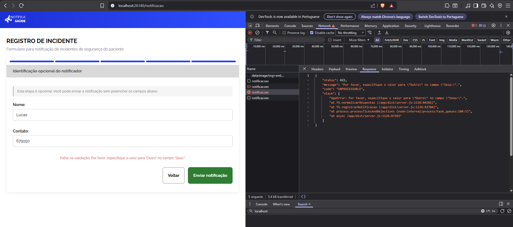{ loading=lazy }

    ```bash
    curl 'http://localhost:26141/api/notificacoes' \
    -H 'Accept: */*' \
    -H 'Accept-Language: pt-BR,pt;q=0.5' \
    -H 'Cache-Control: no-cache' \
    -H 'Connection: keep-alive' \
    -H 'Content-Type: application/json' \
    -H 'Origin: http://localhost:26140' \
    -H 'Pragma: no-cache' \
    -H 'Referer: http://localhost:26140/' \
    -H 'Sec-Fetch-Dest: empty' \
    -H 'Sec-Fetch-Mode: cors' \
    -H 'Sec-Fetch-Site: same-site' \
    -H 'Sec-GPC: 1' \
    -H 'User-Agent: Mozilla/5.0 (Windows NT 10.0; Win64; x64) AppleWebKit/537.36 (KHTML, like Gecko) Chrome/147.0.0.0 Safari/537.36' \
    -H 'sec-ch-ua: "Brave";v="147", "Not.A/Brand";v="8", "Chromium";v="147"' \
    -H 'sec-ch-ua-mobile: ?0' \
    -H 'sec-ch-ua-platform: "Windows"' \
    --data-raw '{"anonima":false,"unidade_id":"3a7f2d42-528d-45d5-8c2e-6c2cd4131e3a","setor_id":"21d6da61-1b39-4c4c-b244-6e554f106423","data_incidente":"2026-04-15T00:00:00.000Z","respostas":[{"campo_id":"55555555-5555-4555-b555-000000000010","valor_opcao_id":"3a7f2d42-528d-45d5-8c2e-6c2cd4131e3a"},{"campo_id":"55555555-5555-4555-b555-000000000000","valor_opcao_id":"accdd0e6-fefb-42cf-88da-d3dd29045d5c"},{"campo_id":"55555555-5555-4555-b555-000000000001","valor_opcao_id":"d71ccbe2-e8f5-40ff-beee-912ddad27799"},{"campo_id":"55555555-5555-4555-b555-000000000002","valor_opcao_id":"9716598f-2b06-4b51-ade3-dff390eb6a2b"},{"campo_id":"55555555-5555-4555-b555-000000000008","valor":"2026-04-15"},{"campo_id":"55555555-5555-4555-b555-000000000009","valor_opcao_id":"6ec2195d-ed29-4450-822b-8519434dd9d9"},{"campo_id":"55555555-5555-4555-b555-000000000003","valor_opcao_id":"21d6da61-1b39-4c4c-b244-6e554f106423"},{"campo_id":"55555555-5555-4555-b555-000000000004","valor":"rstrstrst"},{"campo_id":"55555555-5555-4555-b555-000000000005","valor_opcao_id":"083acc56-49be-4ef8-8e13-eb83ea2f8199"},{"campo_id":"55555555-5555-4555-b555-000000000006","valor":"Lucas"},{"campo_id":"55555555-5555-4555-b555-000000000007","valor":"679150"}]}'
    ```

    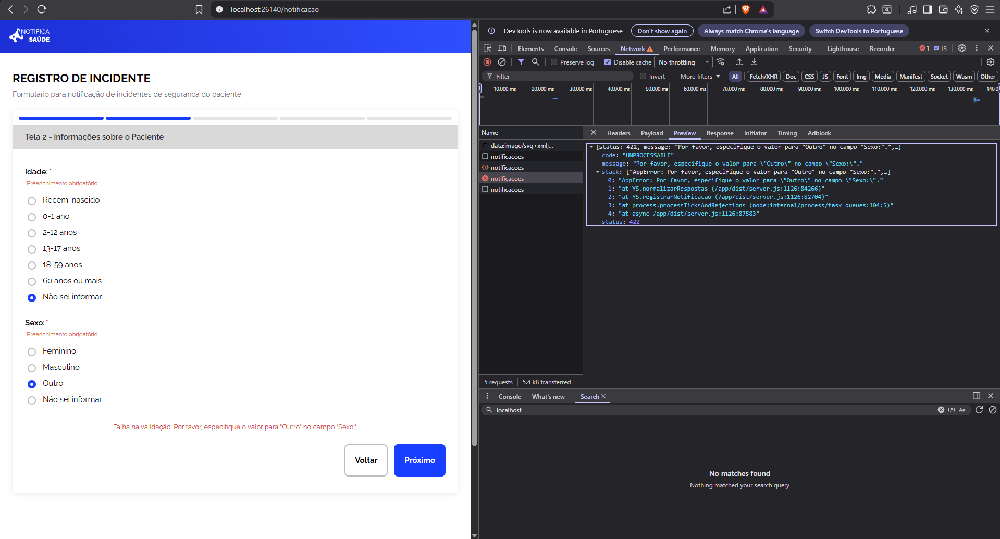{ loading=lazy }

<a id="bug-front-002"></a>

??? bug "BUG-FRONT-002 · #19 · Validação incorreta do campo “Especificação (Outro)” em exibição dinâmica"

    <div class="ns-bug-meta" markdown>
    <span><span class="ns-dec-rotulo">Status</span><span class="ns-status ns-status--encerrado">Fechado</span></span>
    <span><span class="ns-dec-rotulo">Severidade</span><span class="ns-nivel ns-nivel--alta">Alta</span></span>
    <span><span class="ns-dec-rotulo">Reportado por</span>Pedro Soledade</span>
    <span><span class="ns-dec-rotulo">Designado para</span>Luigi Almeida</span>
    </div>

    **Justificativa da severidade:** Afeta diretamente a integridade dos dados e a regra de negócio do sistema.

    **Resumo**

    Validação incorreta do campo “Especificação (Outro)” em formulários com exibição dinâmica. O sistema permite avançar no fluxo mesmo quando o campo obrigatório não é preenchido após selecionar a opção “Outro”.

    **Passos para reprodução**

    1.  Acessar as telas que possuem exibição dinâmica de campos (Tela 2 ou Tela 3).
    2.  Selecionar a opção “Outro” em um campo de seleção.
    3.  Observar a exibição do campo adicional de especificação.
    4.  Tentar avançar no fluxo sem preencher o campo de especificação.

    **Resultado esperado**

    Ao selecionar a opção “Outro”:

    - O campo de especificação deve ser obrigatório;
    - O sistema deve impedir o avanço caso o campo esteja vazio;
    - Deve ser exibida uma mensagem de erro clara informando a obrigatoriedade do preenchimento.

    **Resultado obtido**

    - O sistema permite avançar no fluxo mesmo com o campo de especificação vazio, sem exibir mensagem de erro.

    **Observações**

    - O problema ocorre em múltiplas telas (Tela 2 e Tela 3), indicando possível falha na lógica compartilhada de validação.
    - Estar relacionado à validação condicional não aplicada corretamente no frontend.
    - Risco de persistência de dados incompletos ou inconsistentes.

    **Evidência**

    *Não informado.*

<a id="bug-front-003"></a>

??? bug "BUG-FRONT-003 · #33 · Adicionar data-testid no wrapper do campo de seleção de instituição"

    <div class="ns-bug-meta" markdown>
    <span><span class="ns-dec-rotulo">Status</span><span class="ns-status ns-status--encerrado">Fechado</span></span>
    <span><span class="ns-dec-rotulo">Severidade</span><span class="ns-nivel ns-nivel--media">Média</span></span>
    <span><span class="ns-dec-rotulo">Reportado por</span>Fábio Ramos</span>
    <span><span class="ns-dec-rotulo">Designado para</span>Fábio Ramos</span>
    </div>

    **Resumo**

    O campo "Em qual instituição de saúde ocorreu o incidente?" não possui data-testid no elemento wrapper. Apenas os \<input\> individuais possuem testids no formato field-55555555-5555-4555-b555-000000000010-option-{uuid}.

    O page object NotificacaoPage dos testes E2E usa getByTestId('field-55555555-5555-4555-b555-000000000010') para localizar o grupo de campos, o que falha pois nenhum elemento wrapper possui esse atributo. Isso causa timeout em 31 testes (CT-FUN-001, CT-FUN-002, CT-NF-003, CT-NF-004) nos três browsers.

    **Passos para reprodução**

    *Não informado.*

    **Resultado esperado**

    - Elemento wrapper do grupo de radio buttons da instituição possui data-testid="field-55555555-5555-4555-b555-000000000010"
    - Locator getByTestId('field-55555555-5555-4555-b555-000000000010').getByRole('radio').first() encontra o primeiro radio button
    - Testes E2E CT-FUN-001 e CT-FUN-002 (Tela 1) passam sem timeout nos três browsers

    **Observações**

    - Repositório E2E: Notifica-Saude/notifica-saude-e2e
    - Page object afetado: page-objects/NotificacaoPage.ts — locator selectInstituicao
    - Testids já existentes nos inputs: field-55555555-5555-4555-b555-000000000010-option-{uuid}

    **Evidência**

    *Não informado.*

<a id="bug-front-004"></a>

??? bug "BUG-FRONT-004 · #53 · Descrições de notificação muito grandes não são exibidas adequadamente na tela"

    <div class="ns-bug-meta" markdown>
    <span><span class="ns-dec-rotulo">Status</span><span class="ns-status ns-status--encerrado">Fechado</span></span>
    <span><span class="ns-dec-rotulo">Severidade</span><span class="ns-nivel ns-nivel--media">Média</span></span>
    <span><span class="ns-dec-rotulo">Reportado por</span>Lucas Gonçalves</span>
    <span><span class="ns-dec-rotulo">Designado para</span>Luigi Almeida</span>
    </div>

    **Resumo**

    *Não informado.*

    **Passos para reprodução**

    *Não informado.*

    **Resultado esperado**

    - Quando a descrição do incidente é muito grande ela some da tela ficando em apenas uma linha

    **Observações**

    *Não informado.*

    **Evidência**

    *Não informado.*

<a id="bug-front-005"></a>

??? bug "BUG-FRONT-005 · #36 · Ajuste de detalhes de UI/UX após testes exploratórios"

    <div class="ns-bug-meta" markdown>
    <span><span class="ns-dec-rotulo">Status</span><span class="ns-status ns-status--encerrado">Fechado</span></span>
    <span><span class="ns-dec-rotulo">Severidade</span><span class="ns-nivel ns-nivel--media">Média</span></span>
    <span><span class="ns-dec-rotulo">Reportado por</span>Luigi Almeida</span>
    <span><span class="ns-dec-rotulo">Designado para</span>Luigi Almeida</span>
    </div>

    **Resumo**

    - O campo "Contato" não deixava claro para o usuário quais informações poderiam ser inseridas (email ou telefone), gerando incerteza e possíveis erros de preenchimento.
    - Ao avançar para a próxima etapa do formulário, a tela não reposicionava o usuário no início do novo step, prejudicando a continuidade da experiência e podendo causar confusão.

    **Passos para reprodução**

    *Não informado.*

    **Resultado esperado**

    - Adicionar um placeholder explicativo no campo "Contato" com o formato: Celular: ( ) \_- ou email: email@gmail.com, tornando explícitas as opções de preenchimento.
    - Implementar comportamento de scroll automático ao clicar no botão "Próximo", garantindo que o usuário seja levado ao topo da próxima etapa:  
        - Scroll suave (smooth scroll)  
        - Foco no início do conteúdo (primeiro campo do step)

    **Observações**

    *Não informado.*

    **Evidência**

    *Não informado.*

<a id="bug-front-006"></a>

??? bug "BUG-FRONT-006 · #43 · Não deveria ser possível editar status na tela de detalhes de notificação"

    <div class="ns-bug-meta" markdown>
    <span><span class="ns-dec-rotulo">Status</span><span class="ns-status ns-status--encerrado">Fechado</span></span>
    <span><span class="ns-dec-rotulo">Severidade</span><span class="ns-nivel ns-nivel--media">Média</span></span>
    <span><span class="ns-dec-rotulo">Reportado por</span>Lucas Gonçalves</span>
    <span><span class="ns-dec-rotulo">Designado para</span>Luigi Almeida</span>
    </div>

    **Resumo**

    - Foi conversado que o status não seria editável manualmente e que seria alterado de acordo com o fluxo da notificação, portanto não deveria ser possível alterar o elemento de status, apenas ser exibido o status atual

    **Passos para reprodução**

    *Não informado.*

    **Resultado esperado**

    *Não informado.*

    **Observações**

    *Não informado.*

    **Evidência**

    *Não informado.*

<a id="bug-front-007"></a>

??? bug "BUG-FRONT-007 · #44 · Data do incidente é exibida incorretamente nos detalhes de notificação"

    <div class="ns-bug-meta" markdown>
    <span><span class="ns-dec-rotulo">Status</span><span class="ns-status ns-status--encerrado">Fechado</span></span>
    <span><span class="ns-dec-rotulo">Severidade</span><span class="ns-nivel ns-nivel--media">Média</span></span>
    <span><span class="ns-dec-rotulo">Reportado por</span>Lucas Gonçalves</span>
    <span><span class="ns-dec-rotulo">Designado para</span>Luigi Almeida</span>
    </div>

    **Resumo**

    - A data exibida do ocorrido/incidente está exibindo a Data - 1 dia, exemplo: 08/05/2026 é exibido incorretamente como 07/05/2026

    **Passos para reprodução**

    *Não informado.*

    **Resultado esperado**

    *Não informado.*

    **Observações**

    *Não informado.*

    **Evidência**

    *Não informado.*

<a id="bug-front-008"></a>

??? bug "BUG-FRONT-008 · #45 · Em telas pequenas não é possível visualizar o histórico de alterações"

    <div class="ns-bug-meta" markdown>
    <span><span class="ns-dec-rotulo">Status</span><span class="ns-status ns-status--encerrado">Fechado</span></span>
    <span><span class="ns-dec-rotulo">Severidade</span><span class="ns-nivel ns-nivel--media">Média</span></span>
    <span><span class="ns-dec-rotulo">Reportado por</span>Lucas Gonçalves</span>
    <span><span class="ns-dec-rotulo">Designado para</span>Luigi Almeida</span>
    </div>

    **Resumo**

    - Em telas pequenas não é possível visualizar o histórico de alterações na tela de detalhes da notificação

    **Passos para reprodução**

    *Não informado.*

    **Resultado esperado**

    *Não informado.*

    **Observações**

    *Não informado.*

    **Evidência**

    *Não informado.*

<a id="bug-front-009"></a>

??? bug "BUG-FRONT-009 · #46 · Em telas pequenas não é possível visualizar o botão para continuar a classificação"

    <div class="ns-bug-meta" markdown>
    <span><span class="ns-dec-rotulo">Status</span><span class="ns-status ns-status--encerrado">Fechado</span></span>
    <span><span class="ns-dec-rotulo">Severidade</span><span class="ns-nivel ns-nivel--media">Média</span></span>
    <span><span class="ns-dec-rotulo">Reportado por</span>Lucas Gonçalves</span>
    <span><span class="ns-dec-rotulo">Designado para</span>Luigi Almeida</span>
    </div>

    **Resumo**

    - Em telas pequenas não é possível visualizar o botão para continuar a classificação

    **Passos para reprodução**

    *Não informado.*

    **Resultado esperado**

    *Não informado.*

    **Observações**

    *Não informado.*

    **Evidência**

    *Não informado.*

<a id="bug-front-010"></a>

??? bug "BUG-FRONT-010 · #47 · Em telas pequenas os modal de editar notificação e classificar incidente são sobrepostos pela sidebar"

    <div class="ns-bug-meta" markdown>
    <span><span class="ns-dec-rotulo">Status</span><span class="ns-status ns-status--encerrado">Fechado</span></span>
    <span><span class="ns-dec-rotulo">Severidade</span><span class="ns-nivel ns-nivel--media">Média</span></span>
    <span><span class="ns-dec-rotulo">Reportado por</span>Lucas Gonçalves</span>
    <span><span class="ns-dec-rotulo">Designado para</span>Luigi Almeida</span>
    </div>

    **Resumo**

    - Em telas pequenas os modal de editar notificação e classificar incidente são sobrepostos pela sidebar

    **Passos para reprodução**

    *Não informado.*

    **Resultado esperado**

    *Não informado.*

    **Observações**

    *Não informado.*

    **Evidência**

    *Não informado.*

<a id="bug-front-011"></a>

??? bug "BUG-FRONT-011 · #48 · No componente de edição de campo quando está selecionado a opção de &quot;Outro&quot; não é exibido opção de inserir valor personalizado"

    <div class="ns-bug-meta" markdown>
    <span><span class="ns-dec-rotulo">Status</span><span class="ns-status ns-status--encerrado">Fechado</span></span>
    <span><span class="ns-dec-rotulo">Severidade</span><span class="ns-nivel ns-nivel--media">Média</span></span>
    <span><span class="ns-dec-rotulo">Reportado por</span>Lucas Gonçalves</span>
    <span><span class="ns-dec-rotulo">Designado para</span>Luigi Almeida</span>
    </div>

    **Resumo**

    - No componente de edição ao selecionar a opção "Outro" (ou quando já vier previamente selecionada) não é possível visualizar ou alterar o valor personalizado

    **Passos para reprodução**

    *Não informado.*

    **Resultado esperado**

    Em um componente de edição ao selecionar a opção "Outro" (ou quando já vier previamente selecionada) deve ser possível alterar o valor personalizado

    **Observações**

    *Não informado.*

    **Evidência**

    *Não informado.*

<a id="bug-front-012"></a>

??? bug "BUG-FRONT-012 · #49 · Opção de &quot;Outro&quot; não exibe o valor personalizado na página de detalhes da notificação"

    <div class="ns-bug-meta" markdown>
    <span><span class="ns-dec-rotulo">Status</span><span class="ns-status ns-status--encerrado">Fechado</span></span>
    <span><span class="ns-dec-rotulo">Severidade</span><span class="ns-nivel ns-nivel--media">Média</span></span>
    <span><span class="ns-dec-rotulo">Reportado por</span>Lucas Gonçalves</span>
    <span><span class="ns-dec-rotulo">Designado para</span>Luigi Almeida</span>
    </div>

    **Resumo**

    - Opções "Outro" exibir o valor personalizado que foi preenchido, por exemplo, "Outro - OTR"

    **Passos para reprodução**

    *Não informado.*

    **Resultado esperado**

    Opções "Outro" não é exibido o valor personalizado que foi preenchido, por exemplo, "Outro"

    **Observações**

    *Não informado.*

    **Evidência**

    *Não informado.*

<a id="bug-front-013"></a>

??? bug "BUG-FRONT-013 · #50 · Opções &quot;Outro&quot; exibir o valor personalizado que foi preenchido, por exemplo, &quot;Outro - OTR&quot;"

    <div class="ns-bug-meta" markdown>
    <span><span class="ns-dec-rotulo">Status</span><span class="ns-status ns-status--encerrado">Fechado</span></span>
    <span><span class="ns-dec-rotulo">Severidade</span><span class="ns-nivel ns-nivel--media">Média</span></span>
    <span><span class="ns-dec-rotulo">Reportado por</span>Lucas Gonçalves</span>
    <span><span class="ns-dec-rotulo">Designado para</span>Luigi Almeida</span>
    </div>

    **Resumo**

    - Opções "Outro" exibir o valor personalizado que foi preenchido, por exemplo, "Outro - OTR"

    **Passos para reprodução**

    *Não informado.*

    **Resultado esperado**

    Opções "Outro" não é exibido o valor personalizado que foi preenchido, por exemplo, "Outro"

    **Observações**

    *Não informado.*

    **Evidência**

    *Não informado.*

<a id="bug-front-014"></a>

??? bug "BUG-FRONT-014 · #51 · É possível inserir mais caracteres que o limite estabelecido para o campo de observação"

    <div class="ns-bug-meta" markdown>
    <span><span class="ns-dec-rotulo">Status</span><span class="ns-status ns-status--encerrado">Fechado</span></span>
    <span><span class="ns-dec-rotulo">Severidade</span><span class="ns-nivel ns-nivel--media">Média</span></span>
    <span><span class="ns-dec-rotulo">Reportado por</span>Lucas Gonçalves</span>
    <span><span class="ns-dec-rotulo">Designado para</span>Luigi Almeida</span>
    </div>

    **Resumo**

    - Não ser possível inserir mais de 400 caracteres no campo de observação, ser informado do limite de caracteres

    **Passos para reprodução**

    *Não informado.*

    **Resultado esperado**

    É possível inserir mais de 400 caracteres no campo de observação, a interface mantém o botão habilitado que permite enviar a requisição que responde com erro por conta da limitação de caracteres estabelecida. Também não é exibido nenhuma mensagem a respeito do limite de caracteres

    [DOC_Requisitos: US 2.3 - CA 3.6](https://docs.google.com/document/d/1E5tC2LmNpPxyaPzeelIQwNr0f4nSFRn5/edit?usp=sharing&ouid=112143800728076005126&rtpof=true&sd=true)

    **Observações**

    *Não informado.*

    **Evidência**

    *Não informado.*

<a id="bug-front-015"></a>

??? bug "BUG-FRONT-015 · #52 · Na busca quando selecionado &quot;Evento Adverso&quot; não é possível de nenhuma forma selecionar o grau de dano"

    <div class="ns-bug-meta" markdown>
    <span><span class="ns-dec-rotulo">Status</span><span class="ns-status ns-status--encerrado">Fechado</span></span>
    <span><span class="ns-dec-rotulo">Severidade</span><span class="ns-nivel ns-nivel--media">Média</span></span>
    <span><span class="ns-dec-rotulo">Reportado por</span>Lucas Gonçalves</span>
    <span><span class="ns-dec-rotulo">Designado para</span>Luigi Almeida</span>
    </div>

    **Resumo**

    - Quando selecionado "Evento Adverso" ser possível selecionar também o grau de dano (por padrão vir selecionado "Todos graus de dano")

    **Passos para reprodução**

    *Não informado.*

    **Resultado esperado**

    Quando selecionado "Evento Adverso" não é possível de nenhuma forma selecionar o grau de dano

    **Observações**

    *Não informado.*

    **Evidência**

    *Não informado.*

<a id="bug-front-016"></a>

??? bug "BUG-FRONT-016 · #57 · Campo &quot;Especifique&quot; não é validado ao selecionar &quot;Outro&quot; no setor da notificação de incidente"

    <div class="ns-bug-meta" markdown>
    <span><span class="ns-dec-rotulo">Status</span><span class="ns-status ns-status--encerrado">Fechado</span></span>
    <span><span class="ns-dec-rotulo">Severidade</span><span class="ns-nivel ns-nivel--media">Média</span></span>
    <span><span class="ns-dec-rotulo">Reportado por</span>Pedro Silva Soledade</span>
    <span><span class="ns-dec-rotulo">Designado para</span>Luigi Almeida</span>
    </div>

    **Resumo**

    - No formulário de notificação de incidente, ao selecionar a opção "Outro" no campo de setor, o campo "Especifique" é exibido como obrigatório, porém o sistema permite avançar sem preenchê-lo.

    **Passos para reprodução**

    1.  Acessar o formulário de notificação de incidente.
    2.  Preencher campos anteriores corretamente
    3.  No campo Setor, selecionar a opção "Outro".
    4.  Verificar que o campo "Especifique" é exibido como obrigatório.
    5.  Tentar avançar sem preencher o campo "Especifique".

    **Resultado esperado**

    O sistema deve impedir o avanço do formulário enquanto o campo "Especifique" não for preenchido quando a opção "Outro" estiver selecionada.

    **Observações**

    - O comportamento indica ausência ou falha na validação obrigatória do campo condicionado à opção "Outro".

    **Evidência**

    - Campo "Especifique" aparece como obrigatório visualmente, mas sem bloqueio de avanço ao permanecer vazio.

    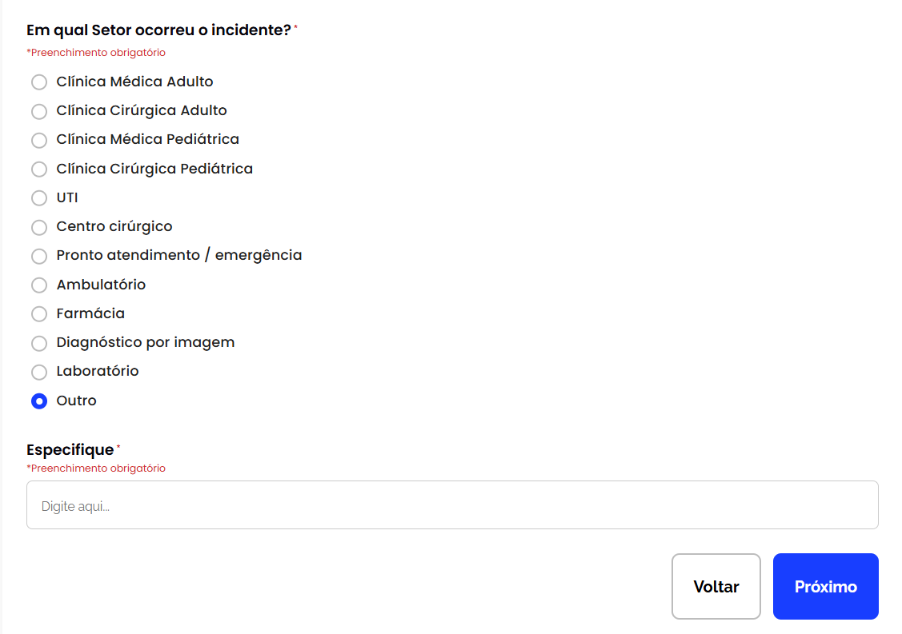{ loading=lazy }

<a id="bug-front-017"></a>

??? bug "BUG-FRONT-017 · #58 · Filtro &quot;Never Event&quot; não retorna notificações classificadas no grau de dano em Evento Adverso"

    <div class="ns-bug-meta" markdown>
    <span><span class="ns-dec-rotulo">Status</span><span class="ns-status ns-status--encerrado">Fechado</span></span>
    <span><span class="ns-dec-rotulo">Severidade</span><span class="ns-nivel ns-nivel--media">Média</span></span>
    <span><span class="ns-dec-rotulo">Reportado por</span>Pedro Silva Soledade</span>
    <span><span class="ns-dec-rotulo">Designado para</span>Luigi Almeida</span>
    </div>

    **Resumo**

    - Ao utilizar o filtro Evento Adverso e selecionar o grau de dano "Never Event", as notificações classificadas com esse grau não são exibidas na listagem.

    **Passos para reprodução**

    6.  Acessar a tela de listagem de notificações.
    7.  Selecionar o filtro Evento Adverso.
    8.  No filtro de Grau de dano, selecionar a opção "Never Event".
    9.  Aplicar o filtro e observar os resultados retornados.

    **Resultado esperado**

    O sistema deve impedir o avanço do formulário enquanto o campo "Especifique" não for preenchido quando a opção "Outro" estiver selecionada.

    **Observações**

    - O problema pode estar relacionado ao mapeamento do valor do filtro ou à consulta utilizada na busca.
    - Validar se o valor salvo no banco corresponde exatamente ao valor enviado pelo filtro.

    **Evidência**

    - Ao aplicar o filtro "Never Event", a listagem retorna vazia mesmo existindo notificações cadastradas com essa classificação.

    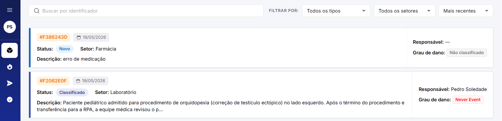{ loading=lazy }

    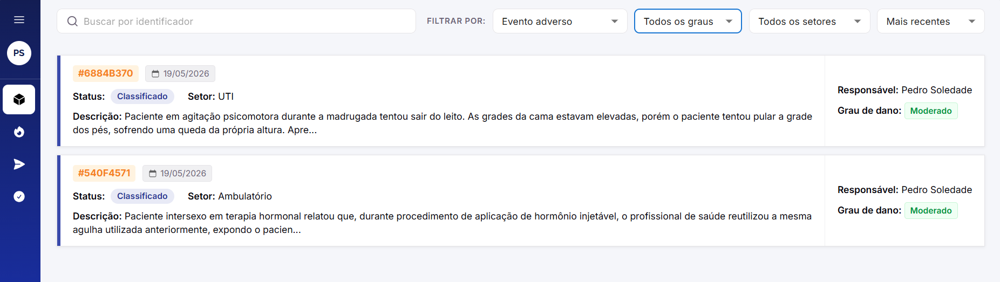{ loading=lazy }

    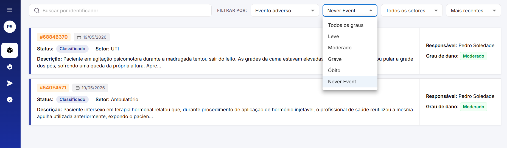{ loading=lazy }

<a id="bug-front-018"></a>

??? bug "BUG-FRONT-018 · #59 · Botão &quot;Salvar&quot; finaliza classificação de notificação indevidamente"

    <div class="ns-bug-meta" markdown>
    <span><span class="ns-dec-rotulo">Status</span><span class="ns-status ns-status--encerrado">Fechado</span></span>
    <span><span class="ns-dec-rotulo">Severidade</span><span class="ns-nivel ns-nivel--media">Média</span></span>
    <span><span class="ns-dec-rotulo">Reportado por</span>Pedro Silva Soledade</span>
    <span><span class="ns-dec-rotulo">Designado para</span>Luigi Almeida</span>
    </div>

    **Resumo**

    - Ao classificar uma notificação recebida, ao preencher os campos e clicar em "Salvar rascunho" em vez de "Finalizar", a notificação é finalizada indevidamente. O mesmo comportamento ocorre quando apenas os campos selecionáveis são preenchidos e a descrição permanece vazia.

    **Passos para reprodução**

    1.  Acessar uma notificação recebida para classificação.
    2.  Preencher todos os campos selecionáveis da classificação.
    3.  Escrever uma descrição
    4.  Clicar no botão "Salvar rascunho".
    5.  Observar o status da notificação após a ação.

    ### Cenário adicional

    1.  Preencher apenas os campos selecionáveis da classificação.
    2.  Deixar o campo de descrição vazio.
    3.  Clicar em "Salvar rascunho".
    4.  Observar que a notificação também é finalizada.

    ### Cenário adicional (erro 404)

    1.  Preencher apenas alguns dos campos selecionáveis da classificação.
    2.  Escrever uma descrição
    3.  Clicar em "Salvar rascunho".
    4.  Observar que a notificação também é finalizada.

    **Resultado esperado**

    - O botão "Salvar rascunho" deve apenas salvar o progresso da classificação sem finalizar a notificação.
    - A notificação só deve ser finalizada ao clicar explicitamente em "Finalizar".
    - O sistema deve validar o preenchimento obrigatório da descrição antes de permitir a finalização.

    **Observações**

    - Possível falha na distinção entre as ações de salvar rascunho e finalizar classificação.
    - Validar regras de obrigatoriedade da descrição antes de alterar o status da notificação.

    **Evidência**

    - Ação de Salvar altera o status da notificação para finalizado mesmo sem confirmação explícita ou preenchimento completo da classificação.

    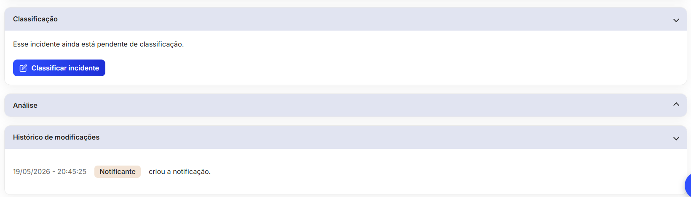{ loading=lazy }

    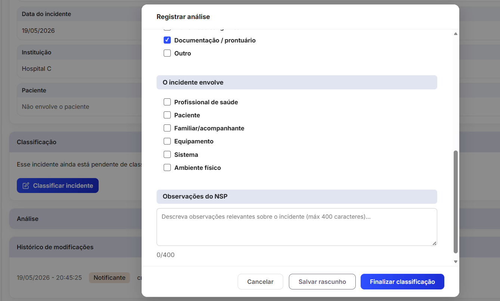{ loading=lazy }

    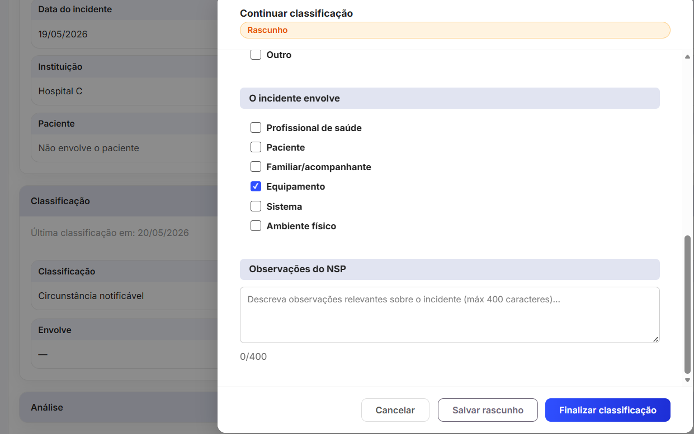{ loading=lazy }

    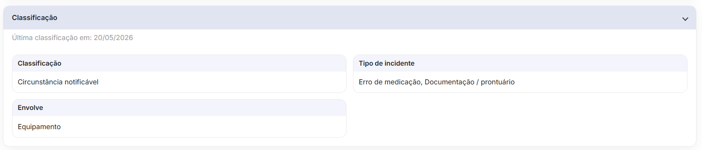{ loading=lazy }

    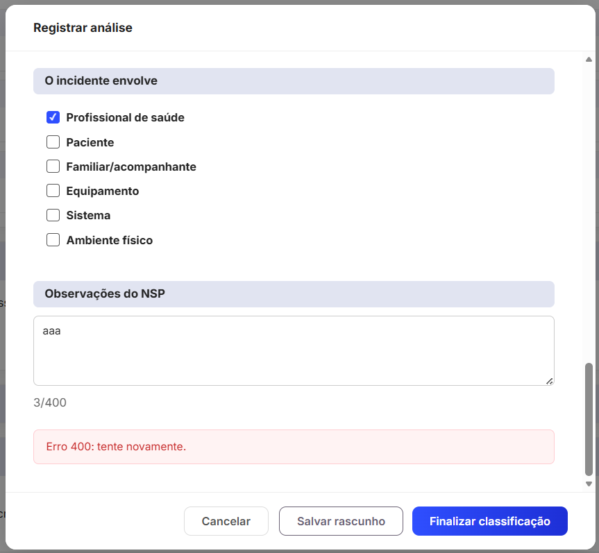{ loading=lazy }

### 3.2 Back-end { #back-end }

<div class="ns-bug-tabela" markdown>

| ID | Issue | Título | Severidade | Status | Responsáveis |
| --- | --- | --- | --- | --- | --- |
| [BUG-BACK-001](#bug-back-001) | #9 | Main não está passando no type-check do typescript (defeitos nos testes unitários) | <span class="ns-nivel ns-nivel--alta">Alta</span> | <span class="ns-status ns-status--encerrado">Fechado</span> | Lucas Gonçalves<br><span class="ns-bug-dest">→ Fábio Ramos</span> |
| [BUG-BACK-002](#bug-back-002) | #15 | Erro 500 ao usar o GET nos campos ativos do formulário | <span class="ns-nivel ns-nivel--alta">Alta</span> | <span class="ns-status ns-status--encerrado">Fechado</span> | Luigi Almeida<br><span class="ns-bug-dest">→ Fábio Ramos</span> |
| [BUG-BACK-003](#bug-back-003) | #19 | Tornar entidade_relacional opcional (nullable) em CampoComOpcoes | <span class="ns-nivel ns-nivel--media">Média</span> | <span class="ns-status ns-status--encerrado">Fechado</span> | Aline Hirokawa<br><span class="ns-bug-dest">→ Fábio Ramos</span> |
| [BUG-BACK-004](#bug-back-004) | #47 | Seed usa deleteMany+createMany em OpcaoCampo causando risco de violação de FK | <span class="ns-nivel ns-nivel--media">Média</span> | <span class="ns-status ns-status--encerrado">Fechado</span> | Fábio Ramos<br><span class="ns-bug-dest">→ Fábio Ramos</span> |
| [BUG-BACK-005](#bug-back-005) | #48 | Substituir console.* por logger Pino em conformidade com ADR-0013 | <span class="ns-nivel ns-nivel--media">Média</span> | <span class="ns-status ns-status--encerrado">Fechado</span> | Fábio Ramos<br><span class="ns-bug-dest">→ Fábio Ramos</span> |
| [BUG-BACK-006](#bug-back-006) | #52 | Validar complexidade de senha no schema de criação de usuário | <span class="ns-nivel ns-nivel--media">Média</span> | <span class="ns-status ns-status--encerrado">Fechado</span> | Fábio Ramos<br><span class="ns-bug-dest">→ Fábio Ramos</span> |
| [BUG-BACK-007](#bug-back-007) | #63 | PUT /api/notificacoes/{id} Não atualiza o valor textual de "Outro" no campo sexo | <span class="ns-nivel ns-nivel--media">Média</span> | <span class="ns-status ns-status--encerrado">Fechado</span> | Lucas Gonçalves<br><span class="ns-bug-dest">→ Lucas Gonçalves</span> |
| [BUG-BACK-008](#bug-back-008) | #97 | Corrige porta fixa no healthcheck do Dockerfile | <span class="ns-nivel ns-nivel--media">Média</span> | <span class="ns-status ns-status--encerrado">Fechado</span> | Fábio Ramos<br><span class="ns-bug-dest">→ Fábio Ramos</span> |

</div>

<a id="bug-back-001"></a>

??? bug "BUG-BACK-001 · #9 · Main não está passando no type-check do typescript (defeitos nos testes unitários)"

    <div class="ns-bug-meta" markdown>
    <span><span class="ns-dec-rotulo">Status</span><span class="ns-status ns-status--encerrado">Fechado</span></span>
    <span><span class="ns-dec-rotulo">Severidade</span><span class="ns-nivel ns-nivel--alta">Alta</span></span>
    <span><span class="ns-dec-rotulo">Reportado por</span>Lucas Gonçalves</span>
    <span><span class="ns-dec-rotulo">Designado para</span>Fábio Ramos</span>
    </div>

    **Justificativa da severidade:** Impede validação de tipos e pode bloquear pipelines de CI/CD.

    **Resumo**

    A branch main não está passando na verificação de tipos do TypeScript (npm run type-check) devido a erros nos testes unitários relacionados à ausência do atributo obrigatório entidade_relacional.

    **Passos para reprodução**

    1.  Executar o comando: npm run type-check
    2.  Observar erros de tipagem nos testes unitários dentro de:

    - opcao-campo.create.spec.ts
    - opcao-campo.listByCampo.spec.ts
    - opcao-campo.update.spec.ts

    3.  Verificar que os mocks (makeCampo) não incluem a propriedade entidade_relacional.

    **Resultado esperado**

    - A verificação de tipos deve ser concluída com sucesso, sem erros, garantindo consistência entre as tipagens do Prisma e os objetos utilizados nos testes.

    **Observações**

    - O erro ocorre porque entidade_relacional é obrigatório na tipagem gerada pelo Prisma, mas não está sendo incluído nos objetos mockados nos testes.
    - Há inconsistência entre a modelagem atual e os testes unitários.
    - Possíveis soluções:
        - Tornar entidade_relacional opcional (ou nullable) na tipagem/modelo.
        - Ajustar os mocks (makeCampo) para incluir entidade_relacional.

    **Evidência**

    error TS2345: Property 'entidade_relacional' is missing in type '{ ... }' but required in type '{ ... entidade_relacional: EntidadeRelacional \| null; ... }'.

    Found 10 errors in 3 files.

<a id="bug-back-002"></a>

??? bug "BUG-BACK-002 · #15 · Erro 500 ao usar o GET nos campos ativos do formulário"

    <div class="ns-bug-meta" markdown>
    <span><span class="ns-dec-rotulo">Status</span><span class="ns-status ns-status--encerrado">Fechado</span></span>
    <span><span class="ns-dec-rotulo">Severidade</span><span class="ns-nivel ns-nivel--alta">Alta</span></span>
    <span><span class="ns-dec-rotulo">Reportado por</span>Luigi Almeida</span>
    <span><span class="ns-dec-rotulo">Designado para</span>Fábio Ramos</span>
    </div>

    **Justificativa da severidade:** Impede o carregamento dos campos do formulário, bloqueando funcionalidade essencial da aplicação.

    **Resumo**

    Erro 500 ao realizar requisição GET para listar campos ativos do formulário. O problema ocorre porque o Prisma está tentando acessar uma coluna inexistente no banco de dados.

    **Passos para reprodução**

    1.  Implementar no front-end a chamada GET utilizando axios para buscar os campos do formulário.
    2.  Acessar a tela que consome o hook useCamposFormulario.ts.
    3.  Observar falha ao carregar os dados.
    4.  Verificar resposta da API retornando erro 500.

    **Resultado esperado**

    - A requisição GET deve retornar corretamente a lista de campos ativos do formulário, ordenados conforme a propriedade definida, sem erros no servidor.

    **Observações**

    - Conforme analisado, o reportante estava com a versão desatualizado do container e com isso gerou inconsistência.

    **Evidência**

    *Não informado.*

<a id="bug-back-003"></a>

??? bug "BUG-BACK-003 · #19 · Tornar entidade_relacional opcional (nullable) em CampoComOpcoes"

    <div class="ns-bug-meta" markdown>
    <span><span class="ns-dec-rotulo">Status</span><span class="ns-status ns-status--encerrado">Fechado</span></span>
    <span><span class="ns-dec-rotulo">Severidade</span><span class="ns-nivel ns-nivel--media">Média</span></span>
    <span><span class="ns-dec-rotulo">Reportado por</span>Aline Hirokawa</span>
    <span><span class="ns-dec-rotulo">Designado para</span>Fábio Ramos</span>
    </div>

    **Justificativa da severidade:** Impacta execução de testes e modelagem correta de dados, mas possui workaround temporário.

    **Resumo**

    O atributo entidade_relacional na entidade **CampoComOpcoes** está sendo tratado como obrigatório, impedindo a execução de testes unitários quando seu valor é null. Isso afeta cenários válidos onde o campo não possui vínculo com entidade relacional (ex: SELECT com opções fixas).

    **Passos para reprodução**

    1.  Executar os testes unitários:

    - campo-formulario.alterarStatus.spec.ts
    - campo-formulario.criarCampo.spec.ts
    - campo-formulario.listar.spec.ts

    2.  Observar a falha ao instanciar ou manipular objetos onde entidade_relacional = null.

    **Resultado esperado**

    - O atributo entidade_relacional deve ser opcional e aceitar valores null, permitindo representar corretamente campos sem vínculo relacional e garantindo a execução dos testes sem erro.

    **Observações**

    - Existem tipos de campos (ex: SELECT com opções fixas) que não necessitam de entidade relacional.
    - A tipagem atual não contempla esse cenário, gerando inconsistência entre regra de negócio e modelo.

    **Evidência**

    *Não informado.*

<a id="bug-back-004"></a>

??? bug "BUG-BACK-004 · #47 · Seed usa deleteMany+createMany em OpcaoCampo causando risco de violação de FK"

    <div class="ns-bug-meta" markdown>
    <span><span class="ns-dec-rotulo">Status</span><span class="ns-status ns-status--encerrado">Fechado</span></span>
    <span><span class="ns-dec-rotulo">Severidade</span><span class="ns-nivel ns-nivel--media">Média</span></span>
    <span><span class="ns-dec-rotulo">Reportado por</span>Fábio Ramos</span>
    <span><span class="ns-dec-rotulo">Designado para</span>Fábio Ramos</span>
    </div>

    **Resumo**

    A seed atual deleta todas as OpcaoCampo de um campo e as recria com novos UUIDs (deleteMany + createMany). Isso apresenta dois riscos críticos:

    1.  FK violation em runtime: se existirem RespostaCampo com valor_opcao_id referenciando as opções deletadas, a seed falha com erro de integridade referencial.
    2.  Órfãos silenciosos: se o banco não enforcar a FK com RESTRICT, respostas históricas ficam com valor_opcao_id apontando para IDs inexistentes — corrompendo o histórico de notificações.

    RespostaCampo.valor_opcao_id é FK para OpcaoCampo.id. O schema não define onDelete explícito (padrão Restrict no PostgreSQL). Logo, qualquer re-seed com dados reais existentes quebrará.

    **Passos para reprodução**

    *Não informado.*

    **Resultado esperado**

    - A seed não deleta OpcaoCampo que possuam RespostaCampo vinculadas
    - Opções removidas ou renomeadas usam soft-delete (ativo = false) ou upsert idempotente por (campo_id, valor)
    - Re-execução da seed em banco com respostas existentes não gera erro de FK nem corrompe histórico
    - Respostas históricas continuam legíveis após re-seed (via label_original ou valor_opcao_id válido)

    **Observações**

    Trecho problemático em prisma/seed.ts (linha ~363):

    - await prisma.opcaoCampo.deleteMany({ where: { campo_id: { in: \[...\] } } });

    await prisma.opcaoCampo.createMany({ data: opcoes });

    Alternativas a avaliar:

    - Upsert por (campo_id, valor): preserva IDs existentes, não quebra FKs
    - Adicionar ativo Boolean em OpcaoCampo: permite soft-delete sem remover registros
    - Migration + seed separados: seed nunca deleta, apenas insere o que falta

    Relacionado à alteração de nomes fictícios de hospitais: issue [\#46](https://github.com/Notifica-Saude/notifica-saude-backend/issues/46).

    **Evidência**

    *Não informado.*

<a id="bug-back-005"></a>

??? bug "BUG-BACK-005 · #48 · Substituir console.* por logger Pino em conformidade com ADR-0013"

    <div class="ns-bug-meta" markdown>
    <span><span class="ns-dec-rotulo">Status</span><span class="ns-status ns-status--encerrado">Fechado</span></span>
    <span><span class="ns-dec-rotulo">Severidade</span><span class="ns-nivel ns-nivel--media">Média</span></span>
    <span><span class="ns-dec-rotulo">Reportado por</span>Fábio Ramos</span>
    <span><span class="ns-dec-rotulo">Designado para</span>Fábio Ramos</span>
    </div>

    **Resumo**

    O ADR-0013 determina que console.log, console.error, console.warn e console.info devem ser eliminados e substituídos pelo logger estruturado Pino em todos os serviços e repositórios. Foram identificadas 12 chamadas a console.\* em 6 arquivos que violam essa decisão.

    Logs via console.\* saem como texto plano, não carregam Correlation ID, não são ingeridos por ferramentas de monitoramento (Grafana Loki, ELK) e não passam pelo pipeline de redact do Pino — risco de exposição de dados sensíveis em conflito com a LGPD.

    **Passos para reprodução**

    *Não informado.*

    **Resultado esperado**

    - src/server.ts (linha 9): console.log → logger.info
    - src/shared/lib/redis.ts (linhas 24, 28, 32, 36, 40, 52): 6x console.\* → logger.\*
    - src/middlewares/error.handler.ts (linha 89): console.error → logger.error
    - src/middlewares/auth.middleware.ts (linha 36): console.error → logger.error
    - src/shared/swagger/swagger.config.ts (linha 15): console.warn → logger.warn
    - src/shared/swagger/swagger.setup.ts (linha 32): console.log → logger.info
    - Nenhuma chamada console.\* remanescente em src/ (exceto arquivos de teste)
    - Logs críticos (error.handler, auth.middleware) passam pelo pipeline JSON com Correlation ID

    **Observações**

    - Referência: [ADR-0013 — Adotar Logger Estruturado com Pino no Backend](https://github.com/Notifica-Saude/docs/blob/main/arquitetura/structurizr/decisoes/0013-adotar-logger-estruturado-backend.md)
    - Logger compartilhado disponível em src/shared/utils/logger.ts — exporta logger, logEvent() e createChildLogger().

    **Evidência**

    *Não informado.*

<a id="bug-back-006"></a>

??? bug "BUG-BACK-006 · #52 · Validar complexidade de senha no schema de criação de usuário"

    <div class="ns-bug-meta" markdown>
    <span><span class="ns-dec-rotulo">Status</span><span class="ns-status ns-status--encerrado">Fechado</span></span>
    <span><span class="ns-dec-rotulo">Severidade</span><span class="ns-nivel ns-nivel--media">Média</span></span>
    <span><span class="ns-dec-rotulo">Reportado por</span>Fábio Ramos</span>
    <span><span class="ns-dec-rotulo">Designado para</span>Fábio Ramos</span>
    </div>

    **Resumo**

    O schema Zod de criação de usuário (criarUsuarioSchema) valida apenas o comprimento mínimo da senha (8 caracteres), ignorando 4 das 5 regras exigidas pelo RNF 5.2.7. Senhas como password123 ou ABCDEFGH1 são aceitas indevidamente.

    Além disso, não existem testes que cubram validação de complexidade de senha no módulo de usuário.

    **Passos para reprodução**

    *Não informado.*

    **Resultado esperado**

    - 
    - criarUsuarioSchema rejeita senha sem letra maiúscula
    - criarUsuarioSchema rejeita senha sem letra minúscula
    - criarUsuarioSchema rejeita senha sem número
    - criarUsuarioSchema rejeita senha sem caractere especial
    - criarUsuarioSchema rejeita senha com menos de 8 caracteres
    - criarUsuarioSchema aceita senha que atende todos os 5 critérios
    - Testes unitários cobrem cada regra de complexidade individualmente

    **Observações**

    - Arquivo: src/modules/usuario/usuario.schemas.ts (linha 9)
    - Testes: tests/unit/modules/usuario/usuario.criar.spec.ts (sem cobertura de schema)
    - RNF 5.2.7: 8 chars + número + maiúscula + minúscula + caractere especial

    **Evidência**

    *Não informado.*

<a id="bug-back-007"></a>

??? bug "BUG-BACK-007 · #63 · PUT /api/notificacoes/{id} Não atualiza o valor textual de &quot;Outro&quot; no campo sexo"

    <div class="ns-bug-meta" markdown>
    <span><span class="ns-dec-rotulo">Status</span><span class="ns-status ns-status--encerrado">Fechado</span></span>
    <span><span class="ns-dec-rotulo">Severidade</span><span class="ns-nivel ns-nivel--media">Média</span></span>
    <span><span class="ns-dec-rotulo">Reportado por</span>Lucas Gonçalves</span>
    <span><span class="ns-dec-rotulo">Designado para</span>Lucas Gonçalves</span>
    </div>

    **Resumo**

    *Não informado.*

    **Passos para reprodução**

    *Não informado.*

    **Resultado esperado**

    - Ao enviar requisição de alteração do campo de "Sexo" que já possua o valor "Outro" com o texto "SXO" para o valor "Outro" com o texto "SXOrrr" então o valor de texto é atualizado de "SXO" para "SXOrrr"

    **Observações**

    *Não informado.*

    **Evidência**

    ```bash
    curl 'http://localhost:26141/api/notificacoes/2e0cc734-0099-4ca9-b95d-1662a592e43b' \
    -X 'PUT' \
    -H 'Accept: */*' \
    -H 'Authorization: Bearer {access_token}' \
    -H 'Content-Type: application/json' \
    --data-raw '{"data_incidente":"2026-05-18T00:00:00.000Z","unidade_id":"11111111-1111-4111-a111-111111111112","setor_id":"aba69c48-6a52-4682-ae1e-53e6f367d06c","respostas":[{"campo_id":"55555555-5555-4555-b555-000000000009","valor_opcao_id":"66666666-6666-4666-b666-000000000018"},{"campo_id":"55555555-5555-4555-b555-000000000001","valor_opcao_id":"66666666-6666-4666-b666-000000000006"},{"campo_id":"55555555-5555-4555-b555-000000000002","valor_opcao_id":"66666666-6666-4666-b666-000000000015","valor":"SXOrrr"},{"campo_id":"55555555-5555-4555-b555-000000000003","valor":"MSTR"}]}'
    ```

    Payload

    {

    "data_incidente": "2026-05-18T00:00:00.000Z",

    "unidade_id": "11111111-1111-4111-a111-111111111112",

    "setor_id": "aba69c48-6a52-4682-ae1e-53e6f367d06c",

    "respostas": \[

    {

    "campo_id": "55555555-5555-4555-b555-000000000009",

    "valor_opcao_id": "66666666-6666-4666-b666-000000000018"

    },

    {

    "campo_id": "55555555-5555-4555-b555-000000000001",

    "valor_opcao_id": "66666666-6666-4666-b666-000000000006"

    },

    {

    "campo_id": "55555555-5555-4555-b555-000000000002",

    "valor_opcao_id": "66666666-6666-4666-b666-000000000015",

    "valor": "SXOrrr"

    },

    {

    "campo_id": "55555555-5555-4555-b555-000000000003",

    "valor": "MSTR"

    }

    \]

    }

    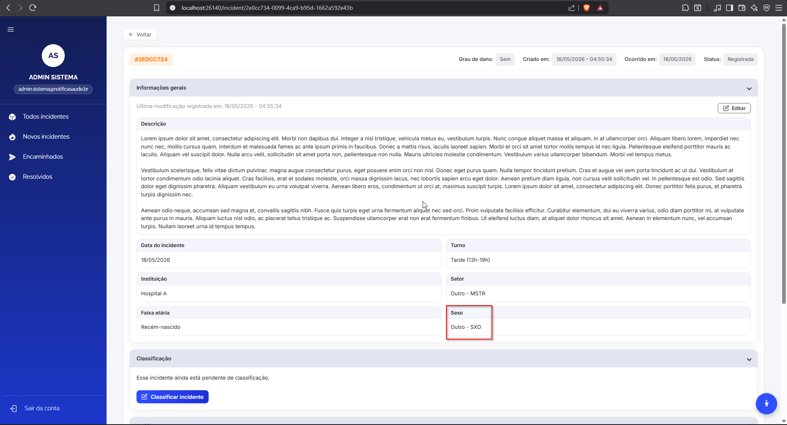{ loading=lazy }

<a id="bug-back-008"></a>

??? bug "BUG-BACK-008 · #97 · Corrige porta fixa no healthcheck do Dockerfile"

    <div class="ns-bug-meta" markdown>
    <span><span class="ns-dec-rotulo">Status</span><span class="ns-status ns-status--encerrado">Fechado</span></span>
    <span><span class="ns-dec-rotulo">Severidade</span><span class="ns-nivel ns-nivel--media">Média</span></span>
    <span><span class="ns-dec-rotulo">Reportado por</span>Fábio Ramos</span>
    <span><span class="ns-dec-rotulo">Designado para</span>Fábio Ramos</span>
    </div>

    **Resumo**

    O HEALTHCHECK do Dockerfile (stage api) usa a porta 3000 fixa, mas a API escuta na porta definida por process.env.PORT (no deploy, 3001 via BACKEND_INTERNAL_PORT). Resultado: o healthcheck bate em localhost:3000, recebe connection refused e marca o container como unhealthy mesmo com a API funcionando normalmente.

    **Passos para reprodução**

    *Não informado.*

    **Resultado esperado**

    HEALTHCHECK usa process.env.PORT com fallback para 3000

    Container backend fica healthy quando PORT != 3000 (ex: 3001)

    Sem regressão quando PORT não está definida (default 3000)

    **Observações**

    Alteração já validada localmente no stack de deploy:

    CMD node -e "fetch([http://localhost:+(process.env.PORT\|\|3000)+/health).then(r=\>process.exit(r.ok?0:1)).catch(()=\>process.exit(1)](about:blank))"

    Relacionado à issue de observabilidade no repo notifica-saude-deploy.

    **Evidência**

    *Não informado.*

### 3.3 End-to-End { #end-to-end }

<div class="ns-bug-tabela" markdown>

| ID | Issue | Título | Severidade | Status | Responsáveis |
| --- | --- | --- | --- | --- | --- |
| [BUG-E2E-001](#bug-e2e-001) | #5 | Mensagem de rate limit não é exibida após múltiplas tentativas de login inválidas | <span class="ns-nivel ns-nivel--media">Média</span> | <span class="ns-status ns-status--encerrado">Fechado</span> | Pedro Silva Soledade<br><span class="ns-bug-dest">→ Lucas Gonçalves, Fábio Ramos</span> |

</div>

<a id="bug-e2e-001"></a>

??? bug "BUG-E2E-001 · #5 · Mensagem de rate limit não é exibida após múltiplas tentativas de login inválidas"

    <div class="ns-bug-meta" markdown>
    <span><span class="ns-dec-rotulo">Status</span><span class="ns-status ns-status--encerrado">Fechado</span></span>
    <span><span class="ns-dec-rotulo">Severidade</span><span class="ns-nivel ns-nivel--media">Média</span></span>
    <span><span class="ns-dec-rotulo">Reportado por</span>Pedro Silva Soledade</span>
    <span><span class="ns-dec-rotulo">Designado para</span>Lucas Gonçalves, Fábio Ramos</span>
    </div>

    **Justificativa da severidade:** Pode impactar negativamente a proteção contra ataques de força bruta e comprometer a experiência do usuário.

    **Resumo**

    Após múltiplas tentativas de login inválidas, o sistema não exibe a mensagem de rate limit esperada. Em vez disso, continua retornando a mensagem padrão de credenciais inválidas.

    **Passos para reprodução**

    1.  Acessar a tela de login
    2.  Inserir e-mail inválido: \`usuario@invalido.com\`
    3.  Inserir senha inválida: \`senhaerrada\`
    4.  Clicar em "Entrar"
    5.  Repetir o processo múltiplas vezes (≥ 5 tentativas consecutivas)
    6.  Observar a mensagem exibida

    **Resultado esperado**

    - Sistema deve exibir mensagem de rate limit:
        - "Muitas tentativas. Tente novamente em 1 minutos."

    **Resultado obtido**

    - Sistema exibe repetidamente a mensagem:
        - "⚠ E-mail ou senha incorretos. Verifique os dados e tente novamente."

    **Observações**

    - O erro foi identificado durante execução automatizada com Playwright
    - O alerta está sendo localizado corretamente (\`getByRole('alert')\`), porém o conteúdo não muda
    - Possível ausência ou falha na implementação da regra de rate limit no backend
    - Pode também indicar delay maior que o esperado para ativação do bloqueio

    **Versões Afetadas**

    - Ambiente: CI (GitHub Actions)
    - Navegador: Chromium

    **Evidência**

    *Não informado.*

---

## 4. Como registrar um novo bug { #novo-bug }

!!! tip "Um bug por bloco"
    Adicione o bug na seção da camada em que ocorreu (Front-end, Back-end ou End-to-End), com o próximo ID da sequência daquela camada (por exemplo, BUG-FRONT-019, BUG-BACK-009, BUG-E2E-002). Inclua uma linha na tabela-resumo da seção, crie o bloco com o relato completo e registre a alteração no histórico.

| Campo | Como preencher |
| --- | --- |
| **ID** | Identificador sequencial por camada: BUG-FRONT-NNN, BUG-BACK-NNN ou BUG-E2E-NNN. |
| **Issue** | Número da issue no GitHub, no formato #N. |
| **Título** | Descrição curta e autoexplicativa do defeito. Se estiver associado a algum caso de teste, mencione o identificador (ex.: CT-FUN-001). |
| **Status** | Situação atual do bug (ex.: Aberto, Em correção, Fechado). |
| **Reportado por / Designado para** | Quem encontrou o defeito e quem é responsável pela correção. |
| **Resumo** | Descrição do problema observado. |
| **Passos para reprodução** | Lista numerada com os passos necessários para reproduzir o defeito. |
| **Resultado esperado / obtido** | Comportamento correto esperado e comportamento observado. |
| **Observações** | Hipóteses de causa, arquivos afetados, relação com outras issues. |
| **Severidade** | <span class="ns-nivel ns-nivel--alta">Alta</span>, <span class="ns-nivel ns-nivel--media">Média</span> ou <span class="ns-nivel ns-nivel--baixa">Baixa</span>, conforme os [critérios da seção 2](#criticidade), com uma justificativa curta. |
| **Versões afetadas** | Ambiente e navegador em que o defeito ocorre, quando relevante. |
| **Evidência** | Capturas de tela, requisições (curl) ou logs que comprovem o defeito. |

<!--
MODELO DE BLOCO PARA COPIAR (não aparece no site). Cole ao final da seção da camada e ajuste os valores:

<a id="bug-front-019"></a>

??? bug "BUG-FRONT-019 · #N · Título do bug"

    <div class="ns-bug-meta" markdown>
    <span><span class="ns-dec-rotulo">Status</span><span class="ns-status ns-status--aberto">Aberto</span></span>
    <span><span class="ns-dec-rotulo">Severidade</span><span class="ns-nivel ns-nivel--media">Média</span></span>
    <span><span class="ns-dec-rotulo">Reportado por</span>Nome</span>
    <span><span class="ns-dec-rotulo">Designado para</span>Nome</span>
    </div>

    **Justificativa da severidade:** Texto.

    **Resumo**

    Texto.

    **Passos para reprodução**

    1. Passo.

    **Resultado esperado**

    Texto.

    **Resultado obtido**

    Texto.

    **Observações**

    Texto.

    **Evidência**

    { loading=lazy }

Status: ns-status--aberto (Aberto), ns-status--analise (Em análise), ns-status--mitigacao (Em correção), ns-status--encerrado (Fechado).
-->
