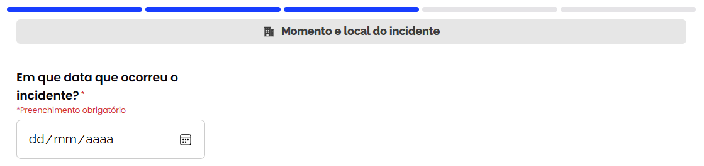
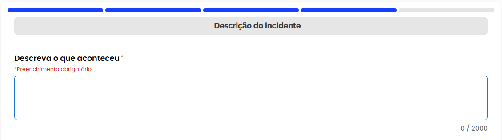
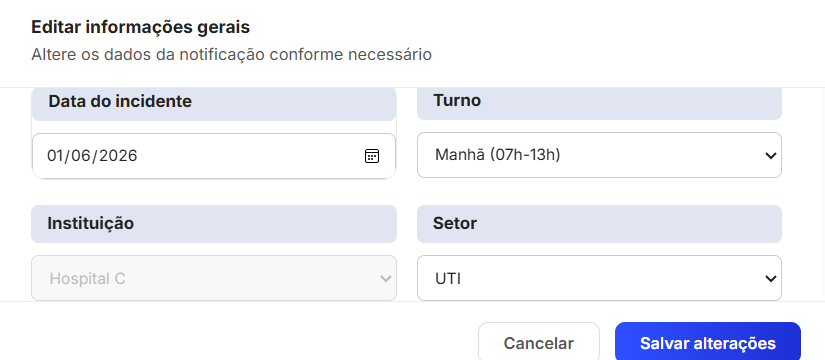
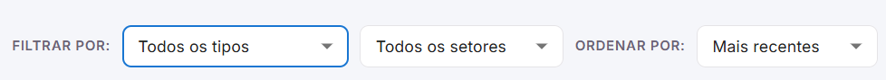
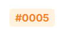
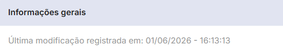

---
hide:
  - toc
---

<h1 align="center">Relatório de Testes Não-Funcionais</h1>


<p align="center"><strong>Mantenedores:</strong> Gustavo Henrique, Kauan Cardoso, Sophya Ribeiro, Brenno, Catarina, Eduardo</p>

??? note "Histórico de Alterações"

    | Versão | Data | Justificativa | Responsável |
    | --- | --- | --- | --- |
    | 1.0 | 21/05/2026 | Criação e estruturação do documento. | Pedro Silva Soledade |
    | 2.0 | 01/06/2026 | Reestruturação do documento; adição de conteúdo nas seções de segurança e acessibilidade. | Pedro Silva Soledade |
    | 2.1 | 25/09/2026 | Migração do documento (Google Docs) para o MkDocs. | Sophya Ribeiro |

## Sumário

- [1. Introdução](#introducao)
- [2. Testes de Segurança](#seguranca)
    - [2.1 Frontend](#seguranca-frontend)
    - [2.2 Backend](#seguranca-backend)
- [3. Testes de Acessibilidade](#acessibilidade)

---

## 1. Introdução { #introducao }

Este documento apresenta os resultados da avaliação técnica realizada no sistema NotificaSaúde. O diagnóstico foi conduzido com duas ferramentas de referência no mercado, o **OWASP ZAP** (*Zed Attack Proxy*) e o **Lighthouse**, analisando a aplicação web nos pilares de segurança e acessibilidade.

### 1.1 Objetivo

Apresentar o diagnóstico técnico do NotificaSaúde, fornecendo um parecer detalhado que fundamente a tomada de decisão, a priorização de correções e a evolução contínua da qualidade da aplicação.

### 1.2 Visão geral do documento

O relatório está organizado em seções que refletem as dimensões testadas. Cada seção detalha os achados técnicos obtidos por meio de varreduras automatizadas, classificando-os por nível de severidade ou impacto, com as evidências e recomendações necessárias para a correção.

| Seção | Ferramenta | Conteúdo |
| --- | --- | --- |
| [2. Testes de Segurança](#seguranca) | OWASP ZAP | Falhas de configuração e vulnerabilidades da aplicação web, alinhadas às boas práticas de proteção de dados. |
| [3. Testes de Acessibilidade](#acessibilidade) | Lighthouse | Conformidade da interface com as diretrizes e padrões de inclusão digital, garantindo o acesso democrático à plataforma. |

<div class="ns-dec-resumo" markdown>
<div class="ns-dec-stat"><strong>7</strong><span>achados de segurança no frontend</span></div>
<div class="ns-dec-stat"><strong>10</strong><span>achados de segurança no backend</span></div>
<div class="ns-dec-stat"><strong>3</strong><span>falhas de acessibilidade</span></div>
<div class="ns-dec-stat"><strong>6</strong><span>achados de severidade média ou alta</span></div>
</div>

---

## 2. Testes de Segurança { #seguranca }

Esta seção detalha as vulnerabilidades e inconformidades identificadas na varredura automatizada com o OWASP ZAP, divididas entre frontend e backend.

### 2.1 Frontend { #seguranca-frontend }

**URL alvo:** <https://nes-server.equipe4.front.facom.ufms.br>

**Resumo dos achados**

| Severidade | Quantidade | Alertas |
| --- | :---: | --- |
| <span class="ns-nivel ns-nivel--media">Média</span> | 3 | Content Security Policy (CSP) Not Set, Missing Anti-clickjacking Header, CORS Misconfiguration |
| <span class="ns-nivel ns-nivel--baixa">Baixa</span> | 2 | Strict-Transport-Security Not Set, X-Content-Type-Options Missing |
| <span class="ns-nivel ns-nivel--info">Informativa</span> | 2 | Modern Web Application (SPA), Re-examine Cache-control Directives |

#### Severidade média

!!! warning "Content Security Policy (CSP) Header Not Set"
    - **Endpoint:** `GET /`
    - **Problema:** ausência do cabeçalho `Content-Security-Policy`.
    - **Impacto/risco:** deixa a aplicação vulnerável a ataques de *Cross-Site Scripting* (XSS) e à injeção de conteúdo malicioso, pois o navegador não tem restrições sobre a origem dos scripts executados.

!!! warning "Missing Anti-clickjacking Header"
    - **Problema:** ausência das diretivas `X-Frame-Options` ou `frame-ancestors` no CSP.
    - **Impacto/risco:** permite que a aplicação seja renderizada dentro de um `<iframe>` em sites de terceiros, tornando-a vulnerável a ataques de *clickjacking* (em que o usuário é induzido a clicar em algo invisível).

!!! warning "Configuração incorreta entre domínios (CORS Misconfiguration)"
    - **Problema:** política de CORS (*Cross-Origin Resource Sharing*) potencialmente permissiva.
    - **Impacto/risco:** pode permitir que domínios maliciosos façam requisições ao frontend e acessem dados restritos que deveriam estar isolados.

#### Severidade baixa

| Alerta | Descrição |
| --- | --- |
| **Strict-Transport-Security Header Not Set** | Ausência do cabeçalho HSTS. Sem ele, a aplicação permite conexões iniciais inseguras via HTTP antes de redirecionar para HTTPS, abrindo brecha para ataques *man-in-the-middle*. |
| **X-Content-Type-Options Header Missing** | Ausência do cabeçalho `X-Content-Type-Options: nosniff`. O navegador pode tentar adivinhar o tipo do arquivo (*MIME sniffing*), permitindo a execução de arquivos maliciosos mascarados como texto ou imagem. |

#### Severidade informativa

| Alerta | Descrição |
| --- | --- |
| **Modern Web Application** | Detectada aplicação do tipo SPA (*Single Page Application*). Recomenda-se ajustar as regras de varredura para garantir a cobertura completa das rotas dinâmicas. |
| **Re-examine Cache-control Directives** | As diretivas de controle de cache devem ser revisadas para garantir que páginas com dados sensíveis não fiquem armazenadas de forma insegura no cache local do navegador. |

### 2.2 Backend { #seguranca-backend }

**URL alvo:** <https://nes-server.equipe4.back.facom.ufms.br>

**Resumo dos achados**

| Severidade | Quantidade | Alertas |
| --- | :---: | --- |
| <span class="ns-nivel ns-nivel--media">Média</span> | 1 | Configuração incorreta entre domínios (CORS Misconfiguration) |
| <span class="ns-nivel ns-nivel--baixa">Baixa</span> | 7 | Cookie Without Secure Flag, Cookie without SameSite Attribute, Strict-Transport-Security Not Set, X-Content-Type-Options Missing, Server Leaks Version, Divulgação de Data/Hora Unix, Private IP Disclosure |
| <span class="ns-nivel ns-nivel--info">Informativa</span> | 2 | Session Management Response Identified, Re-examine Cache-control Directives |

#### Severidade média

!!! warning "Configuração incorreta entre domínios (CORS Misconfiguration)"
    - **Problema:** configuração de CORS considerada insegura, permitindo origens (*origins*) muito amplas ou curingas (`*`).
    - **Impacto/risco:** permite que scripts de outros sites interajam diretamente com a API do backend, potencialmente expondo dados de sessão ou dados sensíveis de usuários a requisições não autorizadas.

#### Severidade baixa

| Alerta | Descrição |
| --- | --- |
| **Cookie Without Secure Flag** | Cookies de sessão ou da aplicação são enviados sem o atributo `Secure` e podem ser transmitidos em canais HTTP não criptografados, facilitando a interceptação do tráfego. |
| **Cookie without SameSite Attribute** | Cookies sem o atributo `SameSite` definido aumentam o risco de ataques CSRF (*Cross-Site Request Forgery*), em que um site terceiro força o navegador a enviar cookies legítimos. |
| **Strict-Transport-Security Header Not Set** | HSTS ausente no backend, permitindo tentativas de conexão inicial sem criptografia forçada. |
| **X-Content-Type-Options Header Missing** | Falta da diretiva `nosniff`, permitindo riscos associados a *MIME sniffing* nas respostas da API. |
| **Server Leaks Version Information via "Server" Header** | O cabeçalho HTTP `Server` expõe a versão e a tecnologia usadas no backend, facilitando a busca de *exploits* públicos para vulnerabilidades conhecidas daquela versão. |
| **Divulgação de data e hora (Unix)** | As respostas da API expõem *timestamps* Unix internos, fornecendo informações sobre a sincronização e a lógica interna do servidor. |
| **Private IP Disclosure** | Vazamento de endereços IP privados nos cabeçalhos ou no corpo das respostas HTTP, revelando detalhes da rede interna da instituição (FACOM/UFMS). |

#### Severidade informativa

| Alerta | Descrição |
| --- | --- |
| **Session Management Response Identified** | Identificado *endpoint* relacionado ao gerenciamento de sessões de usuário. Recomenda-se uma auditoria manual complementar para validar a robustez da expiração e da renovação de *tokens*. |
| **Re-examine Cache-control Directives** | Os cabeçalhos de cache da API precisam ser validados para evitar o armazenamento de dados dinâmicos ou sensíveis em *proxies* ou *gateways* intermediários. |

---

## 3. Testes de Acessibilidade { #acessibilidade }

Esta seção apresenta os resultados da avaliação de acessibilidade digital do frontend do NotificaSaúde, feita com o Lighthouse. Os testes foram baseados nas diretrizes internacionais **WCAG** (*Web Content Accessibility Guidelines*), identificando barreiras que comprometem a experiência de pessoas que dependem de tecnologias assistivas (como leitores de tela) ou que têm limitações visuais.

**Resumo de impacto**

| Criticidade | Tipo de falha | Impacto |
| --- | --- | --- |
| <span class="ns-nivel ns-nivel--alta">Alta</span> | Ausência de rótulos (`<label>`) em formulários | Bloqueia a compreensão por leitores de tela. |
| <span class="ns-nivel ns-nivel--alta">Alta</span> | Campos ARIA sem nome acessível | Identificação genérica ou confusa em leitores de tela. |
| <span class="ns-nivel ns-nivel--media">Média</span> | Contraste de cor insuficiente | Dificulta ou impede a leitura de textos na tela. |

### 3.1 Criticidade alta

!!! danger "Ausência de rótulos (`<label>`) associados a elementos de formulário"
    - **Problema:** elementos de entrada de dados (`<input>`, `<textarea>` e `<select>`) não têm tags `<label>` explicitamente vinculadas a eles por meio dos atributos `id`/`for`.
    - **Impacto:** tecnologias assistivas, como leitores de tela, não conseguem anunciar o propósito do campo para pessoas com deficiência visual, tornando o preenchimento do formulário confuso ou impossível.

**Evidências encontradas**

=== "Campo de data (geral)"

    

    ```text title="Seletor"
    div > div._container_1suwf_1 > div._inputWrapper_1suwf_30 > input._input_1suwf_30
    ```

    ```html title="Código"
    <input type="date" data-testid="field-55555555-5555-4555-b555-000000000008" ...>
    ```

=== "Campo de texto / descrição"

    

    ```text title="Seletor"
    div._container_1ennx_1 > div._content_1ennx_55 > div._container_1khtu_1 > textarea._textarea_1khtu_27
    ```

    ```html title="Código"
    <textarea class="_textarea_1khtu_27" data-testid="field-55555555-5555-4555-b555-000000000004" ...>
    ```

=== "Modal de incidente"

    Campos Data, Turno, Unidade, Setor, Idade e Sexo.

    

    ```text title="Seletor base"
    div._modalBody_1smv7_494 > ... > ._modalInput_1smv7_523
    ```

    **Elementos afetados:** `<input data-testid="field-data-incidente">` e os elementos `<select>` com as tags de teste `field-turno`, `field-unidade`, `field-setor`, `field-idade` e `field-sexo`.

!!! danger "Campos de entrada ARIA sem nomes acessíveis"
    - **Problema:** componentes customizados que usam a semântica ARIA (`role="combobox"`) não têm um rótulo de texto descritivo legível por leitores de tela.
    - **Impacto:** o leitor de tela anuncia o componente apenas como um elemento genérico de seleção (ex.: "caixa de combinação"), sem informar o que está sendo selecionado.

**Evidências encontradas (componentes de filtro e seleção)**



| Filtro | Código |
| --- | --- |
| "Todos os tipos" | `<div role="combobox" class="MuiSelect-select ...">` |
| "Todos os setores" | `<div role="combobox" class="MuiSelect-select ...">` |
| "Mais recentes" | `<div role="combobox" class="MuiSelect-select ...">` |

### 3.2 Criticidade média

!!! warning "Taxa de contraste de cor insuficiente para texto"
    - **Problema:** a relação de contraste entre a cor do texto e a cor do fundo está abaixo do mínimo exigido pela WCAG (4,5:1 para texto normal).
    - **Impacto:** pessoas com baixa visão, daltonismo ou que usam telas sob luz solar direta têm sérias dificuldades para ler as informações, o que gera fadiga visual e perda de contexto.

**Evidências encontradas**

| Elemento | Evidência | Classe |
| --- | --- | --- |
| Identificadores de registros (IDs) |  | `_id_12ilk_43` |
| Metadados de data e hora | { width="320" } | `_metaText_1smv7_180` |
